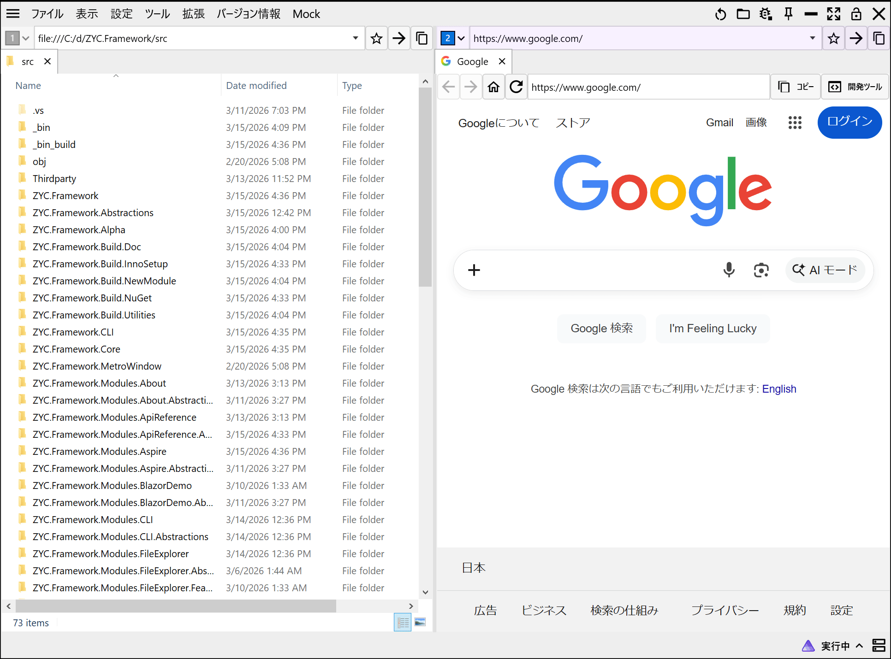
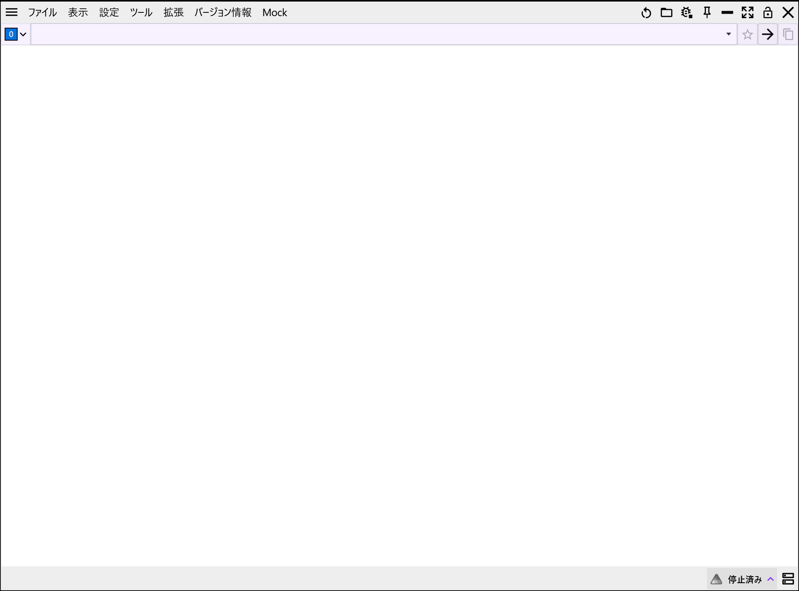
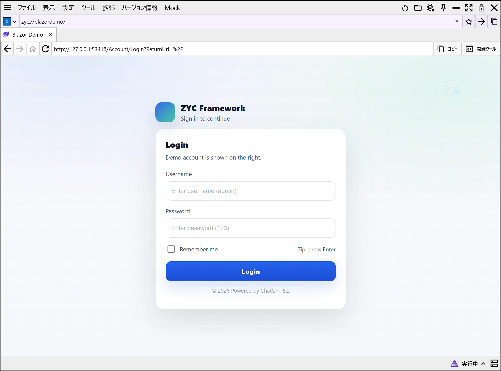

<p align="center">
  <a href="./README.md">English</a> |
  <a href="./README.ja.md">日本語</a> |
  <a href="./README.zh-CN.md">简体中文</a> |
  <a href="./README.zh-TW.md">繁體中文</a> |
  <a href="./README.ko.md">한국어</a> |
</p>

<p align="center">
  
</p>

<h1 align="center">ZYC.Framework</h1>

<p align="center">


<b>.NET 10</b> と <b>WPF</b> で構築した、高性能・モジュール型・拡張可能なデスクトップ自動化フレームワーク。

</p>

<p align="center">
  <a href="https://www.nuget.org/packages/ZYC.Framework.Alpha">
    
  </a>
  <a href="https://www.nuget.org/packages/ZYC.Framework.Alpha">
    
  </a>
  
  
  
</p>

<p align="center">
  <a href="https://github.com/ZiYuCai1984/ZYC.Framework/actions/workflows/publish-nuget-manual.yml">
    
  </a>
  <a href="https://github.com/ZiYuCai1984/ZYC.Framework/actions/workflows/publish-nuget-nightly.yml">
    
  </a>
</p>

---


## 📖  概要


**ZYC.Framework** は、**WPF** の表現力と **.NET 10** の最新機能を活かした、モダンなデスクトップ自動化ソリューションです。モジュール指向のアーキテクチャにより、複雑な自動化システムの開発をシンプルにします。


また、本プロジェクトは分散アプリケーションのオーケストレーションのために **.NET Aspire** を深く統合しています。さらに **Blazor** と **WebView2** を利用したハイブリッド構成にも対応しており、Web / ネイティブのどちらの技術スタックも柔軟に選択できます。


---


## ✨  主な特長

- **モジュール型アーキテクチャ**：ビジネスロジックを疎結合化し、動的ロードや独立開発を支援します。
- **モダン UI**：WPF をベースに、**マルチワークスペース**（Multi-Workspace）および **マルチタブ**（Multi-Tab）をサポートします。
- **ハイブリッド開発**：
  - **WebView2** を統合し、モダンな Web アプリをデスクトップに埋め込み可能。
  - **Blazor** を統合し、Web コンポーネントとデスクトップ側ロジックをシームレスに再利用。
- **クラウドネイティブ対応**：**.NET Aspire** を内蔵し、サービス発見・ガバナンス・デプロイを簡素化します。
- **エンタープライズ向け内蔵機能**：
  - **タスク管理**：タスクのスケジューリングとライフサイクル管理。
  - **例外処理**：グローバル例外の捕捉と診断のための仕組み。
  - **ローカライズ**：多言語対応のためのフレームワークを内蔵。

---


## 🛠️  技術スタック

- **Runtime**: .NET 10 SDK
- **UI Framework**: WPF (Windows Presentation Foundation)
- **Hybrid UI**: WebView2 + Blazor
- **Orchestration**: .NET Aspire
- **Architecture**: Modular Monolith / Plugin-based

---


## 🚀  クイックスタート


詳細な手順はこちら：


👉 **[クイックスタート (quick-start.ja.md)](docs/quick-start.ja.md)**


👉 **[デモ インストーラーをダウンロード](https://github.com/ZiYuCai1984/ZYC.Framework/releases/download/v1.2.2/ZYC.Framework.Setup.1.2.2.exe)**

### インストール


NuGet でコアパッケージを追加できます：

```bash
dotnet add package ZYC.Framework.Alpha --version 1.2.2
```

---


## 主な機能

### コアフレームワーク

| 機能           | 説明                                     |
| ------------ | -------------------------------------- |
| モジュールアーキテクチャ | 機能をモジュール単位で構成し、動的ロードと拡張をサポート。          |
| マルチワークスペース   | ワークスペースの分割・結合・並び替え・方向変更に対応。            |
| マルチタブナビゲーション | URI ベースのタブナビゲーション、復元、ワークスペース間移動。       |
| 拡張可能メニュー     | メインメニュー、ハンバーガーメニュー、タイトルバーなどの拡張ポイント。    |
| 通知システム       | Toast / Banner による通知表示。                |
| UI インタラクション  | BusyWindow、Overlay、ドラッグ＆ドロップ処理などを提供。   |
| ハイブリッド UI    | `WebView2` と `Blazor` によるハイブリッド UI 構築。 |
| 設定・状態管理      | 設定や状態、タスク履歴のローカル保存。                    |
| シングルインスタンス   | アプリケーションの単一インスタンス起動制御。                 |
| MCP 公開       | フレームワーク機能を MCP ツールとして公開可能。             |

### 組み込みモジュール

| モジュール         | 説明                    |
| ------------- | --------------------- |
| About         | バージョンや作者などの基本情報表示。    |
| ApiReference  | アプリ内で API ドキュメントを閲覧。  |
| CLI           | コマンド実行可能な内蔵ターミナル。     |
| FileExplorer  | ディレクトリ閲覧用ファイルエクスプローラ。 |
| WebBrowser    | Web / ローカルページ閲覧用ブラウザ。 |
| Language      | 多言語切替とローカライズ管理。       |
| Translator    | 翻訳サービス統合。             |
| Settings      | 統合設定管理画面。             |
| Secrets       | 機密設定の安全な管理。           |
| TaskManager   | タスク管理と状態追跡。           |
| Update        | NuGet ベースの更新機能。       |
| NuGet         | NuGet パッケージ検索と管理。     |
| ModuleManager | モジュールのインストール・有効化・管理。  |
| MCP.Server    | ローカル MCP Server。      |
| Aspire        | `Aspire` ツール統合。       |
| Log           | ログ機能とログディレクトリ。        |
| BlazorDemo    | Blazor Server 統合デモ。   |
| Mock          | テスト用モジュール。            |

### 開発・配布

| 機能          | 説明                 |
| ----------- | ------------------ |
| CLI ツール     | コマンドラインインターフェース。   |
| モジュールテンプレート | 新規モジュール生成テンプレート。   |
| ドキュメント生成    | README / ドキュメント生成。 |
| NuGet パッケージ | NuGet パッケージ作成。     |
| インストーラ      | デスクトップインストーラ生成。    |


---


## 📸  UI プレビュー

<table align="center">
  <tr>
    <td>
      
      <p align="center">ワークスペース表示</p>
    </td>
    <td>
      
      <p align="center">マルチタブ表示</p>
    </td>
  </tr>
  <tr>
    <td>
      
      <p align="center">複数ワークスペース</p>
    </td>
    <td>
      
      <p align="center">複数ワークスペース + タブ</p>
    </td>
  </tr>
  <tr>
    <td>
      
      <p align="center">Aspire ダッシュボード</p>
    </td>
    <td>
      
      <p align="center">Blazor（認証付き）</p>
    </td>
  </tr>
  <tr>
    <td>
      
      <p align="center">例外処理</p>
    </td>
    <td>
      
      <p align="center">タスク管理</p>
    </td>
  </tr>
</table>

---


## 📄  ライセンス


本プロジェクトは [MIT License](LICENSE) のもとで公開されています。

---


## 💖  謝辞


本プロジェクトは以下の OSS を利用し、また一部実装を参考にしています：

* [MahApps.Metro](https://github.com/MahApps/MahApps.Metro): UI フレームワーク。
* [MdXaml](https://github.com/whistyun/MdXaml): Markdown 表示。
* [titanium-web-proxy](https://github.com/justcoding121/titanium-web-proxy): プロキシのコア。
* [EasyWindowsTerminalControl](https://github.com/mitchcapper/EasyWindowsTerminalControl): ターミナル統合。

> ライセンスおよび著作権は各プロジェクトの作者に帰属します。
> 本リポジトリは各ライセンス条項に従って利用・参照しています。

---


## 🤝  コントリビューション


Issue / Pull Request は歓迎です。改善提案やバグ報告があれば、お気軽に Issue を立ててください。
