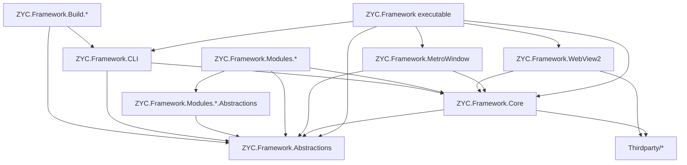
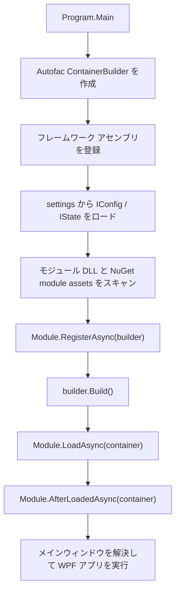
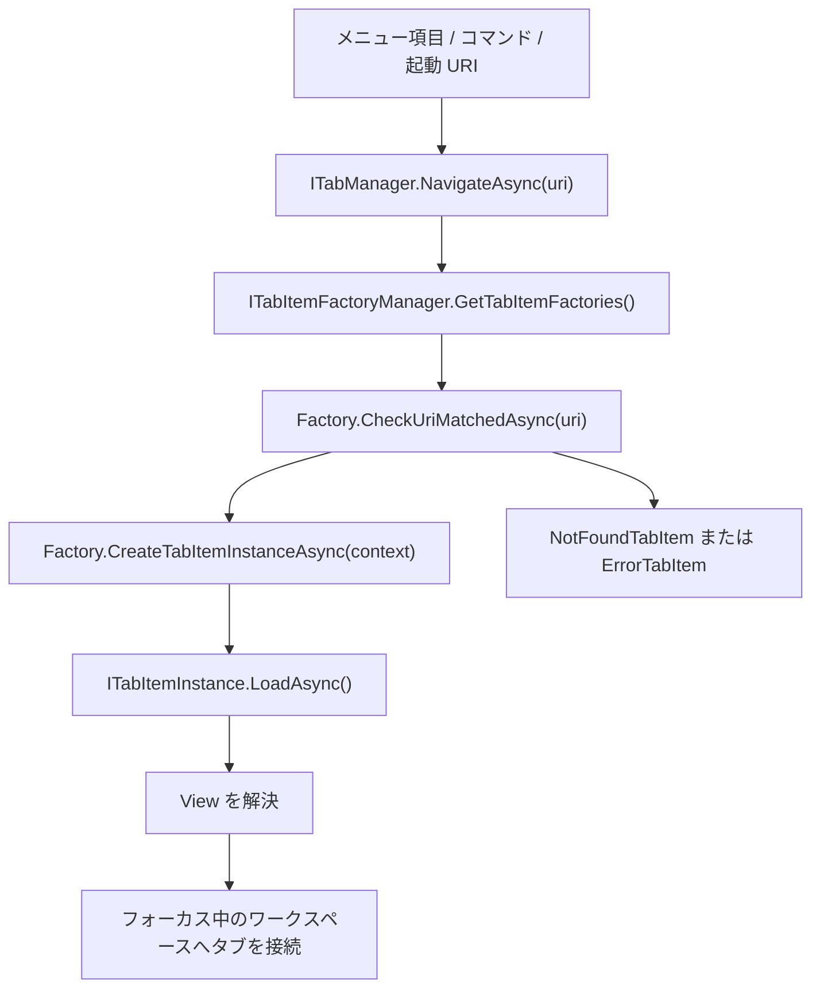

<p align="center">
  <a href="./architecture.md">English</a> |
  <a href="./architecture.ja.md">日本語</a> |
  <a href="./architecture.zh-CN.md">简体中文</a> |
  <a href="./architecture.zh-TW.md">繁體中文</a> |
  <a href="./architecture.ko.md">한국어</a> |
</p>


# アーキテクチャ

このドキュメントでは、リポジトリ構成と実行時のロード経路に基づいて、現在の ZYC.Framework のアーキテクチャを説明します。対象は、アプリケーションで実際に使われている拡張ポイントです。具体的には、モジュール、依存性注入、URI ベースのタブ、ワークスペース、設定と状態の永続化、Aspire リソース、MCP 公開を扱います。

## ソリューション構成

ZYC.Framework はモジュール型の WPF デスクトップ フレームワークです。実行可能シェルは意図的に小さく保たれています。アプリケーションを開始し、Autofac コンテナーを構築し、モジュールをロードした後、メインメニュー、タブ、ワークスペース、ステータスバー、通知などの UI 構成を各マネージャーへ委譲します。

| 領域 | 責務 |
| --- | --- |
| `ZYC.Framework.Abstractions` | 公開コントラクト、設定/状態型、モジュール向け DTO、メニュー/タブ/ワークスペース インターフェイス、MCP 属性。 |
| `ZYC.Framework.Core` | 共通 WPF ヘルパー、コマンド、基底コントロール、ダイアログ、ローカライズ ヘルパー、コンバーター、登録ヘルパー。 |
| `ZYC.Framework.MetroWindow` | メインウィンドウ実装と、ダイアログ ホスティングなどのウィンドウ レベル サービス。 |
| `ZYC.Framework.WebView2` | WebView2 ホスト コントロールとブラウザー統合基盤。 |
| `ZYC.Framework` | デスクトップ実行シェル、起動処理、ワークスペース UI、タブ UI、メニュー UI、通知、クイックバー、ステータスバー、アプリ コンテキスト実装。 |
| `ZYC.Framework.Modules.*.Abstractions` | モジュール固有の公開コントラクト、設定/状態クラス、定数、コマンド インターフェイス。他モジュールが参照すべき境界。 |
| `ZYC.Framework.Modules.*` | モジュール実装プロジェクト。サービス、メニュー項目、タブ ファクトリ、ステータスバー項目、Aspire リソース、コマンドライン オプションなどを登録する。 |
| `ZYC.Framework.CLI` | dotnet tool のエントリポイント。`zyc new`、`zyc new-module` を持ち、デスクトップ ホストと同じモジュール発見/ロード基盤を共有する。 |
| `ZYC.Framework.Build.*` | ドキュメント、パッケージング、インストーラー生成、プロジェクト/モジュール スキャフォールド ラッパー、製品バージョン処理のビルド時ツール。 |
| `Thirdparty/*` | ソリューションと一緒にビルドされる vendored / forked 依存関係。 |

## 上位依存関係グラフ



重要な境界は、`*.Abstractions` プロジェクトが公開モジュール コントラクトを定義し、WPF 実装の詳細から独立している点です。実際の View、メニュー項目、タブ項目を実装するランタイム モジュールは、WPF やフレームワーク UI 基盤に依存できます。

## 起動フロー

デスクトップ エントリポイントは `src/ZYC.Framework/Program.cs` です。

1. プロセスは起動 URI を読み取り、JSON/設定動作を初期化し、Debug ビルド以外では単一インスタンス制御を行い、永続化された起動バージョンへリダイレクトするかを判断します。
2. Autofac の `ContainerBuilder` を作成します。
3. `ModuleTools.RegisterAllFromAssembly(...)` により、実行アセンブリ、`ZYC.Framework.Core`、`ZYC.Framework.WebView2`、`ZYC.Framework.MetroWindow`、`ZYC.Framework.Abstractions` などのコア フレームワーク アセンブリを登録します。
4. `RegisterAllFromAssembly(...)` はアセンブリ内の Autofac サービスを登録し、発見したすべての `IConfig` / `IState` 実装を settings ディレクトリから読み込みます。
5. `ModuleTools.RegisterModules(...)` は実行フォルダーから `ZYC.Framework.Modules*.dll` をスキャンし、`ModuleConfig.AdditionalAssemblyNames` に列挙されたアセンブリを追加し、`ModuleConfig.DisabledAssemblyNames` に含まれるものをスキップし、保留中のファイル削除を処理します。さらに `settings/nuget.module.assets.json` から NuGet モジュールもロードできます。
6. 各モジュール インスタンスは、コンテナー構築前に `RegisterAsync(builder)` を実行します。
7. `builder.Build()` の後、有効なモジュールは `LoadAsync(container)`、続いて `AfterLoadedAsync(container)` を実行します。
8. シェルは組み込みのモジュールロード用タブ ファクトリを登録し、モジュール ロード エラーを `IModuleLoadInfoManager` に保存し、メインウィンドウを解決して WPF を開始します。



## モジュール モデル

通常、モジュールは 2 つのプロジェクトに分かれます。

| プロジェクト | 目的 |
| --- | --- |
| `ZYC.Framework.Modules.<Name>.Abstractions` | 公開 API、定数、設定/状態、コマンド、DTO。 |
| `ZYC.Framework.Modules.<Name>` | 実装。`Module.cs`、View、タブ項目、タブ ファクトリ、メニュー項目、マネージャー、プロバイダー、サービス登録を含む。 |

実行時のモジュール オブジェクトは `ModuleBase` の派生クラスです。フレームワークは次のフェーズを使います。

| フェーズ | 実行タイミング | 主な用途 |
| --- | --- | --- |
| `RegisterAsync(ContainerBuilder)` | Autofac ルート コンテナー構築前。 | 依存解決に参加する必要があるサービスの登録。 |
| `LoadAsync(ILifetimeScope)` | コンテナー構築後。 | タブ ファクトリ、メニュー項目、ステータスバー項目、Aspire リソース、起動タスクなどのランタイム拡張ポイント登録。 |
| `AfterLoadedAsync(ILifetimeScope)` | 有効な全モジュールのロード後。 | 他モジュールが利用可能になっていることに依存する処理。 |

モジュール依存関係は、`ZYC.Framework.Modules.*.Abstractions.dll` へのアセンブリ参照から推定されます。これはモジュール マネージャーに実用的な依存関係ビューを与えますが、独立した意味論的なモジュール マニフェストではなく、あくまで規約ベースの発見です。

## UI 構成

シェルは、モジュール UI を直接固定するのではなく、各種マネージャーから構成されます。

| サーフェス | 主なコントラクト |
| --- | --- |
| メインメニュー / Hamburger メニュー | `IMainMenuManager`, `IMainMenuItemsProvider`, `IMainMenuItem`, `IHamburgerMenuManager` |
| タブとナビゲーション | `ITabManager`, `ITabItemFactoryManager`, `ITabItemFactory`, `ITabItemInstance` |
| ワークスペース | `IParallelWorkspaceManager`, ワークスペースの state/config 型、ワークスペース メニュー マネージャー |
| クイックバー | `IQuickBarManager`, クイックバー項目/プロバイダー コントラクト |
| ステータスバー | `IStatusBarManager`, `IStatusBarItemsProvider`, `IStatusBarItem` |
| 通知 | `IToastManager`, `IBannerManager`, Toast/Banner View 基盤 |
| ダイアログ / オーバーレイ | `IDialogManager`, `IDialog`, `IOverlayManager` |

通常、モジュールは `LoadAsync(...)` で UI を追加します。たとえば、タブ ファクトリと Tools メニュー項目を登録できます。

```csharp
public override Task LoadAsync(ILifetimeScope lifetimeScope)
{
    lifetimeScope.RegisterTabItemFactory<MyTabItemFactory>();
    lifetimeScope.RegisterToolsMainMenuItem<MyMainMenuItem>();
    return Task.CompletedTask;
}
```

単純な WPF View なら `SimpleTabItemFactoryInfo` が最短経路です。URI 対応タブを作成し、Extensions 配下のメニュー項目を追加し、必要に応じてクイックバー項目も追加できます。より複雑なルーティングでは、モジュールが `ITabItemFactory` を直接実装します。

## URI ベースのタブ ナビゲーション

タブ ナビゲーションは URI 駆動です。コマンドやメニュー項目は `ITabManager.NavigateAsync(...)` を呼び出し、タブ マネージャーは登録済みファクトリに URI を処理できるか問い合わせます。最も適したファクトリがタブ インスタンスを作成します。



ファクトリは Priority の降順で並べられます。シングルトン ファクトリは、対象 URI がすでに開かれている場合に既存タブを再利用できます。一致するファクトリがない場合は not-found タブが作成され、作成中に失敗した場合は error タブが作成されます。

## 設定と状態

設定と状態はマーカー インターフェイスで発見されます。

| 種別 | インターフェイス | 典型的な用途 |
| --- | --- | --- |
| Config | `IConfig` | ユーザーまたはモジュールが編集する設定。 |
| State | `IState` | ナビゲーションやワークスペース状態など、プロセス再起動後も保持したいランタイム状態。 |

`ModuleTools.RegisterAllFromAssembly(...)` は起動時に settings ディレクトリからこれらの型を読み込み、Autofac に登録します。`IAppContext` はアプリ レベルのパスと、`SaveAllConfig()` / `SaveAllState()` などの保存操作を公開します。

`ModuleConfig` は中心的なモジュール ロード設定です。

| プロパティ | 意味 |
| --- | --- |
| `DisabledAssemblyNames` | 無視すべきモジュール DLL。 |
| `AdditionalAssemblyNames` | 標準モジュール DLL に加えて、アプリ フォルダーからロードする追加 DLL。 |

NuGet でインストールされたモジュールは、別の起動アーティファクト `settings/nuget.module.assets.json` を使います。これが存在する場合、`ModuleTools.RegisterModules(...)` はランタイム アセット ローダーに `net10.0-windows` 用のランタイム アセンブリをロードさせます。

## ハイブリッド UI と Aspire 統合

ZYC.Framework はネイティブ WPF View とハイブリッド Web コンテンツをサポートします。

`ZYC.Framework.WebView2` は再利用可能な WebView2 ホスト基盤を持ちます。WebBrowser や BlazorDemo などのモジュールは、このサーフェスを使って Web コンテンツや Web ベース体験を埋め込みます。

`ZYC.Framework.Modules.Aspire` は .NET Aspire を統合します。`AspireService.Build(...)` は `DistributedApplicationBuilder` を作成し、既存の Autofac lifetime scope で構成し、`AspireConfig.Environment` を適用し、すべての `IExtensionResourcesProvider` 実装を解決します。拡張モジュールは、コア Aspire モジュールを変更せずに子リソースを Aspire アプリへ差し込めます。

`Translator` モジュールはこのパターンの例です。`ICommandlineResourcesProvider` を解決し、`libretranslate` 用のコマンドライン リソースを登録します。

`ZYC.Framework.Modules.Accounts` は provider-based account shell です。Session initialization、`IAccountManager`、protected token storage、タイトルバーの account UI を持ちます。`ZYC.Framework.Modules.Accounts.GitHub` のような provider module は `IAccountProvider` 実装を提供し、WebView2 ベースの OAuth flow を含む独自の authentication tab factory を登録できます。

`ZYC.Framework.Modules.ChromeExtensions` は browser extension package management を browser runtime から分離します。Chrome Web Store package をダウンロード/展開し、manifest metadata を読み取り、WebView2 が安定した extension identity を使えるよう unpacked manifest key を同期します。`ZYC.Framework.Modules.WebBrowser` は installed package list を利用して `WebBrowserConfig.CustomBrowserArguments` の `--load-extension` を更新し、`ZYC.Framework.WebView2` が公開する live `CoreWebView2BrowserExtension` data を runtime plugin UI に使います。

## MCP 公開

MCP Server モジュールは、インターフェイス注釈を通じてアプリケーション機能を公開します。

`[ExposeToMCP]` が付いたインターフェイスまたはメソッドは、`MCPAutoToolDiscoveryExtensions.AddAutoDiscoveredTools(...)` によって発見されます。`[MCPIgnore]` が付いたメソッドはスキップされます。ツールが UI スレッド実行を必要とする場合、MCP ラッパーは UI dispatcher 経由で呼び出します。

つまり MCP はコントラクト駆動です。

1. 安定した機能をインターフェイスに置く。
2. インターフェイスまたはメソッドに `[ExposeToMCP]` を付ける。
3. 内部用または危険なメンバーは `[MCPIgnore]` で除外する。
4. MCP Server に、ロード済みアセンブリを実行時に発見させる。

## ビルドとテンプレート フロー

ドキュメントとスキャフォールドは、ランタイム モジュールとは分離されています。

| ツール | 責務 |
| --- | --- |
| `ZYC.Framework.Build.Doc` | `Templates/README/README.md` と `Templates/docs/*` をルートの `README*.md` と `docs/*` へレンダリングする。 |
| `ZYC.Framework.CLI` | `zyc new` プロジェクト テンプレートと `zyc new-module` モジュール スキャフォールドを提供する。 |
| `ZYC.Framework.Build.NewModule` | リポジトリ内モジュール生成用の `zyc new-module` ラッパー。 |
| `ZYC.Framework.Build.NuGet` | NuGet パッケージングとリリースノート。 |
| `ZYC.Framework.Build.InnoSetup` | インストーラー ビルド支援。 |

プロジェクト作成とモジュール作成は、意図的に別々のコマンド サーフェスです。

| コマンド | 目的 |
| --- | --- |
| `zyc new <ProjectName>` | `minimal` または `modular` プロジェクト テンプレートから外部 Host プロジェクトを作成する。 |
| `zyc new-module <ModuleName> --src-root <SourceRoot>` | 既存のソース ツリー内にモジュール ペアを作成する。 |

## モジュールを追加する

典型的なモジュール追加は次の流れです。

1. 公開コントラクト、定数、設定、状態、コマンド インターフェイス用に `ZYC.Framework.Modules.<Name>.Abstractions` を作成する。
2. ランタイム実装用に `ZYC.Framework.Modules.<Name>` を作成する。
3. `ModuleBase` 派生クラスを持つ `Module.cs` を追加する。
4. コンテナー構築前に必要な DI 登録は `RegisterAsync(...)` で行う。
5. タブ ファクトリ、メニュー項目、ステータスバー項目、クイックバー項目、Aspire プロバイダー、起動処理は `LoadAsync(...)` で登録する。
6. シェル View を直接操作するのではなく、`RegisterTabItemFactory<T>()` や `RegisterToolsMainMenuItem<T>()` などの manager API を優先する。
7. 公開 Abstractions は、可能な限り安定的かつ追加型で保つ。

この形により、モジュールは独立して開発しつつ、共有シェルと manager ベースの拡張モデルを通じてホストに構成されます。
