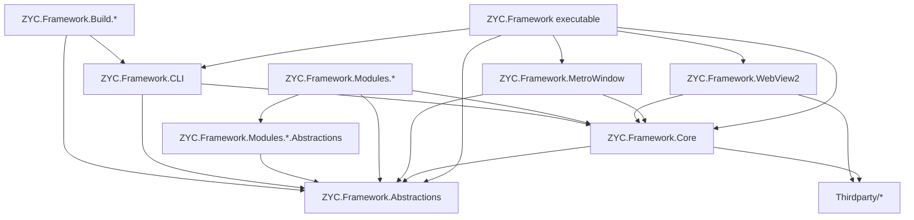
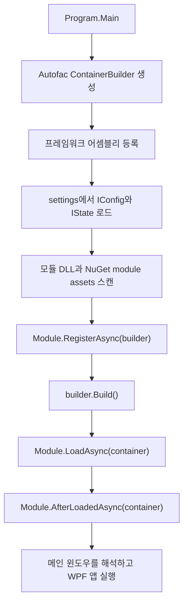
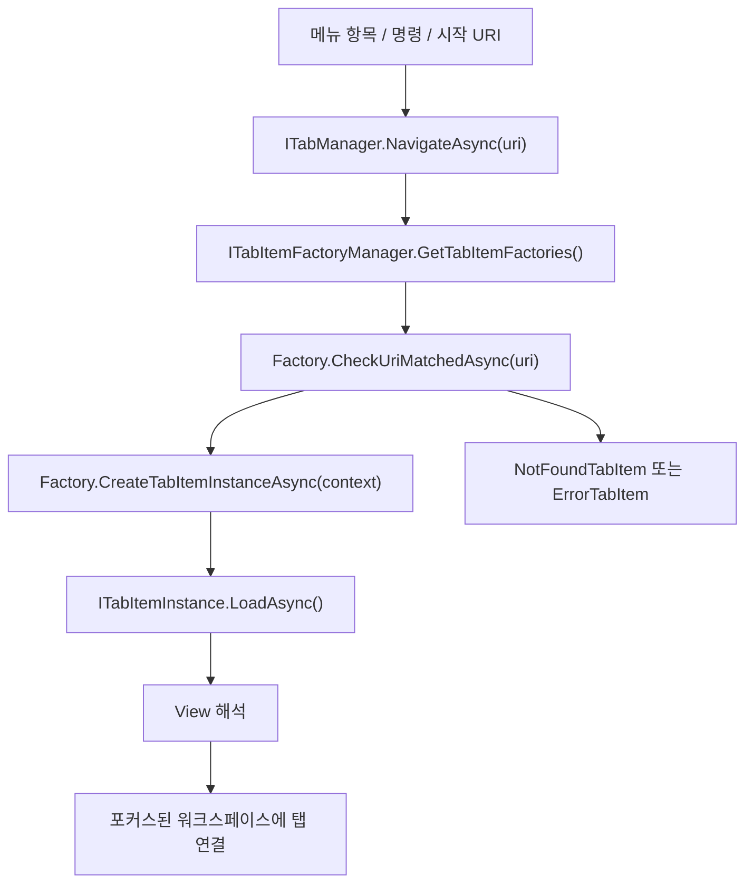

<p align="center">
  <a href="./architecture.md">English</a> |
  <a href="./architecture.ja.md">日本語</a> |
  <a href="./architecture.zh-CN.md">简体中文</a> |
  <a href="./architecture.zh-TW.md">繁體中文</a> |
  <a href="./architecture.ko.md">한국어</a> |
</p>


# 아키텍처

이 문서는 저장소 구조와 런타임 로딩 경로를 기준으로 현재 ZYC.Framework의 아키텍처를 설명합니다. 초점은 일반적인 WPF 설명이 아니라, 애플리케이션에서 실제로 사용하는 확장 지점입니다. 모듈, 의존성 주입, URI 기반 탭, 워크스페이스, 설정/상태 영속화, Aspire 리소스, MCP 노출을 다룹니다.

## 솔루션 구성

ZYC.Framework는 모듈형 WPF 데스크톱 프레임워크입니다. 실행 셸은 의도적으로 작게 유지됩니다. 애플리케이션을 시작하고, Autofac 컨테이너를 만들고, 모듈을 로드한 뒤, UI 구성은 메인 메뉴, 탭, 워크스페이스, 상태 표시줄, 알림 등의 Manager에 위임합니다.

| 영역 | 책임 |
| --- | --- |
| `ZYC.Framework.Abstractions` | 공개 계약, config/state 타입, 모듈용 DTO, 메뉴/탭/워크스페이스 인터페이스, MCP 특성. |
| `ZYC.Framework.Core` | 공통 WPF 헬퍼, 명령, 기본 컨트롤, 다이얼로그, 로컬라이제이션 헬퍼, 컨버터, 등록 헬퍼. |
| `ZYC.Framework.MetroWindow` | 메인 윈도우 구현과 다이얼로그 호스팅 같은 윈도우 레벨 서비스. |
| `ZYC.Framework.WebView2` | WebView2 호스트 컨트롤과 브라우저 통합 인프라. |
| `ZYC.Framework` | 데스크톱 실행 셸, 시작 흐름, 워크스페이스 UI, 탭 UI, 메뉴 UI, 알림, QuickBar, 상태 표시줄, AppContext 구현. |
| `ZYC.Framework.Modules.*.Abstractions` | 모듈별 공개 계약, config/state 클래스, 상수, 명령 인터페이스. 다른 모듈이 참조해야 하는 경계입니다. |
| `ZYC.Framework.Modules.*` | 모듈 구현 프로젝트. 서비스, 메뉴 항목, 탭 팩토리, 상태 표시줄 항목, Aspire 리소스, 명령줄 옵션을 등록합니다. |
| `ZYC.Framework.CLI` | dotnet tool 엔트리포인트. `zyc new`, `zyc new-module`을 제공하며 데스크톱 Host와 모듈 발견/로딩 인프라를 공유합니다. |
| `ZYC.Framework.Build.*` | 문서, 패키징, 설치 프로그램 생성, 프로젝트/모듈 스캐폴딩 래퍼, 제품 버전 처리를 위한 빌드 타임 도구. |
| `Thirdparty/*` | 솔루션과 함께 빌드되는 vendored 또는 forked 의존성. |

## 상위 의존성 그래프



중요한 경계는 `*.Abstractions` 프로젝트가 공개 모듈 계약을 정의하고 WPF 구현 세부사항과 독립되어야 한다는 점입니다. 실제 View, 메뉴 항목, 탭 항목을 구현하는 런타임 모듈은 WPF와 프레임워크 UI 인프라에 의존할 수 있습니다.

## 시작 흐름

데스크톱 엔트리포인트는 `src/ZYC.Framework/Program.cs`입니다.

1. 프로세스는 시작 URI를 읽고, JSON/settings 동작을 초기화하며, Debug 빌드가 아닐 때 단일 인스턴스 제어를 수행하고, 영속화된 시작 버전으로 리디렉션할지 판단합니다.
2. Autofac `ContainerBuilder`를 만듭니다.
3. `ModuleTools.RegisterAllFromAssembly(...)`로 핵심 프레임워크 어셈블리를 등록합니다. 대상은 실행 어셈블리, `ZYC.Framework.Core`, `ZYC.Framework.WebView2`, `ZYC.Framework.MetroWindow`, `ZYC.Framework.Abstractions`입니다.
4. `RegisterAllFromAssembly(...)`는 어셈블리의 Autofac 서비스를 등록하고, settings 디렉터리에서 발견된 모든 `IConfig`와 `IState` 구현을 로드합니다.
5. `ModuleTools.RegisterModules(...)`는 실행 폴더에서 `ZYC.Framework.Modules*.dll`을 스캔하고, `ModuleConfig.AdditionalAssemblyNames`에 나열된 어셈블리를 추가하며, `ModuleConfig.DisabledAssemblyNames`에 있는 어셈블리를 건너뛰고, 대기 중인 파일 삭제를 처리합니다. 또한 `settings/nuget.module.assets.json`에서 NuGet 모듈을 로드할 수 있습니다.
6. 각 모듈 인스턴스는 컨테이너가 빌드되기 전에 `RegisterAsync(builder)`를 실행합니다.
7. `builder.Build()` 후 활성화된 모듈은 `LoadAsync(container)`와 `AfterLoadedAsync(container)`를 차례로 실행합니다.
8. 셸은 내장 모듈 로드 탭 팩토리를 등록하고, 모듈 로드 오류를 `IModuleLoadInfoManager`에 저장하며, 메인 윈도우를 해석한 뒤 WPF를 시작합니다.



## 모듈 모델

모듈은 일반적으로 두 프로젝트로 나뉩니다.

| 프로젝트 | 목적 |
| --- | --- |
| `ZYC.Framework.Modules.<Name>.Abstractions` | 공개 API, 상수, config/state, 명령, DTO. |
| `ZYC.Framework.Modules.<Name>` | 구현: `Module.cs`, View, 탭 항목, 탭 팩토리, 메뉴 항목, Manager, Provider, 서비스 등록. |

런타임 모듈 객체는 `ModuleBase`의 하위 클래스입니다. 프레임워크는 다음 단계를 사용합니다.

| 단계 | 실행 시점 | 용도 |
| --- | --- | --- |
| `RegisterAsync(ContainerBuilder)` | Autofac 루트 컨테이너 빌드 전. | 의존성 해석에 참여해야 하는 서비스 등록. |
| `LoadAsync(ILifetimeScope)` | 컨테이너 빌드 후. | 탭 팩토리, 메뉴 항목, 상태 표시줄 항목, Aspire 리소스, 시작 작업 같은 런타임 확장 지점 등록. |
| `AfterLoadedAsync(ILifetimeScope)` | 모든 활성 모듈 로드 후. | 다른 모듈이 이미 사용 가능해야 하는 작업. |

모듈 의존성은 `ZYC.Framework.Modules.*.Abstractions.dll`에 대한 어셈블리 참조에서 추론됩니다. 이는 모듈 관리자에게 실용적인 의존성 뷰를 제공하지만, 별도의 의미론적 모듈 매니페스트가 아니라 규약 기반 발견입니다.

## UI 구성

셸은 모듈 UI를 하드코딩하지 않고 Manager를 통해 구성됩니다.

| 표면 | 주요 계약 |
| --- | --- |
| 메인 메뉴와 Hamburger 메뉴 | `IMainMenuManager`, `IMainMenuItemsProvider`, `IMainMenuItem`, `IHamburgerMenuManager` |
| 탭과 탐색 | `ITabManager`, `ITabItemFactoryManager`, `ITabItemFactory`, `ITabItemInstance` |
| 워크스페이스 | `IParallelWorkspaceManager`, 워크스페이스 state/config 타입, 워크스페이스 메뉴 Manager |
| QuickBar | `IQuickBarManager`, QuickBar item/provider 계약 |
| 상태 표시줄 | `IStatusBarManager`, `IStatusBarItemsProvider`, `IStatusBarItem` |
| 알림 | `IToastManager`, `IBannerManager`, Toast/Banner View 인프라 |
| 다이얼로그와 Overlay | `IDialogManager`, `IDialog`, `IOverlayManager` |

모듈은 보통 `LoadAsync(...)`에서 UI를 추가합니다. 예를 들어, 모듈은 탭 팩토리와 Tools 메뉴 항목을 등록할 수 있습니다.

```csharp
public override Task LoadAsync(ILifetimeScope lifetimeScope)
{
    lifetimeScope.RegisterTabItemFactory<MyTabItemFactory>();
    lifetimeScope.RegisterToolsMainMenuItem<MyMainMenuItem>();
    return Task.CompletedTask;
}
```

간단한 WPF View에는 `SimpleTabItemFactoryInfo`가 가장 짧은 경로입니다. URI 기반 탭을 만들고 Extensions 아래에 메뉴 항목을 추가하며, 필요하면 QuickBar 항목도 추가합니다. 더 복잡한 라우팅에서는 모듈이 `ITabItemFactory`를 직접 구현합니다.

## URI 기반 탭 탐색

탭 탐색은 URI로 구동됩니다. 명령과 메뉴 항목은 `ITabManager.NavigateAsync(...)`를 호출하고, 탭 매니저는 등록된 팩토리에게 URI를 처리할 수 있는지 확인합니다. 가장 잘 맞는 팩토리가 탭 인스턴스를 생성합니다.



팩토리는 Priority 내림차순으로 정렬됩니다. Singleton 팩토리는 대상 URI가 이미 열려 있을 때 기존 탭을 재사용할 수 있습니다. 일치하는 팩토리가 없으면 셸은 not-found 탭을 만들고, 생성 중 실패하면 error 탭을 만듭니다.

## 설정과 상태

설정과 상태는 마커 인터페이스로 발견됩니다.

| 종류 | 인터페이스 | 일반적인 용도 |
| --- | --- | --- |
| Config | `IConfig` | 사용자 또는 모듈이 편집할 수 있는 설정. |
| State | `IState` | 탐색이나 워크스페이스 상태처럼 프로세스 재시작 후에도 유지해야 하는 런타임 상태. |

`ModuleTools.RegisterAllFromAssembly(...)`는 시작 시 settings 디렉터리에서 이러한 타입을 로드하고 인스턴스를 Autofac에 등록합니다. `IAppContext`는 앱 수준 경로와 `SaveAllConfig()`, `SaveAllState()` 같은 저장 작업을 노출합니다.

`ModuleConfig`는 중심적인 모듈 로딩 설정입니다.

| 속성 | 의미 |
| --- | --- |
| `DisabledAssemblyNames` | 무시해야 하는 모듈 DLL. |
| `AdditionalAssemblyNames` | 표준 모듈 DLL 외에 app 폴더에서 추가로 로드할 DLL. |

NuGet으로 설치된 모듈은 별도의 시작 아티팩트인 `settings/nuget.module.assets.json`을 사용합니다. 이 파일이 있으면 `ModuleTools.RegisterModules(...)`는 런타임 asset loader에게 `net10.0-windows`용 런타임 어셈블리를 로드하게 합니다.

## 하이브리드 UI와 Aspire 통합

ZYC.Framework는 네이티브 WPF View와 하이브리드 Web 콘텐츠를 지원합니다.

`ZYC.Framework.WebView2`는 재사용 가능한 WebView2 Host 인프라를 소유합니다. WebBrowser와 BlazorDemo 같은 모듈은 이 표면을 기반으로 Web 콘텐츠나 Web 기반 경험을 임베드합니다.

`ZYC.Framework.Modules.Aspire`는 .NET Aspire를 통합합니다. `AspireService.Build(...)`는 `DistributedApplicationBuilder`를 만들고, 기존 Autofac lifetime scope로 구성하며, `AspireConfig.Environment`를 적용하고, 모든 `IExtensionResourcesProvider` 구현을 해석합니다. 확장 모듈은 핵심 Aspire 모듈을 수정하지 않고도 자식 리소스를 Aspire 앱에 연결할 수 있습니다.

`Translator` 모듈은 이 패턴의 예입니다. `ICommandlineResourcesProvider`를 해석하고 `libretranslate`용 명령줄 리소스를 등록합니다.

`ZYC.Framework.Modules.Accounts`는 provider-based account shell입니다. Session initialization, `IAccountManager`, protected token storage, 창 제목 표시줄 account UI를 소유합니다. `ZYC.Framework.Modules.Accounts.GitHub` 같은 provider module은 `IAccountProvider` 구현을 제공하고 WebView2 기반 OAuth flow를 포함한 자체 authentication tab factory를 등록할 수 있습니다.

`ZYC.Framework.Modules.ChromeExtensions`는 browser extension package management를 browser runtime에서 분리합니다. Chrome Web Store package를 다운로드하고 압축을 풀며, manifest metadata를 읽고, WebView2가 안정적인 extension identity를 사용할 수 있도록 unpacked manifest key를 동기화합니다. `ZYC.Framework.Modules.WebBrowser`는 installed package list를 사용해 `WebBrowserConfig.CustomBrowserArguments`의 `--load-extension`을 갱신하고, `ZYC.Framework.WebView2`가 노출하는 live `CoreWebView2BrowserExtension` data를 runtime plugin UI에 사용합니다.

## MCP 노출

MCP Server 모듈은 인터페이스 주석을 통해 애플리케이션 기능을 노출합니다.

`[ExposeToMCP]`가 붙은 인터페이스나 메서드는 `MCPAutoToolDiscoveryExtensions.AddAutoDiscoveredTools(...)`에 의해 발견될 수 있습니다. `[MCPIgnore]`가 붙은 메서드는 건너뜁니다. 도구가 UI 스레드 실행을 필요로 하면 MCP 래퍼가 UI dispatcher를 통해 호출을 위임합니다.

즉 MCP는 계약 기반입니다.

1. 안정적인 기능을 인터페이스에 둡니다.
2. 인터페이스나 메서드에 `[ExposeToMCP]`를 붙입니다.
3. 내부용이거나 노출하기 부적절한 멤버는 `[MCPIgnore]`로 제외합니다.
4. MCP Server가 런타임에 로드된 어셈블리를 발견하게 합니다.

## 빌드와 템플릿 흐름

문서와 스캐폴딩은 런타임 모듈과 분리되어 있습니다.

| 도구 | 책임 |
| --- | --- |
| `ZYC.Framework.Build.Doc` | `Templates/README/README.md`와 `Templates/docs/*`를 루트 `README*.md`와 `docs/*`로 렌더링합니다. |
| `ZYC.Framework.CLI` | `zyc new` 프로젝트 템플릿과 `zyc new-module` 모듈 스캐폴딩을 제공합니다. |
| `ZYC.Framework.Build.NewModule` | 저장소 내부 모듈 생성을 위한 `zyc new-module` 래퍼입니다. |
| `ZYC.Framework.Build.NuGet` | NuGet 패키징과 릴리스 노트. |
| `ZYC.Framework.Build.InnoSetup` | 설치 프로그램 빌드 지원. |

프로젝트 생성과 모듈 생성은 의도적으로 서로 다른 명령 표면입니다.

| 명령 | 목적 |
| --- | --- |
| `zyc new <ProjectName>` | `minimal` 또는 `modular` 프로젝트 템플릿에서 외부 Host 프로젝트를 만듭니다. |
| `zyc new-module <ModuleName> --src-root <SourceRoot>` | 기존 소스 트리 안에 모듈 쌍을 만듭니다. |

## 모듈 추가하기

일반적인 모듈 추가 흐름은 다음과 같습니다.

1. 공개 계약, 상수, 설정, 상태, 명령 인터페이스를 위해 `ZYC.Framework.Modules.<Name>.Abstractions`를 만듭니다.
2. 런타임 구현을 위해 `ZYC.Framework.Modules.<Name>`를 만듭니다.
3. `ModuleBase` 하위 클래스를 포함하는 `Module.cs`를 추가합니다.
4. 컨테이너 빌드 전에 필요한 DI 등록은 `RegisterAsync(...)`에 둡니다.
5. 탭 팩토리, 메뉴 항목, 상태 표시줄 항목, QuickBar 항목, Aspire Provider, 시작 동작은 `LoadAsync(...)`에서 등록합니다.
6. 셸 View를 직접 조작하기보다 `RegisterTabItemFactory<T>()`, `RegisterToolsMainMenuItem<T>()` 같은 Manager API를 우선 사용합니다.
7. 공개 Abstractions는 가능한 한 안정적이고 추가형 변경으로 유지합니다.

이 구조는 모듈을 독립적으로 개발하면서도 공유 셸과 Manager 기반 확장 모델을 통해 Host에 구성할 수 있게 합니다.
