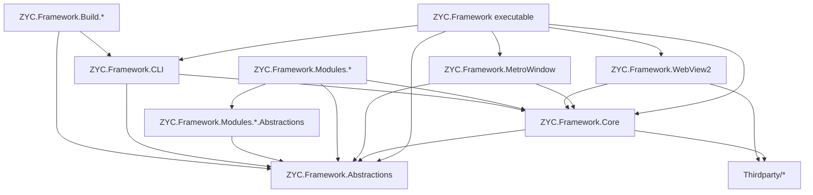
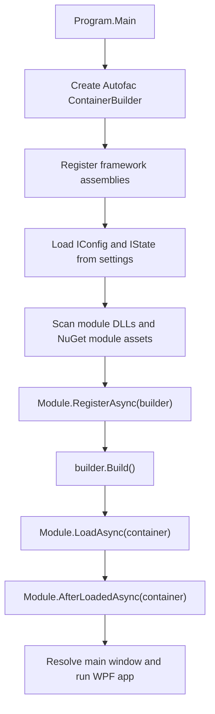
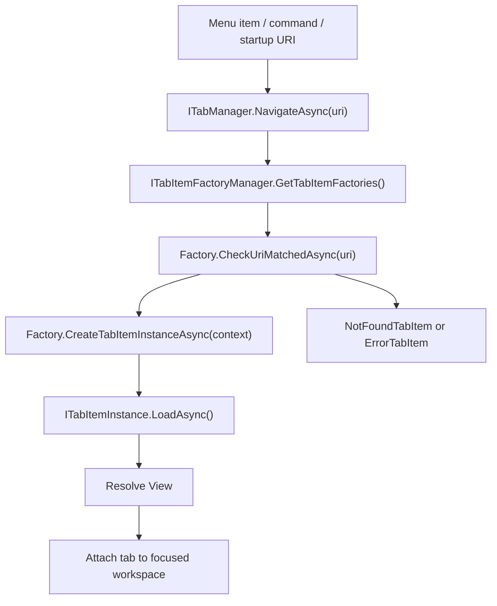

<p align="center">
  <a href="./architecture.md">English</a> |
  <a href="./architecture.ja.md">日本語</a> |
  <a href="./architecture.zh-CN.md">简体中文</a> |
  <a href="./architecture.zh-TW.md">繁體中文</a> |
  <a href="./architecture.ko.md">한국어</a> |
</p>


# Architecture

This document describes the current architecture of ZYC.Framework from the repository structure and runtime loading path. It focuses on the real extension points used by the application: modules, dependency injection, URI-based tabs, workspaces, configuration/state persistence, Aspire resources, and MCP exposure.

## Solution Shape

ZYC.Framework is a modular WPF desktop framework. The executable shell is intentionally small: it starts the application, builds the Autofac container, loads modules, and then hands UI composition to managers such as the main menu manager, tab manager, workspace manager, status bar manager, and notification managers.

| Area | Responsibility |
| --- | --- |
| `ZYC.Framework.Abstractions` | Public contracts, config/state types, module-facing DTOs, menu/tab/workspace interfaces, MCP attributes. |
| `ZYC.Framework.Core` | Shared WPF helpers, commands, base controls, dialogs, localization helpers, converters, and registration helpers. |
| `ZYC.Framework.MetroWindow` | Main window implementation and window-level services such as dialog hosting. |
| `ZYC.Framework.WebView2` | WebView2 host controls and browser integration infrastructure. |
| `ZYC.Framework` | Desktop executable shell, startup flow, workspace UI, tab UI, menu UI, notifications, quick bar, status bar, and app context implementation. |
| `ZYC.Framework.Modules.*.Abstractions` | Module-specific public contracts, config/state classes, constants, and command interfaces. These projects are the boundary other modules should reference. |
| `ZYC.Framework.Modules.*` | Module implementation projects. They register services, menu items, tab factories, status bar items, Aspire resources, or command-line options. |
| `ZYC.Framework.CLI` | Dotnet tool entrypoint. It owns `zyc new`, `zyc new-module`, and shares the module discovery/loading infrastructure used by the desktop host. |
| `ZYC.Framework.Build.*` | Build-time tools for docs, packaging, installer generation, project/module scaffolding wrappers, and product-version work. |
| `Thirdparty/*` | Vendored or forked dependencies that are built with the solution. |

## High-Level Dependency Graph



The important boundary is that `*.Abstractions` projects define public module contracts and should stay independent from WPF implementation details. Runtime modules can depend on WPF and framework UI infrastructure when they implement actual views, menu items, or tab items.

## Startup Flow

The desktop entrypoint is `src/ZYC.Framework/Program.cs`.

1. The process reads the startup URI, initializes JSON/settings behavior, enforces single-instance behavior outside Debug builds, and decides whether to redirect to a persisted startup version.
2. An Autofac `ContainerBuilder` is created.
3. Core framework assemblies are registered through `ModuleTools.RegisterAllFromAssembly(...)`: the executable assembly, `ZYC.Framework.Core`, `ZYC.Framework.WebView2`, `ZYC.Framework.MetroWindow`, and `ZYC.Framework.Abstractions`.
4. `RegisterAllFromAssembly(...)` registers Autofac services from the assembly and loads every discovered `IConfig` and `IState` implementation from the settings directory.
5. `ModuleTools.RegisterModules(...)` scans the executing folder for `ZYC.Framework.Modules*.dll`, adds assemblies listed in `ModuleConfig.AdditionalAssemblyNames`, skips disabled assemblies from `ModuleConfig.DisabledAssemblyNames`, handles pending file deletion, and can also load NuGet modules from `settings/nuget.module.assets.json`.
6. Each module instance runs `RegisterAsync(builder)` before the container is built.
7. After `builder.Build()`, enabled modules run `LoadAsync(container)` and then `AfterLoadedAsync(container)`.
8. The shell registers the built-in module-load tab factory, stores module load errors in `IModuleLoadInfoManager`, resolves the main window, and starts WPF.



## Module Model

A module is normally split into two projects:

| Project | Purpose |
| --- | --- |
| `ZYC.Framework.Modules.<Name>.Abstractions` | Public API, constants, config/state, commands, and DTOs. |
| `ZYC.Framework.Modules.<Name>` | Implementation: `Module.cs`, views, tab items, tab factories, menu items, managers, providers, and service registrations. |

The runtime module object is a `ModuleBase` subclass. The framework uses these phases:

| Phase | When it runs | Use it for |
| --- | --- | --- |
| `RegisterAsync(ContainerBuilder)` | Before Autofac builds the root container. | Register services that must participate in dependency resolution. |
| `LoadAsync(ILifetimeScope)` | After the container is built. | Register runtime extension points such as tab factories, menu items, status bar items, Aspire resources, and startup tasks. |
| `AfterLoadedAsync(ILifetimeScope)` | After all enabled modules have loaded. | Work that depends on other modules already being available. |

Module dependencies are inferred from assembly references to `ZYC.Framework.Modules.*.Abstractions.dll`. This gives the module manager a practical dependency view, but it is still convention-based discovery rather than a separate semantic module manifest.

## UI Composition

The shell is built from managers rather than hardcoded module UI.

| Surface | Primary contracts |
| --- | --- |
| Main menu and hamburger menu | `IMainMenuManager`, `IMainMenuItemsProvider`, `IMainMenuItem`, `IHamburgerMenuManager` |
| Tabs and navigation | `ITabManager`, `ITabItemFactoryManager`, `ITabItemFactory`, `ITabItemInstance` |
| Workspaces | `IParallelWorkspaceManager`, workspace state/config types, workspace menu managers |
| Quick bar | `IQuickBarManager`, quick bar item/provider contracts |
| Status bar | `IStatusBarManager`, `IStatusBarItemsProvider`, `IStatusBarItem` |
| Notifications | `IToastManager`, `IBannerManager`, toast/banner view infrastructure |
| Dialogs and overlays | `IDialogManager`, `IDialog`, `IOverlayManager` |

Modules usually add UI in `LoadAsync(...)`. For example, a module can register a tab factory and a Tools menu item:

```csharp
public override Task LoadAsync(ILifetimeScope lifetimeScope)
{
    lifetimeScope.RegisterTabItemFactory<MyTabItemFactory>();
    lifetimeScope.RegisterToolsMainMenuItem<MyMainMenuItem>();
    return Task.CompletedTask;
}
```

For simple WPF views, `SimpleTabItemFactoryInfo` is the shortest path. It creates a URI-backed tab, adds a menu entry under Extensions, and can add a quick bar item. For richer routing, modules implement `ITabItemFactory` directly.

## URI-Based Tab Navigation

Tab navigation is URI-driven. Commands and menu items call `ITabManager.NavigateAsync(...)`; the tab manager asks registered factories whether they can handle the URI; the best matching factory creates the tab instance.



Factories are sorted by descending priority. Singleton factories can reuse an existing tab when the target URI is already open. When no factory matches, the shell creates a not-found tab; when creation fails, it creates an error tab.

## Configuration and State

Configuration and state are discovered through marker interfaces:

| Kind | Interface | Typical use |
| --- | --- | --- |
| Config | `IConfig` | User-editable or module-editable settings. |
| State | `IState` | Runtime state that should survive process restarts, such as navigation or workspace state. |

`ModuleTools.RegisterAllFromAssembly(...)` loads these types from the settings directory during startup and registers the instances into Autofac. `IAppContext` exposes app-level paths and save operations such as `SaveAllConfig()` and `SaveAllState()`.

`ModuleConfig` is the central module loading config:

| Property | Meaning |
| --- | --- |
| `DisabledAssemblyNames` | Module DLLs that should be ignored. |
| `AdditionalAssemblyNames` | Extra DLLs to load from the app folder in addition to standard module DLLs. |

NuGet-installed modules use a separate startup artifact: `settings/nuget.module.assets.json`. When it exists, `ModuleTools.RegisterModules(...)` asks the runtime asset loader to load runtime assemblies for `net10.0-windows`.

## Hybrid UI and Aspire Integration

ZYC.Framework supports native WPF views and hybrid web content.

`ZYC.Framework.WebView2` owns reusable WebView2 host infrastructure. Modules such as WebBrowser and BlazorDemo build on this surface to embed web content or web-backed experiences.

`ZYC.Framework.Modules.Aspire` integrates .NET Aspire. `AspireService.Build(...)` creates a `DistributedApplicationBuilder`, configures it with the existing Autofac lifetime scope, applies `AspireConfig.Environment`, and resolves all `IExtensionResourcesProvider` implementations. Extension modules can plug child resources into the Aspire app without modifying the core Aspire module.

The `Translator` module is an example of this pattern: it resolves `ICommandlineResourcesProvider` and registers a command-line resource for `libretranslate`.

`ZYC.Framework.Modules.Accounts` is a provider-based account shell. It owns session initialization, `IAccountManager`, protected token storage, and the window-title account UI. Provider modules such as `ZYC.Framework.Modules.Accounts.GitHub` contribute `IAccountProvider` implementations and can register their own authentication tab factories, including WebView2-backed OAuth flows.

`ZYC.Framework.Modules.ChromeExtensions` keeps browser extension package management separate from the browser runtime. It downloads and unpacks Chrome Web Store packages, reads manifest metadata, and synchronizes the unpacked manifest key so WebView2 can use stable extension identities. `ZYC.Framework.Modules.WebBrowser` consumes the installed package list, updates `WebBrowserConfig.CustomBrowserArguments` with `--load-extension`, and uses the live `CoreWebView2BrowserExtension` data exposed by `ZYC.Framework.WebView2` for runtime plugin UI.

## MCP Exposure

The MCP server module exposes application capabilities through interface annotations.

Interfaces or methods marked with `[ExposeToMCP]` can be discovered by `MCPAutoToolDiscoveryExtensions.AddAutoDiscoveredTools(...)`. Methods marked with `[MCPIgnore]` are skipped. If a tool requires UI-thread execution, the MCP wrapper delegates the call through the UI dispatcher.

This means MCP is contract-driven:

1. Put stable capabilities on interfaces.
2. Mark the interface or method with `[ExposeToMCP]`.
3. Exclude internal or unsafe members with `[MCPIgnore]`.
4. Let the MCP server discover the loaded assemblies at runtime.

## Build and Template Flow

Documentation and scaffolding are separate from runtime modules.

| Tool | Responsibility |
| --- | --- |
| `ZYC.Framework.Build.Doc` | Renders `Templates/README/README.md` and `Templates/docs/*` into root `README*.md` and `docs/*`. |
| `ZYC.Framework.CLI` | Provides `zyc new` project templates and `zyc new-module` module scaffolding. |
| `ZYC.Framework.Build.NewModule` | Wrapper around `zyc new-module` for repository-local module generation. |
| `ZYC.Framework.Build.NuGet` | NuGet packaging and release notes. |
| `ZYC.Framework.Build.InnoSetup` | Installer build support. |

Project creation and module creation are intentionally different command surfaces:

| Command | Purpose |
| --- | --- |
| `zyc new <ProjectName>` | Creates an external host project from `minimal` or `modular` project templates. |
| `zyc new-module <ModuleName> --src-root <SourceRoot>` | Creates a module pair inside an existing source tree. |

## Adding a Module

A typical module addition follows this path:

1. Create `ZYC.Framework.Modules.<Name>.Abstractions` for public contracts, constants, config, state, and command interfaces.
2. Create `ZYC.Framework.Modules.<Name>` for the runtime implementation.
3. Add `Module.cs` with a `ModuleBase` subclass.
4. Use `RegisterAsync(...)` for DI registrations that must exist before the container is built.
5. Use `LoadAsync(...)` to register tab factories, menu items, status bar items, quick bar items, Aspire providers, or startup behavior.
6. Prefer manager APIs such as `RegisterTabItemFactory<T>()` and `RegisterToolsMainMenuItem<T>()` over directly manipulating shell views.
7. Keep public abstractions stable and additive when possible.

This keeps modules independently developed while still letting the host compose them through a shared shell and manager-based extension model.
