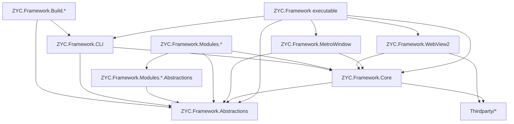
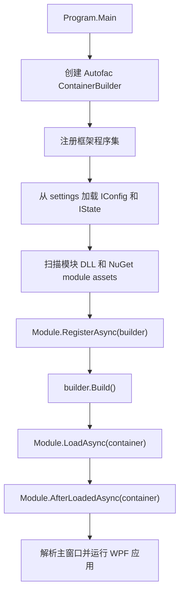
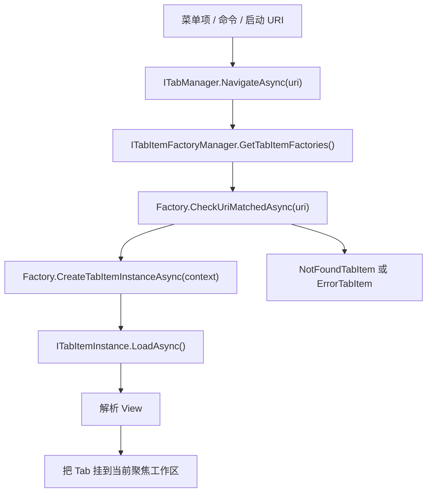

<p align="center">
  <a href="./architecture.md">English</a> |
  <a href="./architecture.ja.md">日本語</a> |
  <a href="./architecture.zh-CN.md">简体中文</a> |
  <a href="./architecture.zh-TW.md">繁體中文</a> |
  <a href="./architecture.ko.md">한국어</a> |
</p>


# 架构

本文档基于仓库结构和运行时加载路径，说明当前 ZYC.Framework 的架构。重点不是泛泛介绍 WPF，而是项目中真实使用的扩展点：模块、依赖注入、基于 URI 的 Tab、工作区、配置/状态持久化、Aspire 资源和 MCP 暴露。

## 解决方案结构

ZYC.Framework 是一个模块化 WPF 桌面框架。可执行 Shell 刻意保持较小：它负责启动应用、构建 Autofac 容器、加载模块，然后把 UI 组合交给主菜单、Tab、工作区、状态栏、通知等 Manager。

| 区域 | 职责 |
| --- | --- |
| `ZYC.Framework.Abstractions` | 公共契约、配置/状态类型、模块侧 DTO、菜单/Tab/工作区接口、MCP 属性。 |
| `ZYC.Framework.Core` | 通用 WPF 辅助能力、命令、基础控件、对话框、本地化辅助、转换器和注册辅助方法。 |
| `ZYC.Framework.MetroWindow` | 主窗口实现，以及对话框承载等窗口级服务。 |
| `ZYC.Framework.WebView2` | WebView2 宿主控件和浏览器集成基础设施。 |
| `ZYC.Framework` | 桌面可执行 Shell、启动流程、工作区 UI、Tab UI、菜单 UI、通知、QuickBar、状态栏和 AppContext 实现。 |
| `ZYC.Framework.Modules.*.Abstractions` | 模块专用的公共契约、配置/状态类、常量和命令接口。这些项目是其他模块应当引用的边界。 |
| `ZYC.Framework.Modules.*` | 模块实现项目。负责注册服务、菜单项、Tab Factory、状态栏项、Aspire 资源或命令行选项。 |
| `ZYC.Framework.CLI` | dotnet tool 入口。拥有 `zyc new`、`zyc new-module`，并与桌面 Host 共享模块发现/加载基础设施。 |
| `ZYC.Framework.Build.*` | 构建期工具，包括文档、打包、安装器生成、项目/模块脚手架包装器和产品版本处理。 |
| `Thirdparty/*` | 随解决方案一起构建的 vendored 或 forked 依赖。 |

## 高层依赖图



最重要的边界是：`*.Abstractions` 项目定义公开模块契约，并应保持与 WPF 实现细节解耦。运行时模块在实现真实 View、菜单项或 Tab 项时，可以依赖 WPF 和框架 UI 基础设施。

## 启动流程

桌面端入口是 `src/ZYC.Framework/Program.cs`。

1. 进程读取启动 URI，初始化 JSON/Settings 行为，在非 Debug 构建下启用单实例控制，并判断是否需要重定向到持久化的启动版本。
2. 创建 Autofac `ContainerBuilder`。
3. 通过 `ModuleTools.RegisterAllFromAssembly(...)` 注册核心框架程序集：可执行程序集、`ZYC.Framework.Core`、`ZYC.Framework.WebView2`、`ZYC.Framework.MetroWindow` 和 `ZYC.Framework.Abstractions`。
4. `RegisterAllFromAssembly(...)` 注册程序集中的 Autofac 服务，并从 settings 目录加载发现到的所有 `IConfig` 和 `IState` 实现。
5. `ModuleTools.RegisterModules(...)` 从执行目录扫描 `ZYC.Framework.Modules*.dll`，追加 `ModuleConfig.AdditionalAssemblyNames` 中列出的程序集，跳过 `ModuleConfig.DisabledAssemblyNames` 中禁用的程序集，处理待删除文件，并可从 `settings/nuget.module.assets.json` 加载 NuGet 模块。
6. 每个模块实例在容器构建前执行 `RegisterAsync(builder)`。
7. `builder.Build()` 之后，启用的模块依次执行 `LoadAsync(container)` 和 `AfterLoadedAsync(container)`。
8. Shell 注册内置的模块加载 Tab Factory，把模块加载错误写入 `IModuleLoadInfoManager`，解析主窗口，并启动 WPF。



## 模块模型

一个模块通常拆成两个项目：

| 项目 | 用途 |
| --- | --- |
| `ZYC.Framework.Modules.<Name>.Abstractions` | 公共 API、常量、配置/状态、命令和 DTO。 |
| `ZYC.Framework.Modules.<Name>` | 实现层：`Module.cs`、View、Tab Item、Tab Factory、菜单项、Manager、Provider 和服务注册。 |

运行时模块对象是 `ModuleBase` 的子类。框架使用以下阶段：

| 阶段 | 执行时机 | 用途 |
| --- | --- | --- |
| `RegisterAsync(ContainerBuilder)` | Autofac 根容器构建前。 | 注册必须参与依赖解析的服务。 |
| `LoadAsync(ILifetimeScope)` | 容器构建后。 | 注册运行时扩展点，例如 Tab Factory、菜单项、状态栏项、Aspire 资源和启动任务。 |
| `AfterLoadedAsync(ILifetimeScope)` | 所有启用模块加载完成后。 | 依赖其他模块已可用的工作。 |

模块依赖关系通过对 `ZYC.Framework.Modules.*.Abstractions.dll` 的程序集引用推断。这给模块管理器提供了实用的依赖视图，但它仍是基于约定的发现，并不是独立的语义化模块清单。

## UI 组合

Shell 由 Manager 组合，而不是硬编码模块 UI。

| 界面区域 | 主要契约 |
| --- | --- |
| 主菜单和 Hamburger 菜单 | `IMainMenuManager`, `IMainMenuItemsProvider`, `IMainMenuItem`, `IHamburgerMenuManager` |
| Tab 和导航 | `ITabManager`, `ITabItemFactoryManager`, `ITabItemFactory`, `ITabItemInstance` |
| 工作区 | `IParallelWorkspaceManager`, 工作区 state/config 类型, 工作区菜单 Manager |
| QuickBar | `IQuickBarManager`, QuickBar item/provider 契约 |
| 状态栏 | `IStatusBarManager`, `IStatusBarItemsProvider`, `IStatusBarItem` |
| 通知 | `IToastManager`, `IBannerManager`, Toast/Banner View 基础设施 |
| 对话框和 Overlay | `IDialogManager`, `IDialog`, `IOverlayManager` |

模块通常在 `LoadAsync(...)` 中添加 UI。例如，一个模块可以注册 Tab Factory 和 Tools 菜单项：

```csharp
public override Task LoadAsync(ILifetimeScope lifetimeScope)
{
    lifetimeScope.RegisterTabItemFactory<MyTabItemFactory>();
    lifetimeScope.RegisterToolsMainMenuItem<MyMainMenuItem>();
    return Task.CompletedTask;
}
```

对于简单 WPF View，`SimpleTabItemFactoryInfo` 是最短路径。它会创建一个 URI 驱动的 Tab，在 Extensions 下添加菜单入口，并可添加 QuickBar 项。更复杂的路由场景中，模块应直接实现 `ITabItemFactory`。

## 基于 URI 的 Tab 导航

Tab 导航由 URI 驱动。命令和菜单项调用 `ITabManager.NavigateAsync(...)`；TabManager 查询已注册的 Factory 是否能处理该 URI；最匹配的 Factory 创建 Tab 实例。



Factory 按 Priority 降序排列。Singleton Factory 在目标 URI 已经打开时可以复用已有 Tab。没有 Factory 匹配时，Shell 创建 not-found Tab；创建失败时，Shell 创建 error Tab。

## 配置和状态

配置和状态通过标记接口发现：

| 类型 | 接口 | 典型用途 |
| --- | --- | --- |
| Config | `IConfig` | 用户或模块可编辑的设置。 |
| State | `IState` | 进程重启后仍需保留的运行时状态，例如导航或工作区状态。 |

`ModuleTools.RegisterAllFromAssembly(...)` 在启动时从 settings 目录加载这些类型，并把实例注册到 Autofac。`IAppContext` 暴露应用级路径和保存操作，例如 `SaveAllConfig()` 与 `SaveAllState()`。

`ModuleConfig` 是核心模块加载配置：

| 属性 | 含义 |
| --- | --- |
| `DisabledAssemblyNames` | 应被忽略的模块 DLL。 |
| `AdditionalAssemblyNames` | 除标准模块 DLL 外，需要从 app 文件夹额外加载的 DLL。 |

NuGet 安装的模块使用单独的启动产物：`settings/nuget.module.assets.json`。当它存在时，`ModuleTools.RegisterModules(...)` 会让运行时资产加载器加载 `net10.0-windows` 对应的运行时程序集。

## 混合 UI 和 Aspire 集成

ZYC.Framework 支持原生 WPF View 和混合 Web 内容。

`ZYC.Framework.WebView2` 拥有可复用的 WebView2 Host 基础设施。WebBrowser、BlazorDemo 等模块基于这个能力嵌入 Web 内容或 Web 化体验。

`ZYC.Framework.Modules.Aspire` 集成 .NET Aspire。`AspireService.Build(...)` 创建 `DistributedApplicationBuilder`，使用现有 Autofac lifetime scope 配置它，应用 `AspireConfig.Environment`，并解析所有 `IExtensionResourcesProvider` 实现。扩展模块可以把子资源插入 Aspire app，而不需要修改核心 Aspire 模块。

`Translator` 模块是这个模式的一个例子：它解析 `ICommandlineResourcesProvider`，并为 `libretranslate` 注册命令行资源。

## MCP 暴露

MCP Server 模块通过接口注解暴露应用能力。

标记了 `[ExposeToMCP]` 的接口或方法可以被 `MCPAutoToolDiscoveryExtensions.AddAutoDiscoveredTools(...)` 发现。标记了 `[MCPIgnore]` 的方法会被跳过。如果工具需要在 UI 线程执行，MCP 包装器会通过 UI dispatcher 转发调用。

这意味着 MCP 是契约驱动的：

1. 把稳定能力放在接口上。
2. 给接口或方法添加 `[ExposeToMCP]`。
3. 用 `[MCPIgnore]` 排除内部或不适合暴露的成员。
4. 让 MCP Server 在运行时发现已加载程序集。

## 构建和模板流程

文档和脚手架与运行时模块分离。

| 工具 | 职责 |
| --- | --- |
| `ZYC.Framework.Build.Doc` | 将 `Templates/README/README.md` 和 `Templates/docs/*` 渲染到根目录 `README*.md` 和 `docs/*`。 |
| `ZYC.Framework.CLI` | 提供 `zyc new` 项目模板和 `zyc new-module` 模块脚手架。 |
| `ZYC.Framework.Build.NewModule` | 面向仓库内模块生成的 `zyc new-module` 包装器。 |
| `ZYC.Framework.Build.NuGet` | NuGet 打包和发布说明。 |
| `ZYC.Framework.Build.InnoSetup` | 安装器构建支持。 |

项目创建和模块创建是刻意分开的命令面：

| 命令 | 用途 |
| --- | --- |
| `zyc new <ProjectName>` | 从 `minimal` 或 `modular` 项目模板创建外部 Host 项目。 |
| `zyc new-module <ModuleName> --src-root <SourceRoot>` | 在已有源码树中创建模块项目对。 |

## 添加模块

典型模块添加流程如下：

1. 创建 `ZYC.Framework.Modules.<Name>.Abstractions`，放公共契约、常量、配置、状态和命令接口。
2. 创建 `ZYC.Framework.Modules.<Name>`，放运行时实现。
3. 添加包含 `ModuleBase` 子类的 `Module.cs`。
4. 必须在容器构建前参与 DI 的注册放在 `RegisterAsync(...)`。
5. Tab Factory、菜单项、状态栏项、QuickBar 项、Aspire Provider 或启动行为放在 `LoadAsync(...)` 注册。
6. 优先使用 `RegisterTabItemFactory<T>()`、`RegisterToolsMainMenuItem<T>()` 等 Manager API，而不是直接操作 Shell View。
7. 公开 Abstractions 尽量保持稳定，并优先采用追加式变更。

这样可以让模块独立开发，同时仍通过共享 Shell 和基于 Manager 的扩展模型组合进 Host。
