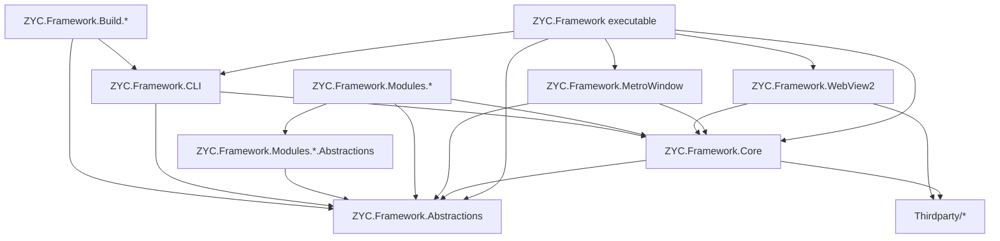
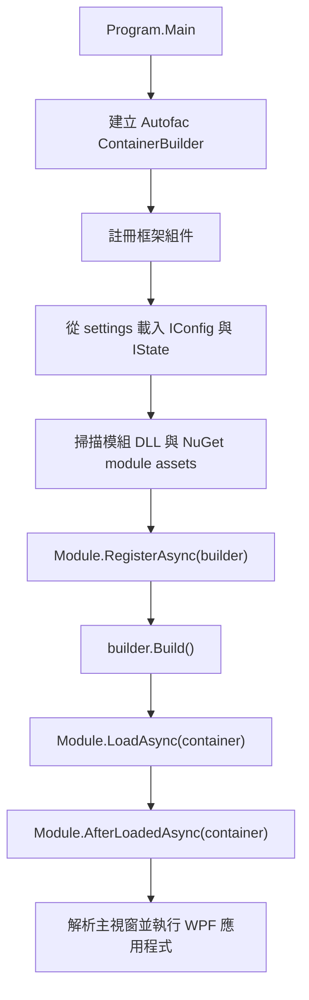
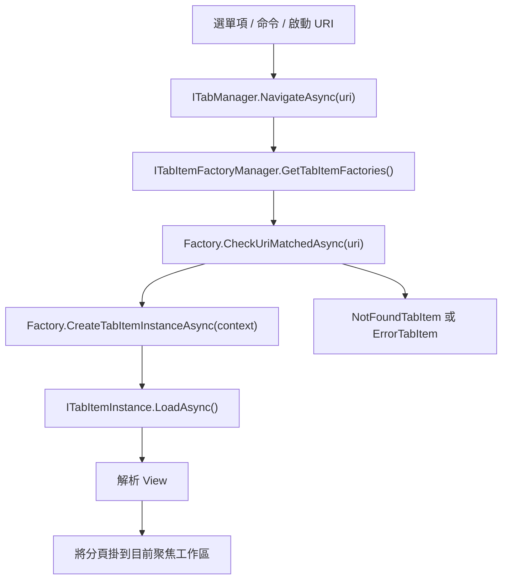

<p align="center">
  <a href="./architecture.md">English</a> |
  <a href="./architecture.ja.md">日本語</a> |
  <a href="./architecture.zh-CN.md">简体中文</a> |
  <a href="./architecture.zh-TW.md">繁體中文</a> |
  <a href="./architecture.ko.md">한국어</a> |
</p>


# 架構

本文件根據儲存庫結構與執行時載入路徑，說明目前 ZYC.Framework 的架構。重點不是泛泛介紹 WPF，而是專案中實際使用的擴充點：模組、相依性注入、基於 URI 的分頁、工作區、設定/狀態持久化、Aspire 資源與 MCP 暴露。

## 解決方案結構

ZYC.Framework 是一個模組化 WPF 桌面框架。可執行 Shell 刻意保持精簡：它負責啟動應用程式、建立 Autofac 容器、載入模組，然後將 UI 組合交給主選單、分頁、工作區、狀態列與通知等 Manager。

| 區域 | 職責 |
| --- | --- |
| `ZYC.Framework.Abstractions` | 公開契約、設定/狀態型別、模組側 DTO、選單/分頁/工作區介面、MCP 屬性。 |
| `ZYC.Framework.Core` | 通用 WPF 輔助能力、命令、基礎控制項、對話框、在地化輔助、轉換器與註冊輔助方法。 |
| `ZYC.Framework.MetroWindow` | 主視窗實作，以及對話框承載等視窗層級服務。 |
| `ZYC.Framework.WebView2` | WebView2 Host 控制項與瀏覽器整合基礎設施。 |
| `ZYC.Framework` | 桌面可執行 Shell、啟動流程、工作區 UI、分頁 UI、選單 UI、通知、QuickBar、狀態列與 AppContext 實作。 |
| `ZYC.Framework.Modules.*.Abstractions` | 模組專用的公開契約、設定/狀態類別、常數與命令介面。這些專案是其他模組應引用的邊界。 |
| `ZYC.Framework.Modules.*` | 模組實作專案。負責註冊服務、選單項、分頁 Factory、狀態列項、Aspire 資源或命令列選項。 |
| `ZYC.Framework.CLI` | dotnet tool 入口。擁有 `zyc new`、`zyc new-module`，並與桌面 Host 共用模組發現/載入基礎設施。 |
| `ZYC.Framework.Build.*` | 建置期工具，包含文件、打包、安裝程式產生、專案/模組鷹架包裝器與產品版本處理。 |
| `Thirdparty/*` | 隨解決方案一起建置的 vendored 或 forked 相依項。 |

## 高層相依圖



最重要的邊界是：`*.Abstractions` 專案定義公開模組契約，並應與 WPF 實作細節解耦。執行時模組在實作真實 View、選單項或分頁項時，可以依賴 WPF 與框架 UI 基礎設施。

## 啟動流程

桌面端入口是 `src/ZYC.Framework/Program.cs`。

1. 程序讀取啟動 URI，初始化 JSON/Settings 行為，在非 Debug 建置下啟用單一實例控制，並判斷是否需要重新導向至持久化的啟動版本。
2. 建立 Autofac `ContainerBuilder`。
3. 透過 `ModuleTools.RegisterAllFromAssembly(...)` 註冊核心框架組件：可執行組件、`ZYC.Framework.Core`、`ZYC.Framework.WebView2`、`ZYC.Framework.MetroWindow` 與 `ZYC.Framework.Abstractions`。
4. `RegisterAllFromAssembly(...)` 註冊組件中的 Autofac 服務，並從 settings 目錄載入發現到的所有 `IConfig` 與 `IState` 實作。
5. `ModuleTools.RegisterModules(...)` 從執行目錄掃描 `ZYC.Framework.Modules*.dll`，追加 `ModuleConfig.AdditionalAssemblyNames` 中列出的組件，略過 `ModuleConfig.DisabledAssemblyNames` 中停用的組件，處理待刪除檔案，並可從 `settings/nuget.module.assets.json` 載入 NuGet 模組。
6. 每個模組實例會在容器建立前執行 `RegisterAsync(builder)`。
7. `builder.Build()` 之後，啟用的模組依序執行 `LoadAsync(container)` 與 `AfterLoadedAsync(container)`。
8. Shell 註冊內建的模組載入分頁 Factory，將模組載入錯誤寫入 `IModuleLoadInfoManager`，解析主視窗，並啟動 WPF。



## 模組模型

一個模組通常拆成兩個專案：

| 專案 | 用途 |
| --- | --- |
| `ZYC.Framework.Modules.<Name>.Abstractions` | 公開 API、常數、設定/狀態、命令與 DTO。 |
| `ZYC.Framework.Modules.<Name>` | 實作層：`Module.cs`、View、分頁項、分頁 Factory、選單項、Manager、Provider 與服務註冊。 |

執行時模組物件是 `ModuleBase` 的子類別。框架使用以下階段：

| 階段 | 執行時機 | 用途 |
| --- | --- | --- |
| `RegisterAsync(ContainerBuilder)` | Autofac 根容器建立前。 | 註冊必須參與相依解析的服務。 |
| `LoadAsync(ILifetimeScope)` | 容器建立後。 | 註冊執行時擴充點，例如分頁 Factory、選單項、狀態列項、Aspire 資源與啟動工作。 |
| `AfterLoadedAsync(ILifetimeScope)` | 所有啟用模組載入完成後。 | 依賴其他模組已可用的工作。 |

模組相依關係是透過對 `ZYC.Framework.Modules.*.Abstractions.dll` 的組件參考推斷。這能提供模組管理器實用的相依視圖，但它仍是基於約定的發現，而不是獨立的語意化模組清單。

## UI 組合

Shell 由 Manager 組合，而不是硬編碼模組 UI。

| 介面區域 | 主要契約 |
| --- | --- |
| 主選單與 Hamburger 選單 | `IMainMenuManager`, `IMainMenuItemsProvider`, `IMainMenuItem`, `IHamburgerMenuManager` |
| 分頁與導覽 | `ITabManager`, `ITabItemFactoryManager`, `ITabItemFactory`, `ITabItemInstance` |
| 工作區 | `IParallelWorkspaceManager`, 工作區 state/config 型別, 工作區選單 Manager |
| QuickBar | `IQuickBarManager`, QuickBar item/provider 契約 |
| 狀態列 | `IStatusBarManager`, `IStatusBarItemsProvider`, `IStatusBarItem` |
| 通知 | `IToastManager`, `IBannerManager`, Toast/Banner View 基礎設施 |
| 對話框與 Overlay | `IDialogManager`, `IDialog`, `IOverlayManager` |

模組通常在 `LoadAsync(...)` 中加入 UI。例如，一個模組可以註冊分頁 Factory 與 Tools 選單項：

```csharp
public override Task LoadAsync(ILifetimeScope lifetimeScope)
{
    lifetimeScope.RegisterTabItemFactory<MyTabItemFactory>();
    lifetimeScope.RegisterToolsMainMenuItem<MyMainMenuItem>();
    return Task.CompletedTask;
}
```

對於簡單 WPF View，`SimpleTabItemFactoryInfo` 是最短路徑。它會建立一個 URI 驅動的分頁，在 Extensions 下加入選單入口，並可加入 QuickBar 項。更複雜的路由情境中，模組應直接實作 `ITabItemFactory`。

## 基於 URI 的分頁導覽

分頁導覽由 URI 驅動。命令與選單項呼叫 `ITabManager.NavigateAsync(...)`；TabManager 查詢已註冊的 Factory 是否能處理該 URI；最符合的 Factory 建立分頁實例。



Factory 依 Priority 遞減排序。Singleton Factory 在目標 URI 已開啟時可以重用既有分頁。沒有 Factory 符合時，Shell 會建立 not-found 分頁；建立失敗時，Shell 會建立 error 分頁。

## 設定與狀態

設定與狀態透過標記介面發現：

| 類型 | 介面 | 典型用途 |
| --- | --- | --- |
| Config | `IConfig` | 使用者或模組可編輯的設定。 |
| State | `IState` | 程序重啟後仍需保留的執行時狀態，例如導覽或工作區狀態。 |

`ModuleTools.RegisterAllFromAssembly(...)` 在啟動時從 settings 目錄載入這些型別，並將實例註冊到 Autofac。`IAppContext` 暴露應用層級路徑與保存操作，例如 `SaveAllConfig()` 與 `SaveAllState()`。

`ModuleConfig` 是核心模組載入設定：

| 屬性 | 含義 |
| --- | --- |
| `DisabledAssemblyNames` | 應被忽略的模組 DLL。 |
| `AdditionalAssemblyNames` | 除標準模組 DLL 外，需要從 app 資料夾額外載入的 DLL。 |

NuGet 安裝的模組使用獨立的啟動產物：`settings/nuget.module.assets.json`。當它存在時，`ModuleTools.RegisterModules(...)` 會讓執行時資產載入器載入 `net10.0-windows` 對應的執行時組件。

## 混合 UI 與 Aspire 整合

ZYC.Framework 支援原生 WPF View 與混合 Web 內容。

`ZYC.Framework.WebView2` 擁有可重用的 WebView2 Host 基礎設施。WebBrowser、BlazorDemo 等模組基於這個能力嵌入 Web 內容或 Web 化體驗。

`ZYC.Framework.Modules.Aspire` 整合 .NET Aspire。`AspireService.Build(...)` 建立 `DistributedApplicationBuilder`，使用現有 Autofac lifetime scope 進行配置，套用 `AspireConfig.Environment`，並解析所有 `IExtensionResourcesProvider` 實作。擴充模組可以將子資源插入 Aspire app，而不需要修改核心 Aspire 模組。

`Translator` 模組是這個模式的例子：它解析 `ICommandlineResourcesProvider`，並為 `libretranslate` 註冊命令列資源。

## MCP 暴露

MCP Server 模組透過介面註解暴露應用能力。

標記了 `[ExposeToMCP]` 的介面或方法可以被 `MCPAutoToolDiscoveryExtensions.AddAutoDiscoveredTools(...)` 發現。標記了 `[MCPIgnore]` 的方法會被略過。如果工具需要在 UI 執行緒執行，MCP 包裝器會透過 UI dispatcher 轉發呼叫。

這代表 MCP 是契約驅動的：

1. 將穩定能力放在介面上。
2. 對介面或方法加上 `[ExposeToMCP]`。
3. 用 `[MCPIgnore]` 排除內部或不適合暴露的成員。
4. 讓 MCP Server 在執行時發現已載入組件。

## 建置與範本流程

文件與鷹架和執行時模組是分離的。

| 工具 | 職責 |
| --- | --- |
| `ZYC.Framework.Build.Doc` | 將 `Templates/README/README.md` 與 `Templates/docs/*` 渲染到根目錄 `README*.md` 與 `docs/*`。 |
| `ZYC.Framework.CLI` | 提供 `zyc new` 專案範本與 `zyc new-module` 模組鷹架。 |
| `ZYC.Framework.Build.NewModule` | 面向儲存庫內模組生成的 `zyc new-module` 包裝器。 |
| `ZYC.Framework.Build.NuGet` | NuGet 打包與發布說明。 |
| `ZYC.Framework.Build.InnoSetup` | 安裝程式建置支援。 |

專案建立與模組建立是刻意分開的命令面：

| 命令 | 用途 |
| --- | --- |
| `zyc new <ProjectName>` | 從 `minimal` 或 `modular` 專案範本建立外部 Host 專案。 |
| `zyc new-module <ModuleName> --src-root <SourceRoot>` | 在既有原始碼樹中建立模組專案對。 |

## 新增模組

典型模組新增流程如下：

1. 建立 `ZYC.Framework.Modules.<Name>.Abstractions`，放公開契約、常數、設定、狀態與命令介面。
2. 建立 `ZYC.Framework.Modules.<Name>`，放執行時實作。
3. 新增包含 `ModuleBase` 子類別的 `Module.cs`。
4. 必須在容器建立前參與 DI 的註冊放在 `RegisterAsync(...)`。
5. 分頁 Factory、選單項、狀態列項、QuickBar 項、Aspire Provider 或啟動行為放在 `LoadAsync(...)` 註冊。
6. 優先使用 `RegisterTabItemFactory<T>()`、`RegisterToolsMainMenuItem<T>()` 等 Manager API，而不是直接操作 Shell View。
7. 公開 Abstractions 盡量保持穩定，並優先採用追加式變更。

這樣可以讓模組獨立開發，同時仍透過共享 Shell 與基於 Manager 的擴充模型組合進 Host。
