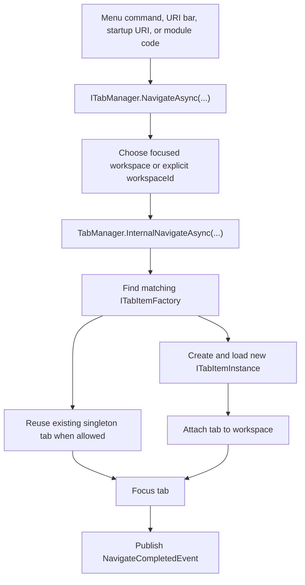

<p align="center">
  <a href="./navigation-workspace.md">English</a> |
  <a href="./navigation-workspace.ja.md">日本語</a> |
  <a href="./navigation-workspace.zh-CN.md">简体中文</a> |
  <a href="./navigation-workspace.zh-TW.md">繁體中文</a> |
  <a href="./navigation-workspace.ko.md">한국어</a> |
</p>


# ナビゲーションとワークスペース

ZYC.Framework は **何を開くか** と **どこに表示するか** を分離します。URI は対象コンテンツを表します。タブ ファクトリはその URI に対応するタブ インスタンスを作成します。ワークスペースは、そのインスタンスをどのタブ表示領域に載せるかを決めます。

## メンタルモデル

| 概念 | 実行時の役割 |
| --- | --- |
| URI | 機能、ファイル、ページ、ツールのアドレス。例: `zyc://...`、`file://...`、モジュール独自 scheme。 |
| `ITabItemFactory` | URI を処理できるか判定し、`ITabItemInstance` を作成する。 |
| `ITabItemInstance` | タブ ID、タイトル、アイコン、ビュー、ライフサイクル、クローズ動作を持つ。 |
| `ITabManager` | URI ナビゲーション、タブ作成、再利用、フォーカス、クローズ、リロード、移動、復元を調整する。 |
| `WorkspaceNode` | ワークスペース レイアウト ツリーの 1 ノード。リーフ ノードはナビゲーション状態を持つ。 |
| `IParallelWorkspaceManager` | ワークスペースの分割、結合、フォーカス、入れ替え、リセット、レイアウト適用を行う。 |

## ナビゲーション フロー



`NavigateAsync(Uri)` は現在フォーカスされているワークスペースへ移動します。`NavigateAsync(Guid workspaceId, Uri uri)` は特定のワークスペースを対象にします。

## URI ルーティングとファクトリ

ファクトリは通常 `Module.LoadAsync` から `ITabItemFactoryManager` に登録します。

```csharp
public override Task LoadAsync(ILifetimeScope lifetimeScope)
{
    lifetimeScope.RegisterTabItemFactory<ReportsTabItemFactory>();
    return Task.CompletedTask;
}
```

`TabItemFactoryBase` は `TabItemRouteAttribute` でルートを判定します。

```csharp
[RegisterSingleInstance]
[TabItemRoute(Host = ReportsModuleConstants.Host)]
internal class ReportsTabItemFactory : TabItemFactoryBase
{
    public override async Task<ITabItemInstance> CreateTabItemInstanceAsync(
        TabItemCreationContext context)
    {
        await Task.CompletedTask;
        return context.Resolve<ReportsTabItem>(
            new TypedParameter(
                typeof(TabReference),
                new TabReference(context.Uri)));
    }
}
```

重要な動作:

- ファクトリはマネージャーの順序で確認されます。
- `TabItemRouteAttribute` は `Scheme`、`Host`、`Path`、`PathMatch` を判定できます。
- `TabItemFactoryBase.IsSingle` の既定値は `true` です。
- シングルトン ファクトリが既に開いている URI に一致すると、既存タブを再利用します。
- 一致するファクトリがない場合、組み込みの Not Found タブを開きます。
- 作成またはロードで例外が発生した場合、組み込みの Error タブを開きます。

## ワークスペース選択

フォーカス中のワークスペースは `ParallelWorkspaceState.FocusedWorkspaceId` に保存されます。`IParallelWorkspaceManager.GetFocusedWorkspace()` は有効なリーフ ノードを解決し、保存された id が無効な場合は最初に見つかったリーフへフォールバックします。

UI は、ワークスペース メニュー ボタン、空のワークスペース領域、URI バー、タブ領域の操作でフォーカスを変更します。モジュール コードから明示的にワークスペースを指定することもできます。

```csharp
var workspace = parallelWorkspaceManager.GetFocusedWorkspace();
await tabManager.NavigateAsync(workspace.Id, ReportsModuleConstants.Uri);
```

コマンドが特定のワークスペースに結び付く場合は `workspaceId` 付きのオーバーロードを使います。ユーザーの現在フォーカスに従うべきコマンドでは、通常の `NavigateAsync(Uri)` を使います。

## ワークスペース レイアウト ツリー

ワークスペース レイアウトは `WorkspaceNode` のツリーです。

| プロパティ | 意味 |
| --- | --- |
| `Id` | 安定したワークスペース ノード ID。 |
| `Left` / `Right` | 子ノード。子を持たないノードがリーフ ワークスペースです。 |
| `IsHorizontal` | 子ノードの分割方向。 |
| `Ratio` | 子ノード間の分割比率。 |
| `IsSplitterLocked` | 分割線を表示したままドラッグを禁止する。 |
| `NavigationState` | ワークスペースごとのタブ URI、フォーカス URI、履歴。 |
| `IsNavigationBarVisible` | ワークスペース ナビゲーションバーの表示状態。 |

`ParallelWorkspaceView` はビジュアル ホストであり、`IParallelWorkspaceManager` の実装でもあります。各リーフ ワークスペースは `TabManagerView` を解決し、各 `TabManagerView` は自身の `WorkspaceNode` に属するタブ コレクションを表示します。

## 分割、結合、レイアウト操作

`IParallelWorkspaceManager` がレイアウト操作を持ちます。

| 操作 | 効果 |
| --- | --- |
| `SplitHorizontalAsync` | リーフを左右のワークスペースに分割する。 |
| `SplitVerticalAsync` | リーフを上下のワークスペースに分割する。 |
| `MergeAsync` | 可能な場合、ワークスペースを親構造へ結合する。 |
| `MergeAllAsync` | レイアウトを 1 つのワークスペースへ折りたたむ。 |
| `ToggleOrientationAsync` | 親分割の方向を切り替える。 |
| `SwapAsync` | ワークスペースを関連する兄弟位置と入れ替える。 |
| `ApplyLayoutAsync` | 保存済み `WorkspaceNode` ツリーからレイアウトを再構築する。 |

ワークスペースが削除されると、`ParallelWorkspaceView` はワークスペース ビューを切り離す前に `ITabManager.MoveAllTabItemInstances(...)` でタブをフォールバック先へ移動します。

## 状態復元

起動時の復元は、ワークスペースのビジュアル ツリーが準備された後に行われます。

1. `ParallelWorkspaceView` が root `WorkspaceView` を作成する。
2. 各リーフ ワークスペースが `TabManagerView` を解決する。
3. `TabManager.RestoreStateAsync()` が各リーフの `NavigationState` から保存済みタブ URI を再オープンする。
4. 可能であれば、以前フォーカスされていた URI をフォーカスする。
5. `TabManagerRestoreCompleted` を発行する。

Startup URI 処理は `TabManagerRestoreCompleted` を待つため、プロトコルやコマンドラインからのナビゲーションがタブ/ワークスペース復元と競合しません。

## ワークスペース間のタブ移動

タブ移動には 3 つの経路があります。

- `ITabManager.MoveTabItemInstance(instance, from, to)` は 1 つのタブを別ワークスペースへ移動します。
- `ITabManager.MoveTabItemInstance(source, target, position)` はタブを並べ替える、または対象タブに対する相対位置へ移動します。
- `ITabManager.MoveAllTabItemInstances(from, to)` はワークスペース削除時に全タブを移動します。

組み込みのタブ ヘッダー コンテキストメニューは、`IMoveWorkspaceTabItemHeaderContextMenuItemManager` で「移動先ワークスペース」を構築します。ドラッグ&ドロップは `IDropActionProvider` と `DropOrchestrator` を使い、組み込みの `TabManagerDropProvider` がタブ移動ペイロードを処理します。

## ワークスペース メニュー

ワークスペース メニューには 2 つの面があります。

| 面 | Manager | 補足 |
| --- | --- | --- |
| ワークスペース ナビゲーション ドロップダウン | `IWorkspaceMenuManager` | ワークスペース番号の近くにある有効な表示メニュー。組み込み項目は reset、split、merge、swap、orientation toggle、focus。 |
| ワークスペース コンテキストメニュー manager | `IWorkspaceContextMenuManager` | `Anchor` と `Priority` による再帰ソートを提供します。現在の空白領域コンテキストメニューに表示される前提にするには、先に表示面を接続してください。 |

表示中のワークスペース メニューへコマンドを出したい場合は `IWorkspaceMenuManager.RegisterItem<T>()` を使います。`IWorkspaceContextMenuManager` は、コンテキストメニュー面を拡張または接続する場合だけ使います。

## 実用ルール

- メニュー コマンドからビューを直接生成せず、URI でナビゲーションする。
- モジュールが所有する各 URI 面にはタブ ファクトリを登録する。
- 「フォーカス中ワークスペースで開く」動作には `NavigateAsync(Uri)` を使う。
- コマンドがワークスペース固有の場合は `NavigateAsync(Guid, Uri)` を使う。
- `WorkspaceNode.NavigationState` はそのワークスペースの永続タブ状態として扱う。
- 復元済みタブに依存する起動時ナビゲーションは `TabManagerRestoreCompleted` を待つ。
- タブ移動は UI コレクションを直接編集せず、`ITabManager` 経由で行う。
