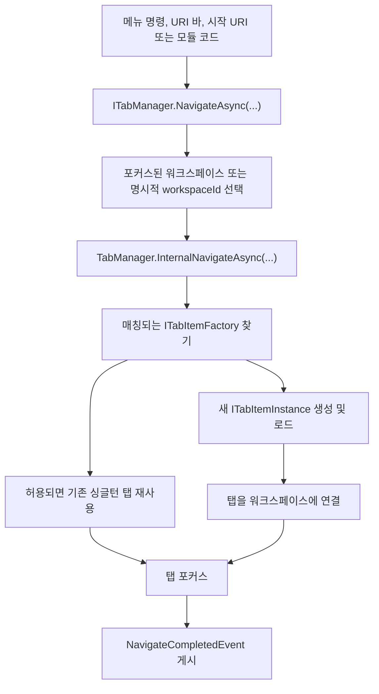

<p align="center">
  <a href="./navigation-workspace.md">English</a> |
  <a href="./navigation-workspace.ja.md">日本語</a> |
  <a href="./navigation-workspace.zh-CN.md">简体中文</a> |
  <a href="./navigation-workspace.zh-TW.md">繁體中文</a> |
  <a href="./navigation-workspace.ko.md">한국어</a> |
</p>


# 내비게이션과 워크스페이스

ZYC.Framework는 **무엇을 열지** 와 **어디에 표시할지** 를 분리합니다. URI는 대상 콘텐츠를 설명합니다. 탭 팩터리는 해당 URI의 탭 인스턴스를 만듭니다. 워크스페이스는 그 인스턴스가 어느 탭 표면에 들어갈지 결정합니다.

## 멘탈 모델

| 개념 | 런타임 역할 |
| --- | --- |
| URI | 기능, 파일, 페이지, 도구의 주소입니다. 예: `zyc://...`, `file://...`, 모듈 소유 scheme. |
| `ITabItemFactory` | URI를 처리할 수 있는지 확인하고 `ITabItemInstance`를 만듭니다. |
| `ITabItemInstance` | 탭 ID, 제목, 아이콘, 뷰, 라이프사이클, 닫기 동작을 가집니다. |
| `ITabManager` | URI 내비게이션, 탭 생성, 재사용, 포커스, 닫기, 리로드, 이동, 복원을 조정합니다. |
| `WorkspaceNode` | 워크스페이스 레이아웃 트리의 노드입니다. 리프 노드는 내비게이션 상태를 가집니다. |
| `IParallelWorkspaceManager` | 워크스페이스 분할, 병합, 포커스, 교환, 리셋, 레이아웃 적용을 담당합니다. |

## 내비게이션 흐름



`NavigateAsync(Uri)`는 현재 포커스된 워크스페이스로 이동합니다. `NavigateAsync(Guid workspaceId, Uri uri)`는 특정 워크스페이스를 대상으로 합니다.

## URI 라우팅과 팩터리

팩터리는 보통 `Module.LoadAsync`에서 `ITabItemFactoryManager`에 등록합니다.

```csharp
public override Task LoadAsync(ILifetimeScope lifetimeScope)
{
    lifetimeScope.RegisterTabItemFactory<ReportsTabItemFactory>();
    return Task.CompletedTask;
}
```

`TabItemFactoryBase`는 `TabItemRouteAttribute`로 라우트를 매칭합니다.

```csharp
[RegisterSingleInstance]
[TabItemRoute(Host = ReportsModuleConstants.Host)]
internal class ReportsTabItemFactory : TabItemFactoryBase
{
    public override async Task<ITabItemInstance> CreateTabItemInstanceAsync(
        TabItemCreationContext context)
    {
        await Task.CompletedTask;
        return context.Resolve<ReportsTabItem>(
            new TypedParameter(
                typeof(TabReference),
                new TabReference(context.Uri)));
    }
}
```

중요한 동작:

- 팩터리는 매니저 순서대로 검사됩니다.
- `TabItemRouteAttribute`는 `Scheme`, `Host`, `Path`, `PathMatch`를 매칭할 수 있습니다.
- `TabItemFactoryBase.IsSingle` 기본값은 `true`입니다.
- 싱글턴 팩터리가 이미 열린 URI와 매칭되면 기존 탭을 재사용합니다.
- 매칭되는 팩터리가 없으면 Host는 내장 Not Found 탭을 엽니다.
- 생성 또는 로딩 중 예외가 발생하면 Host는 내장 Error 탭을 엽니다.

## 워크스페이스 선택

현재 포커스된 워크스페이스는 `ParallelWorkspaceState.FocusedWorkspaceId`에 저장됩니다. `IParallelWorkspaceManager.GetFocusedWorkspace()`는 활성 리프 노드를 찾고, 저장된 id가 더 이상 유효하지 않으면 첫 번째 사용 가능한 리프로 대체합니다.

UI는 워크스페이스 메뉴 버튼, 빈 워크스페이스 표면, URI 바, 탭 표면 조작으로 포커스를 변경합니다. 모듈 코드도 워크스페이스를 명시적으로 지정할 수 있습니다.

```csharp
var workspace = parallelWorkspaceManager.GetFocusedWorkspace();
await tabManager.NavigateAsync(workspace.Id, ReportsModuleConstants.Uri);
```

명령이 특정 워크스페이스에 묶여 있으면 `workspaceId`가 있는 오버로드를 사용합니다. 사용자의 현재 포커스를 따라야 하는 명령은 일반 `NavigateAsync(Uri)`를 사용합니다.

## 워크스페이스 레이아웃 트리

워크스페이스 레이아웃은 `WorkspaceNode` 트리입니다.

| 속성 | 의미 |
| --- | --- |
| `Id` | 안정적인 워크스페이스 노드 ID. |
| `Left` / `Right` | 자식 노드. 자식이 없는 노드가 리프 워크스페이스입니다. |
| `IsHorizontal` | 자식 노드의 분할 방향. |
| `Ratio` | 자식 노드 사이의 분할 비율. |
| `IsSplitterLocked` | 분할선을 보이게 유지하면서 드래그를 막습니다. |
| `NavigationState` | 워크스페이스별 탭 URI, 포커스 URI, 히스토리. |
| `IsNavigationBarVisible` | 워크스페이스 내비게이션 바 표시 여부. |

`ParallelWorkspaceView`는 시각적 host이면서 `IParallelWorkspaceManager` 구현입니다. 각 리프 워크스페이스는 `TabManagerView`를 resolve하고, 각 `TabManagerView`는 자신의 `WorkspaceNode`에 속한 탭 컬렉션을 표시합니다.

## 분할, 병합, 레이아웃 작업

`IParallelWorkspaceManager`가 레이아웃 작업을 담당합니다.

| 작업 | 효과 |
| --- | --- |
| `SplitHorizontalAsync` | 리프를 좌우 워크스페이스로 분할합니다. |
| `SplitVerticalAsync` | 리프를 상하 워크스페이스로 분할합니다. |
| `MergeAsync` | 가능하면 워크스페이스를 부모 구조로 병합합니다. |
| `MergeAllAsync` | 레이아웃을 하나의 워크스페이스로 접습니다. |
| `ToggleOrientationAsync` | 부모 분할 방향을 토글합니다. |
| `SwapAsync` | 워크스페이스를 관련 형제 위치와 교환합니다. |
| `ApplyLayoutAsync` | 저장된 `WorkspaceNode` 트리에서 레이아웃을 다시 만듭니다. |

워크스페이스가 제거되면 `ParallelWorkspaceView`는 워크스페이스 뷰를 분리하기 전에 `ITabManager.MoveAllTabItemInstances(...)`로 탭을 대체 워크스페이스로 이동합니다.

## 상태 복원

시작 복원은 워크스페이스 시각 트리가 준비된 뒤 실행됩니다.

1. `ParallelWorkspaceView`가 root `WorkspaceView`를 만듭니다.
2. 각 리프 워크스페이스가 `TabManagerView`를 resolve합니다.
3. `TabManager.RestoreStateAsync()`가 각 리프 `NavigationState`에서 저장된 탭 URI를 다시 엽니다.
4. 가능하면 이전에 포커스된 URI를 포커스합니다.
5. `TabManagerRestoreCompleted`를 게시합니다.

시작 URI 처리는 `TabManagerRestoreCompleted`를 기다리므로 프로토콜 또는 명령줄 내비게이션이 탭/워크스페이스 복원과 경쟁하지 않습니다.

## 워크스페이스 간 탭 이동

탭은 세 가지 방식으로 이동할 수 있습니다.

- `ITabManager.MoveTabItemInstance(instance, from, to)`는 하나의 탭을 다른 워크스페이스로 이동합니다.
- `ITabManager.MoveTabItemInstance(source, target, position)`은 탭을 재정렬하거나 대상 탭 기준 위치로 이동합니다.
- `ITabManager.MoveAllTabItemInstances(from, to)`는 워크스페이스가 제거될 때 모든 탭을 이동합니다.

내장 탭 헤더 컨텍스트 메뉴는 `IMoveWorkspaceTabItemHeaderContextMenuItemManager`로 "이동할 워크스페이스" 대상을 만듭니다. 드래그 앤 드롭은 `IDropActionProvider`와 `DropOrchestrator`를 사용하며, 내장 `TabManagerDropProvider`가 탭 이동 payload를 처리합니다.

## 워크스페이스 메뉴

워크스페이스 메뉴에는 두 표면이 있습니다.

| 표면 | Manager | 설명 |
| --- | --- | --- |
| 워크스페이스 내비게이션 드롭다운 | `IWorkspaceMenuManager` | 워크스페이스 번호 근처의 현재 표시 메뉴입니다. 내장 항목에는 reset, split, merge, swap, orientation toggle, focus가 있습니다. |
| 워크스페이스 컨텍스트 메뉴 manager | `IWorkspaceContextMenuManager` | `Anchor`와 `Priority`에 따른 재귀 정렬을 제공합니다. 현재 빈 영역 컨텍스트 메뉴에 항목이 보인다고 가정하려면 먼저 뷰 표면을 연결해야 합니다. |

표시되는 워크스페이스 메뉴에 명령을 넣으려면 `IWorkspaceMenuManager.RegisterItem<T>()`를 사용합니다. `IWorkspaceContextMenuManager`는 컨텍스트 메뉴 표면을 확장하거나 연결할 때만 사용합니다.

## 실무 규칙

- 메뉴 명령에서 뷰를 직접 인스턴스화하지 말고 URI로 이동합니다.
- 모듈이 소유한 각 URI 표면에는 탭 팩터리를 등록합니다.
- "포커스된 워크스페이스에서 열기" 동작에는 `NavigateAsync(Uri)`를 사용합니다.
- 명령이 워크스페이스에 명확히 연결되어 있으면 `NavigateAsync(Guid, Uri)`를 사용합니다.
- `WorkspaceNode.NavigationState`를 해당 워크스페이스의 지속 탭 상태로 취급합니다.
- 복원된 탭에 의존하는 시작 내비게이션은 `TabManagerRestoreCompleted`를 기다립니다.
- 탭 이동은 UI 컬렉션을 직접 수정하지 말고 `ITabManager`를 통해 수행합니다.
