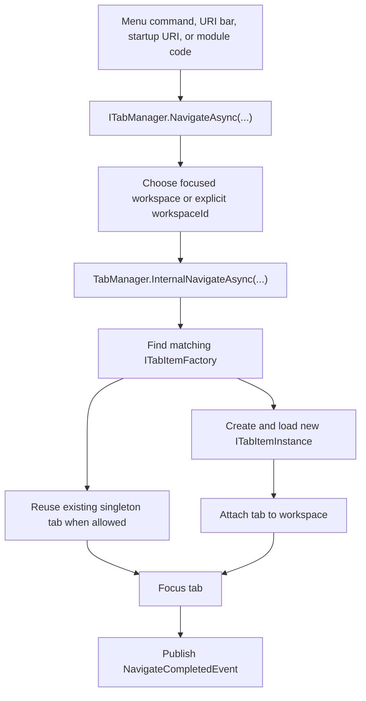

<p align="center">
  <a href="./navigation-workspace.md">English</a> |
  <a href="./navigation-workspace.ja.md">日本語</a> |
  <a href="./navigation-workspace.zh-CN.md">简体中文</a> |
  <a href="./navigation-workspace.zh-TW.md">繁體中文</a> |
  <a href="./navigation-workspace.ko.md">한국어</a> |
</p>


# Navigation and Workspace

ZYC.Framework separates **what to open** from **where to show it**. A URI describes the target content. A tab factory creates the tab instance for that URI. A workspace decides which tab surface receives the instance.

## Mental Model

| Concept | Runtime role |
| --- | --- |
| URI | The address of a feature, file, page, or tool. Examples include `zyc://...`, `file://...`, and module-owned schemes. |
| `ITabItemFactory` | Checks whether it can handle a URI and creates an `ITabItemInstance`. |
| `ITabItemInstance` | Owns tab identity, title, icon, view, lifecycle, and close behavior. |
| `ITabManager` | Coordinates URI navigation, tab creation, reuse, focus, close, reload, move, and restore. |
| `WorkspaceNode` | Represents one node in the workspace layout tree. Leaf nodes contain navigation state. |
| `IParallelWorkspaceManager` | Splits, merges, focuses, swaps, resets, and applies workspace layouts. |

## Navigation Flow



`NavigateAsync(Uri)` navigates in the currently focused workspace. `NavigateAsync(Guid workspaceId, Uri uri)` targets a specific workspace.

## URI Routing and Factories

Factories are registered through `ITabItemFactoryManager`, usually from `Module.LoadAsync`:

```csharp
public override Task LoadAsync(ILifetimeScope lifetimeScope)
{
    lifetimeScope.RegisterTabItemFactory<ReportsTabItemFactory>();
    return Task.CompletedTask;
}
```

`TabItemFactoryBase` uses `TabItemRouteAttribute` for route matching:

```csharp
[RegisterSingleInstance]
[TabItemRoute(Host = ReportsModuleConstants.Host)]
internal class ReportsTabItemFactory : TabItemFactoryBase
{
    public override async Task<ITabItemInstance> CreateTabItemInstanceAsync(
        TabItemCreationContext context)
    {
        await Task.CompletedTask;
        return context.Resolve<ReportsTabItem>(
            new TypedParameter(
                typeof(TabReference),
                new TabReference(context.Uri)));
    }
}
```

Important behavior:

- Factories are checked in manager order.
- `TabItemRouteAttribute` can match `Scheme`, `Host`, `Path`, and `PathMatch`.
- `TabItemFactoryBase.IsSingle` defaults to `true`.
- If a singleton factory matches a URI that is already open, the existing tab is reused.
- If no factory matches, the host opens the built-in Not Found tab.
- If creation or loading throws, the host opens the built-in Error tab.

## Workspace Selection

The focused workspace is stored in `ParallelWorkspaceState.FocusedWorkspaceId`. `IParallelWorkspaceManager.GetFocusedWorkspace()` resolves the active leaf node and falls back to the first available leaf if the stored id is no longer valid.

The UI changes focus when a workspace menu button, empty workspace surface, URI bar, or tab surface is interacted with. Module code can also target a workspace explicitly:

```csharp
var workspace = parallelWorkspaceManager.GetFocusedWorkspace();
await tabManager.NavigateAsync(workspace.Id, ReportsModuleConstants.Uri);
```

Use the overload with `workspaceId` when a command is clearly tied to a specific workspace. Use the plain `NavigateAsync(Uri)` overload when the command should follow the user's current focus.

## Workspace Layout Tree

The workspace layout is a tree of `WorkspaceNode` objects:

| Property | Meaning |
| --- | --- |
| `Id` | Stable workspace node identity. |
| `Left` / `Right` | Child nodes. A node with no children is a leaf workspace. |
| `IsHorizontal` | Split orientation for child nodes. |
| `Ratio` | Split ratio between child nodes. |
| `IsSplitterLocked` | Prevents splitter dragging while keeping the split visible. |
| `NavigationState` | Per-workspace tab URIs, focus URI, and history. |
| `IsNavigationBarVisible` | Controls whether the workspace navigation bar is visible. |

`ParallelWorkspaceView` is both the visual host and the `IParallelWorkspaceManager` implementation. Each leaf workspace resolves a `TabManagerView`, and each `TabManagerView` displays the tab collection for its `WorkspaceNode`.

## Split, Merge, and Layout Operations

`IParallelWorkspaceManager` owns layout operations:

| Operation | Effect |
| --- | --- |
| `SplitHorizontalAsync` | Splits a leaf into side-by-side workspaces. |
| `SplitVerticalAsync` | Splits a leaf into stacked workspaces. |
| `MergeAsync` | Merges a workspace back into its parent structure when possible. |
| `MergeAllAsync` | Collapses the layout to one workspace. |
| `ToggleOrientationAsync` | Toggles a parent split orientation. |
| `SwapAsync` | Swaps a workspace with the related sibling position. |
| `ApplyLayoutAsync` | Rebuilds the layout from a saved `WorkspaceNode` tree. |

When a workspace is removed, `ParallelWorkspaceView` moves its tabs to a fallback workspace through `ITabManager.MoveAllTabItemInstances(...)` before detaching the workspace view.

## State Restore

Startup restore happens after the workspace visual tree is ready:

1. `ParallelWorkspaceView` creates the root `WorkspaceView`.
2. Each leaf workspace resolves a `TabManagerView`.
3. `TabManager.RestoreStateAsync()` reopens saved tab URIs from every leaf `NavigationState`.
4. The previously focused URI is focused when possible.
5. `TabManagerRestoreCompleted` is published.

Startup URI handling waits for `TabManagerRestoreCompleted`, so protocol or command-line navigation does not race against tab/workspace restoration.

## Moving Tabs Between Workspaces

Tabs can move in three ways:

- `ITabManager.MoveTabItemInstance(instance, from, to)` moves one tab to another workspace.
- `ITabManager.MoveTabItemInstance(source, target, position)` reorders tabs or moves them relative to a target tab.
- `ITabManager.MoveAllTabItemInstances(from, to)` moves all tabs when a workspace is removed.

The built-in tab header context menu uses `IMoveWorkspaceTabItemHeaderContextMenuItemManager` to build the "move to workspace" targets. Drag/drop uses `IDropActionProvider` and `DropOrchestrator`; the built-in `TabManagerDropProvider` handles tab movement payloads.

## Workspace Menus

There are two workspace menu surfaces:

| Surface | Manager | Notes |
| --- | --- | --- |
| Workspace navigation drop-down | `IWorkspaceMenuManager` | Active visible menu near the workspace index. Built-in items include reset, split, merge, swap, orientation toggle, and focus. |
| Workspace context menu manager | `IWorkspaceContextMenuManager` | Provides recursive sorting by `Anchor` and `Priority`. Wire a view surface before assuming items appear in the current blank-area context menu. |

Use `IWorkspaceMenuManager.RegisterItem<T>()` for commands that should appear in the visible workspace menu. Use `IWorkspaceContextMenuManager` only when you are extending or wiring a context-menu surface.

## Practical Rules

- Navigate by URI; do not instantiate views directly from menu commands.
- Register a tab factory for every URI surface a module owns.
- Use `NavigateAsync(Uri)` for "open in focused workspace" behavior.
- Use `NavigateAsync(Guid, Uri)` when the command is workspace-specific.
- Treat `WorkspaceNode.NavigationState` as the persisted tab state for that workspace.
- Wait for `TabManagerRestoreCompleted` before running startup navigation that depends on restored tabs.
- Move tabs through `ITabManager`, not by editing UI collections.
