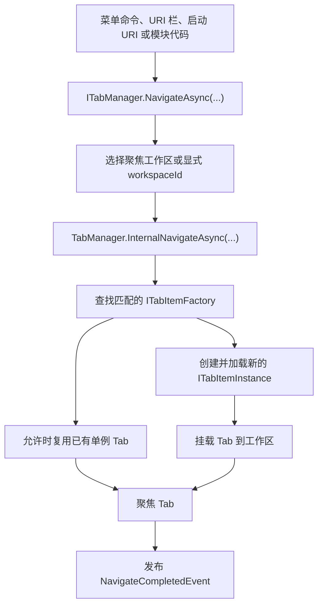

<p align="center">
  <a href="./navigation-workspace.md">English</a> |
  <a href="./navigation-workspace.ja.md">日本語</a> |
  <a href="./navigation-workspace.zh-CN.md">简体中文</a> |
  <a href="./navigation-workspace.zh-TW.md">繁體中文</a> |
  <a href="./navigation-workspace.ko.md">한국어</a> |
</p>


# 导航与工作区

ZYC.Framework 将 **打开什么** 和 **显示在哪里** 分开处理。URI 描述目标内容。Tab 工厂为该 URI 创建 Tab 实例。Workspace 决定这个实例进入哪个 Tab 显示区域。

## 心智模型

| 概念 | 运行时角色 |
| --- | --- |
| URI | 功能、文件、页面或工具的地址。例如 `zyc://...`、`file://...` 和模块自有 scheme。 |
| `ITabItemFactory` | 判断自己能否处理某个 URI，并创建 `ITabItemInstance`。 |
| `ITabItemInstance` | 拥有 Tab 标识、标题、图标、View、生命周期和关闭行为。 |
| `ITabManager` | 协调 URI 导航、Tab 创建、复用、聚焦、关闭、重载、移动和恢复。 |
| `WorkspaceNode` | 工作区布局树中的一个节点。叶子节点持有导航状态。 |
| `IParallelWorkspaceManager` | 负责工作区拆分、合并、聚焦、交换、重置和应用布局。 |

## 导航流程



`NavigateAsync(Uri)` 会导航到当前聚焦工作区。`NavigateAsync(Guid workspaceId, Uri uri)` 会导航到指定工作区。

## URI 路由与工厂

工厂通过 `ITabItemFactoryManager` 注册，通常在 `Module.LoadAsync` 中完成：

```csharp
public override Task LoadAsync(ILifetimeScope lifetimeScope)
{
    lifetimeScope.RegisterTabItemFactory<ReportsTabItemFactory>();
    return Task.CompletedTask;
}
```

`TabItemFactoryBase` 使用 `TabItemRouteAttribute` 做路由匹配：

```csharp
[RegisterSingleInstance]
[TabItemRoute(Host = ReportsModuleConstants.Host)]
internal class ReportsTabItemFactory : TabItemFactoryBase
{
    public override async Task<ITabItemInstance> CreateTabItemInstanceAsync(
        TabItemCreationContext context)
    {
        await Task.CompletedTask;
        return context.Resolve<ReportsTabItem>(
            new TypedParameter(
                typeof(TabReference),
                new TabReference(context.Uri)));
    }
}
```

关键行为：

- 工厂按 Manager 返回顺序检查。
- `TabItemRouteAttribute` 可以匹配 `Scheme`、`Host`、`Path` 和 `PathMatch`。
- `TabItemFactoryBase.IsSingle` 默认是 `true`。
- 如果单例工厂匹配到一个已经打开的 URI，会复用已有 Tab。
- 如果没有工厂匹配，Host 会打开内置 Not Found Tab。
- 如果创建或加载时抛出异常，Host 会打开内置 Error Tab。

## 工作区选择

当前聚焦工作区保存在 `ParallelWorkspaceState.FocusedWorkspaceId`。`IParallelWorkspaceManager.GetFocusedWorkspace()` 会解析当前有效叶子节点；如果保存的 id 已经失效，会回退到第一个可用叶子节点。

当用户操作工作区菜单按钮、空工作区区域、URI 栏或 Tab 区域时，UI 会切换聚焦工作区。模块代码也可以显式指定工作区：

```csharp
var workspace = parallelWorkspaceManager.GetFocusedWorkspace();
await tabManager.NavigateAsync(workspace.Id, ReportsModuleConstants.Uri);
```

当命令明确绑定到某个工作区时，使用带 `workspaceId` 的重载。当命令应该跟随用户当前焦点时，使用普通的 `NavigateAsync(Uri)`。

## 工作区布局树

工作区布局是一棵 `WorkspaceNode` 树：

| 属性 | 含义 |
| --- | --- |
| `Id` | 稳定的工作区节点标识。 |
| `Left` / `Right` | 子节点。没有子节点的节点就是叶子工作区。 |
| `IsHorizontal` | 子节点拆分方向。 |
| `Ratio` | 子节点之间的拆分比例。 |
| `IsSplitterLocked` | 禁止拖动分隔条，但仍保持分隔可见。 |
| `NavigationState` | 每个工作区自己的 Tab URI、焦点 URI 和历史记录。 |
| `IsNavigationBarVisible` | 控制工作区导航栏是否可见。 |

`ParallelWorkspaceView` 既是可视化宿主，也是 `IParallelWorkspaceManager` 的实现。每个叶子工作区都会解析一个 `TabManagerView`，每个 `TabManagerView` 显示自己 `WorkspaceNode` 下的 Tab 集合。

## 拆分、合并与布局操作

`IParallelWorkspaceManager` 拥有布局操作：

| 操作 | 效果 |
| --- | --- |
| `SplitHorizontalAsync` | 将叶子拆成左右两个工作区。 |
| `SplitVerticalAsync` | 将叶子拆成上下两个工作区。 |
| `MergeAsync` | 在可行时把工作区合并回父结构。 |
| `MergeAllAsync` | 将布局折叠为单一工作区。 |
| `ToggleOrientationAsync` | 切换父拆分方向。 |
| `SwapAsync` | 与相关兄弟位置交换。 |
| `ApplyLayoutAsync` | 从保存的 `WorkspaceNode` 树重建布局。 |

当工作区被移除时，`ParallelWorkspaceView` 会先通过 `ITabManager.MoveAllTabItemInstances(...)` 把它的 Tab 移到兜底工作区，然后再分离工作区视图。

## 状态恢复

启动恢复发生在工作区可视化树准备完成之后：

1. `ParallelWorkspaceView` 创建根 `WorkspaceView`。
2. 每个叶子工作区解析一个 `TabManagerView`。
3. `TabManager.RestoreStateAsync()` 从每个叶子 `NavigationState` 中重新打开已保存的 Tab URI。
4. 如果可能，恢复之前聚焦的 URI。
5. 发布 `TabManagerRestoreCompleted`。

启动 URI 处理会等待 `TabManagerRestoreCompleted`，因此协议或命令行导航不会和 Tab/工作区恢复发生竞态。

## 在工作区之间移动 Tab

Tab 有三种移动方式：

- `ITabManager.MoveTabItemInstance(instance, from, to)` 把一个 Tab 移到另一个工作区。
- `ITabManager.MoveTabItemInstance(source, target, position)` 重排 Tab，或把它移动到目标 Tab 的相对位置。
- `ITabManager.MoveAllTabItemInstances(from, to)` 在工作区被移除时移动所有 Tab。

内置 Tab 头部右键菜单通过 `IMoveWorkspaceTabItemHeaderContextMenuItemManager` 构建“移动到工作区”的目标。拖放使用 `IDropActionProvider` 和 `DropOrchestrator`；内置 `TabManagerDropProvider` 处理 Tab 移动负载。

## 工作区菜单

工作区菜单有两个表面：

| 表面 | Manager | 说明 |
| --- | --- | --- |
| 工作区导航下拉菜单 | `IWorkspaceMenuManager` | 工作区编号附近的当前可见菜单。内置项包括 reset、split、merge、swap、orientation toggle 和 focus。 |
| 工作区上下文菜单 Manager | `IWorkspaceContextMenuManager` | 提供按 `Anchor` 和 `Priority` 的递归排序。不要假设它的项会出现在当前空白区域右键菜单中，除非已经接入对应 View 表面。 |

要把命令放进可见的工作区菜单，请使用 `IWorkspaceMenuManager.RegisterItem<T>()`。只有在扩展或接线工作区上下文菜单表面时，才使用 `IWorkspaceContextMenuManager`。

## 实用规则

- 通过 URI 导航，不要从菜单命令直接实例化 View。
- 模块拥有的每个 URI 表面都应注册 Tab 工厂。
- “在当前聚焦工作区打开”使用 `NavigateAsync(Uri)`。
- 命令明确绑定工作区时使用 `NavigateAsync(Guid, Uri)`。
- 将 `WorkspaceNode.NavigationState` 视为该工作区的持久化 Tab 状态。
- 依赖已恢复 Tab 的启动导航要等待 `TabManagerRestoreCompleted`。
- 移动 Tab 通过 `ITabManager`，不要直接编辑 UI 集合。
