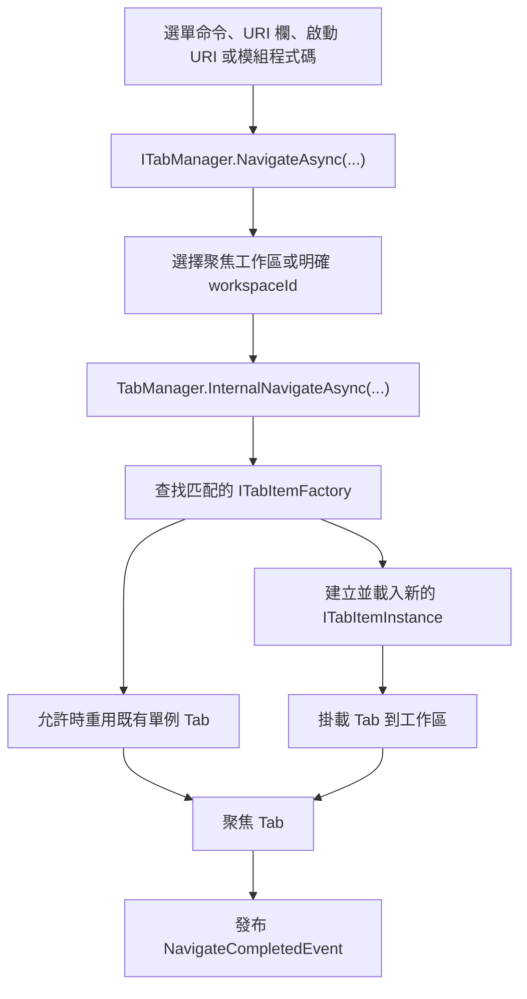

<p align="center">
  <a href="./navigation-workspace.md">English</a> |
  <a href="./navigation-workspace.ja.md">日本語</a> |
  <a href="./navigation-workspace.zh-CN.md">简体中文</a> |
  <a href="./navigation-workspace.zh-TW.md">繁體中文</a> |
  <a href="./navigation-workspace.ko.md">한국어</a> |
</p>


# 導覽與工作區

ZYC.Framework 將 **開啟什麼** 和 **顯示在哪裡** 分開處理。URI 描述目標內容。Tab factory 為該 URI 建立 Tab 實例。Workspace 決定這個實例進入哪個 Tab 顯示區域。

## 心智模型

| 概念 | 執行階段角色 |
| --- | --- |
| URI | 功能、檔案、頁面或工具的位址。例如 `zyc://...`、`file://...` 和模組自有 scheme。 |
| `ITabItemFactory` | 判斷自己能否處理某個 URI，並建立 `ITabItemInstance`。 |
| `ITabItemInstance` | 擁有 Tab 識別、標題、圖示、View、生命週期與關閉行為。 |
| `ITabManager` | 協調 URI 導覽、Tab 建立、重用、聚焦、關閉、重載、移動與恢復。 |
| `WorkspaceNode` | 工作區布局樹中的一個節點。葉節點持有導覽狀態。 |
| `IParallelWorkspaceManager` | 負責工作區拆分、合併、聚焦、交換、重置與套用布局。 |

## 導覽流程



`NavigateAsync(Uri)` 會導覽到目前聚焦工作區。`NavigateAsync(Guid workspaceId, Uri uri)` 會導覽到指定工作區。

## URI 路由與 factory

Factory 透過 `ITabItemFactoryManager` 註冊，通常在 `Module.LoadAsync` 中完成：

```csharp
public override Task LoadAsync(ILifetimeScope lifetimeScope)
{
    lifetimeScope.RegisterTabItemFactory<ReportsTabItemFactory>();
    return Task.CompletedTask;
}
```

`TabItemFactoryBase` 使用 `TabItemRouteAttribute` 做路由匹配：

```csharp
[RegisterSingleInstance]
[TabItemRoute(Host = ReportsModuleConstants.Host)]
internal class ReportsTabItemFactory : TabItemFactoryBase
{
    public override async Task<ITabItemInstance> CreateTabItemInstanceAsync(
        TabItemCreationContext context)
    {
        await Task.CompletedTask;
        return context.Resolve<ReportsTabItem>(
            new TypedParameter(
                typeof(TabReference),
                new TabReference(context.Uri)));
    }
}
```

關鍵行為：

- Factory 依 Manager 回傳順序檢查。
- `TabItemRouteAttribute` 可以匹配 `Scheme`、`Host`、`Path` 和 `PathMatch`。
- `TabItemFactoryBase.IsSingle` 預設是 `true`。
- 如果單例 factory 匹配到一個已經開啟的 URI，會重用既有 Tab。
- 如果沒有 factory 匹配，Host 會開啟內建 Not Found Tab。
- 如果建立或載入時拋出例外，Host 會開啟內建 Error Tab。

## 工作區選擇

目前聚焦工作區保存在 `ParallelWorkspaceState.FocusedWorkspaceId`。`IParallelWorkspaceManager.GetFocusedWorkspace()` 會解析目前有效葉節點；如果保存的 id 已失效，會回退到第一個可用葉節點。

當使用者操作工作區選單按鈕、空工作區區域、URI 欄或 Tab 區域時，UI 會切換聚焦工作區。模組程式碼也可以明確指定工作區：

```csharp
var workspace = parallelWorkspaceManager.GetFocusedWorkspace();
await tabManager.NavigateAsync(workspace.Id, ReportsModuleConstants.Uri);
```

當命令明確繫結到某個工作區時，使用帶 `workspaceId` 的多載。當命令應該跟隨使用者目前焦點時，使用普通的 `NavigateAsync(Uri)`。

## 工作區布局樹

工作區布局是一棵 `WorkspaceNode` 樹：

| 屬性 | 含義 |
| --- | --- |
| `Id` | 穩定的工作區節點識別。 |
| `Left` / `Right` | 子節點。沒有子節點的節點就是葉工作區。 |
| `IsHorizontal` | 子節點拆分方向。 |
| `Ratio` | 子節點之間的拆分比例。 |
| `IsSplitterLocked` | 禁止拖動分隔條，但仍保持分隔可見。 |
| `NavigationState` | 每個工作區自己的 Tab URI、焦點 URI 與歷史記錄。 |
| `IsNavigationBarVisible` | 控制工作區導覽列是否可見。 |

`ParallelWorkspaceView` 既是視覺宿主，也是 `IParallelWorkspaceManager` 的實作。每個葉工作區都會解析一個 `TabManagerView`，每個 `TabManagerView` 顯示自己 `WorkspaceNode` 下的 Tab 集合。

## 拆分、合併與布局操作

`IParallelWorkspaceManager` 擁有布局操作：

| 操作 | 效果 |
| --- | --- |
| `SplitHorizontalAsync` | 將葉節點拆成左右兩個工作區。 |
| `SplitVerticalAsync` | 將葉節點拆成上下兩個工作區。 |
| `MergeAsync` | 在可行時把工作區合併回父結構。 |
| `MergeAllAsync` | 將布局摺疊為單一工作區。 |
| `ToggleOrientationAsync` | 切換父拆分方向。 |
| `SwapAsync` | 與相關兄弟位置交換。 |
| `ApplyLayoutAsync` | 從保存的 `WorkspaceNode` 樹重建布局。 |

當工作區被移除時，`ParallelWorkspaceView` 會先透過 `ITabManager.MoveAllTabItemInstances(...)` 把它的 Tab 移到備援工作區，然後再分離工作區 View。

## 狀態恢復

啟動恢復發生在工作區視覺樹準備完成之後：

1. `ParallelWorkspaceView` 建立根 `WorkspaceView`。
2. 每個葉工作區解析一個 `TabManagerView`。
3. `TabManager.RestoreStateAsync()` 從每個葉 `NavigationState` 中重新開啟已保存的 Tab URI。
4. 如果可能，恢復之前聚焦的 URI。
5. 發布 `TabManagerRestoreCompleted`。

啟動 URI 處理會等待 `TabManagerRestoreCompleted`，因此通訊協定或命令列導覽不會和 Tab/工作區恢復發生競態。

## 在工作區之間移動 Tab

Tab 有三種移動方式：

- `ITabManager.MoveTabItemInstance(instance, from, to)` 把一個 Tab 移到另一個工作區。
- `ITabManager.MoveTabItemInstance(source, target, position)` 重排 Tab，或把它移動到目標 Tab 的相對位置。
- `ITabManager.MoveAllTabItemInstances(from, to)` 在工作區被移除時移動所有 Tab。

內建 Tab 標頭右鍵選單透過 `IMoveWorkspaceTabItemHeaderContextMenuItemManager` 建立「移動到工作區」的目標。拖放使用 `IDropActionProvider` 與 `DropOrchestrator`；內建 `TabManagerDropProvider` 處理 Tab 移動負載。

## 工作區選單

工作區選單有兩個表面：

| 表面 | Manager | 說明 |
| --- | --- | --- |
| 工作區導覽下拉選單 | `IWorkspaceMenuManager` | 工作區編號附近的目前可見選單。內建項包括 reset、split、merge、swap、orientation toggle 和 focus。 |
| 工作區內容選單 Manager | `IWorkspaceContextMenuManager` | 提供依 `Anchor` 和 `Priority` 的遞迴排序。不要假設它的項目會出現在目前空白區域右鍵選單中，除非已接入對應 View 表面。 |

要把命令放進可見的工作區選單，請使用 `IWorkspaceMenuManager.RegisterItem<T>()`。只有在擴展或接線工作區內容選單表面時，才使用 `IWorkspaceContextMenuManager`。

## 實用規則

- 透過 URI 導覽，不要從選單命令直接實例化 View。
- 模組擁有的每個 URI 表面都應註冊 Tab factory。
- 「在目前聚焦工作區開啟」使用 `NavigateAsync(Uri)`。
- 命令明確繫結工作區時使用 `NavigateAsync(Guid, Uri)`。
- 將 `WorkspaceNode.NavigationState` 視為該工作區的持久化 Tab 狀態。
- 依賴已恢復 Tab 的啟動導覽要等待 `TabManagerRestoreCompleted`。
- 移動 Tab 透過 `ITabManager`，不要直接編輯 UI 集合。
