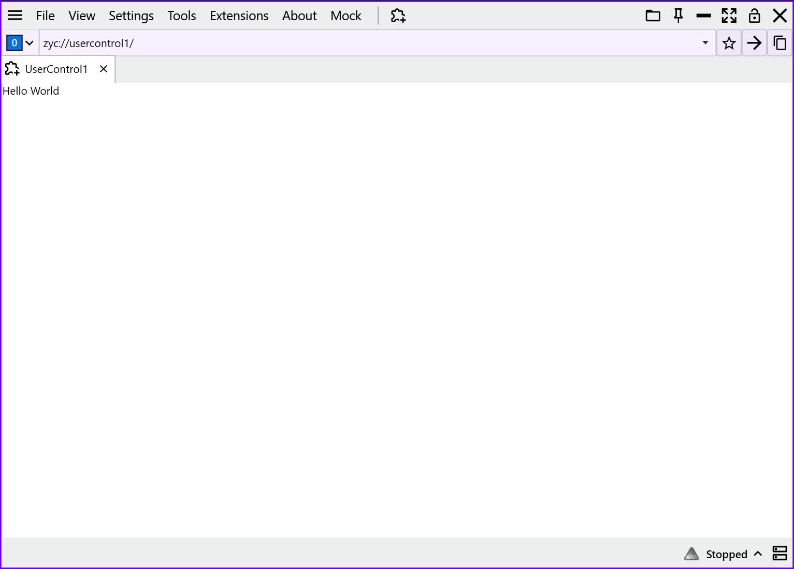

<p align="center">
  <a href="./quick-start.md">English</a> |
  <a href="./quick-start.ja.md">日本語</a> |
  <a href="./quick-start.zh-CN.md">简体中文</a> |
  <a href="./quick-start.zh-TW.md">繁體中文</a> |
  <a href="./quick-start.ko.md">한국어</a> |
</p>


# 🚀 빠른 시작: 첫 번째 ZYC.Framework Host 만들기

이 가이드는 **ZYC.Framework Host** 프로젝트를 처음부터 만드는 과정을 안내합니다. NuGet으로 프레임워크를 통합하고 모듈 시스템(Module + UserControl)을 사용해 사용자 정의 UI를 호스트 환경에 탑재하는 방법을 배웁니다. 🛠️

---

## 권장 방식: dotnet tool로 만들기

ZYC.Framework CLI 도구를 설치하거나 업데이트합니다:

```bash
dotnet tool install --global ZYC.Framework.CLI --version 1.3.2
# 이미 설치되어 있다면:
dotnet tool update --global ZYC.Framework.CLI --version 1.3.2
```

최소 Host 프로젝트를 만듭니다:

```bash
zyc new WpfApp1
```

기본 프로젝트 템플릿은 `minimal`이며, 아래의 수동 생성 방법과 같은 Host 구조를 생성합니다. 템플릿을 명시할 수도 있습니다:

```bash
zyc new WpfApp1 --template minimal
```

`Entry` 프로젝트, 모듈 프로젝트, `Abstractions` 프로젝트를 포함하는 솔루션이 필요하다면 `modular`를 사용합니다:

```bash
zyc new MyCompany.Tools --template modular
```

자주 쓰는 옵션:

```bash
zyc new MyCompany.Tools --output ./MyCompany.Tools --package-version 1.3.2
```

생성된 솔루션 또는 프로젝트를 열고 시작 프로젝트로 설정한 뒤 디버깅을 시작합니다. 생성된 파일에는 패키지 참조, `Module.cs`, `ModuleConfig.json`, 초기 View가 이미 포함되어 있습니다.

---

## 수동 생성 방법

Host 프로젝트를 직접 만들고 싶다면 아래의 동등한 절차를 따르면 됩니다.

### 1. 🧱 프로젝트 준비 및 사전 요구 사항

1. **프로젝트 만들기**: **.NET 10**을 대상으로 하는 새 **WPF Application**을 만듭니다(예: `WpfApp1`). ✨
2. **NuGet 패키지 추가**: NuGet 패키지 관리자를 통해 핵심 패키지 `ZYC.Framework.Alpha`를 설치합니다. 📦

```xml
<ItemGroup>
  <PackageReference Include="ZYC.Framework.Alpha" Version="1.3.2" />
</ItemGroup>
```

3. **기본 진입점 정리**: 🧹
프레임워크는 자체 통합 진입점(`Entry.cs`)을 제공합니다. 템플릿이 기본으로 생성한 다음 파일은 **반드시 삭제**해야 합니다.
* `App.xaml`
* `App.xaml.cs`

> [!IMPORTANT]
> ⚠️ **중요 단계**: `App.xaml`을 삭제하지 않으면 전역 진입점 충돌이 발생합니다. 애플리케이션 시작 로직은 프레임워크가 전적으로 제어합니다.

---

### 2. ⚙️ 어셈블리 참조 구성

호스트가 추상화 인터페이스를 올바르게 식별하고 로드할 수 있도록 `.csproj` 파일에 `Abstractions` 어셈블리 참조를 수동으로 추가합니다. 🔗

```xml
<ItemGroup>
  <Reference Include="ZYC.Framework.Abstractions">
    <HintPath>$(OutputPath)ZYC.Framework.Abstractions.dll</HintPath>
  </Reference>
</ItemGroup>
```

---

### 3. 🛠️ 비즈니스 모듈 구현 (`Module.cs`)

프로젝트 루트에 `Module.cs` 파일을 만듭니다. 이 클래스는 모듈의 "두뇌" 역할을 하며, 로드 로직을 정의하고 UI 페이지를 호스트에 등록합니다. 🧠

```csharp
using Autofac;
using ZYC.Framework.Abstractions.Tab;
using ZYC.CoreToolkit;
using ZYC.CoreToolkit.Extensions.Autofac;

namespace WpfApp1;

internal class Module : ModuleBase
{
    public override Task LoadAsync(ILifetimeScope lifetimeScope)
    {
        // 선택 사항: 내장 디버거 도구 연결
        DebuggerTools.Attach();

        // Tab Manager를 확인하고 UI 컴포넌트를 등록
        var simpleTabItemFactoryManager = lifetimeScope.Resolve<ISimpleTabItemFactoryManager>();
        simpleTabItemFactoryManager.Register(new SimpleTabItemFactoryInfo(typeof(UserControl1)));

        return base.LoadAsync(lifetimeScope);
    }
}
```

---

### 4. 🎨 UI 컴포넌트 만들기

새 `UserControl1`(WPF User Control)을 만들고 `[Register]` 특성을 추가합니다. 그러면 프레임워크의 의존성 주입(DI) 컨테이너가 이 타입을 자동으로 인식하고 관리합니다. 🖥️

```csharp
using ZYC.CoreToolkit.Extensions.Autofac.Attributes;

namespace WpfApp1;

[Register] // DI 컨테이너에 자동 등록
public partial class UserControl1
{
    public UserControl1()
    {
        InitializeComponent();
    }
}
```

---

### 5. 📄 모듈 구성 파일 추가

프로젝트 루트에 `ModuleConfig.json` 파일을 만듭니다. 이 파일은 호스트에게 어떤 어셈블리를 동적으로 로드해야 하는지 알려 주는 "지도" 역할을 합니다. 또한 주 실행 파일 기준으로 `../settings/ModuleConfig.json`에 복사되도록 프로젝트를 설정해야 합니다. ⚙️

1. **파일 내용**:
```json
{
  "AdditionalAssemblyNames": [
    "WpfApp1.dll"
  ],
  "DisabledAssemblyNames": []
}
```

2. **프로젝트 항목 설정**: 📌
빌드 시 `ModuleConfig.json`이 `../settings/ModuleConfig.json`으로 생성되도록 `.csproj` 파일에 다음 설정을 추가합니다:

```xml
<ItemGroup>
  <None Update="ModuleConfig.json">
    <CopyToOutputDirectory>Always</CopyToOutputDirectory>
    <Link>../settings/ModuleConfig.json</Link>
  </None>
</ItemGroup>
```

> 💡 **팁**: `AdditionalAssemblyNames`에는 `Module.cs`를 포함하는 어셈블리 이름이 반드시 들어가야 합니다.

---

### 6. ▶️ 실행 및 디버그

1. **시작 프로젝트 설정**: 이 WPF 프로젝트를 솔루션의 **Startup Project**로 설정합니다.
2. **디버그 시작**: `F5`를 누릅니다.

🎉 **예상 결과**:
호스트가 시작되고 `ModuleConfig.json`을 스캔한 뒤 `WpfApp1` 모듈을 로드합니다. 등록한 `UserControl1` 페이지가 메인 인터페이스에 새 탭으로 자동 표시됩니다.

---


