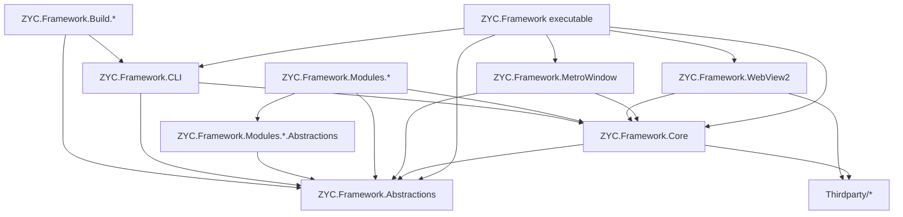
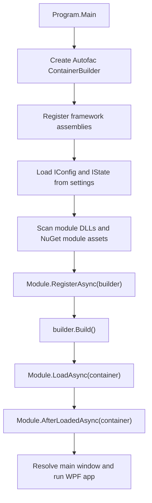
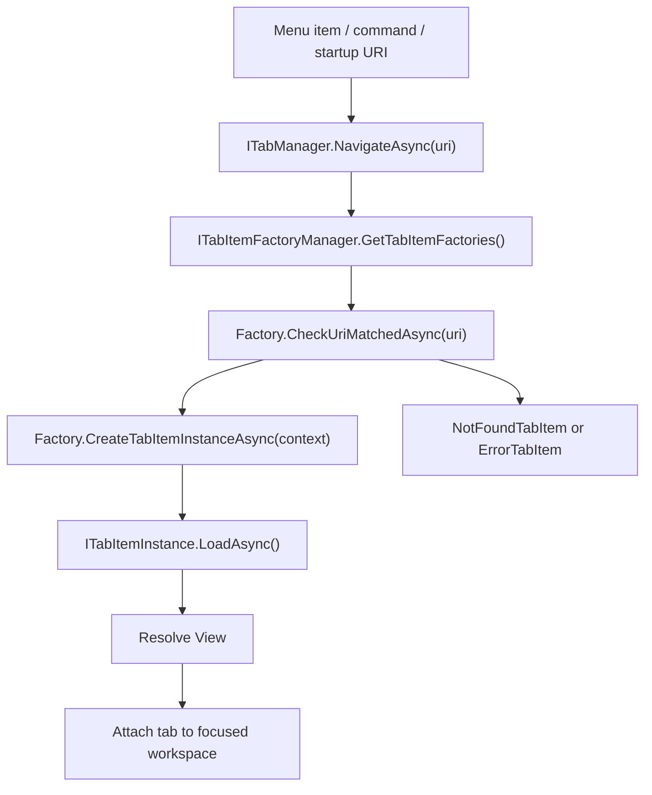
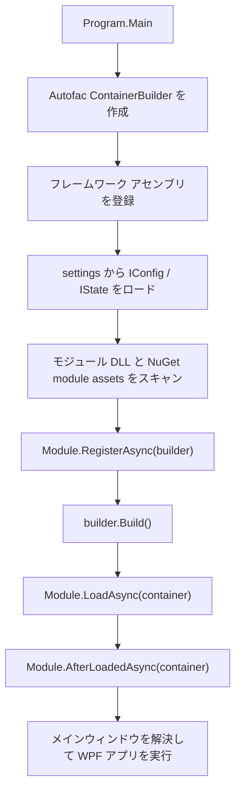
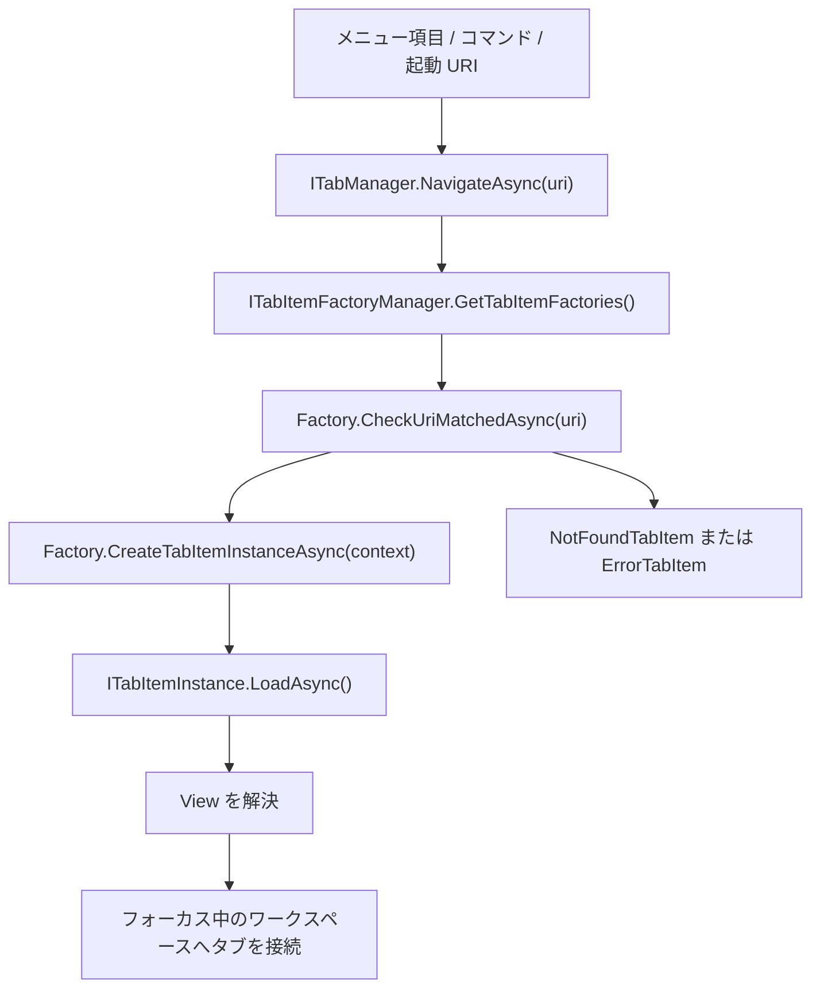
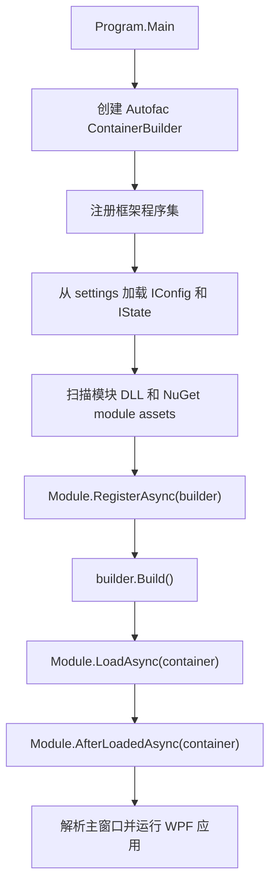
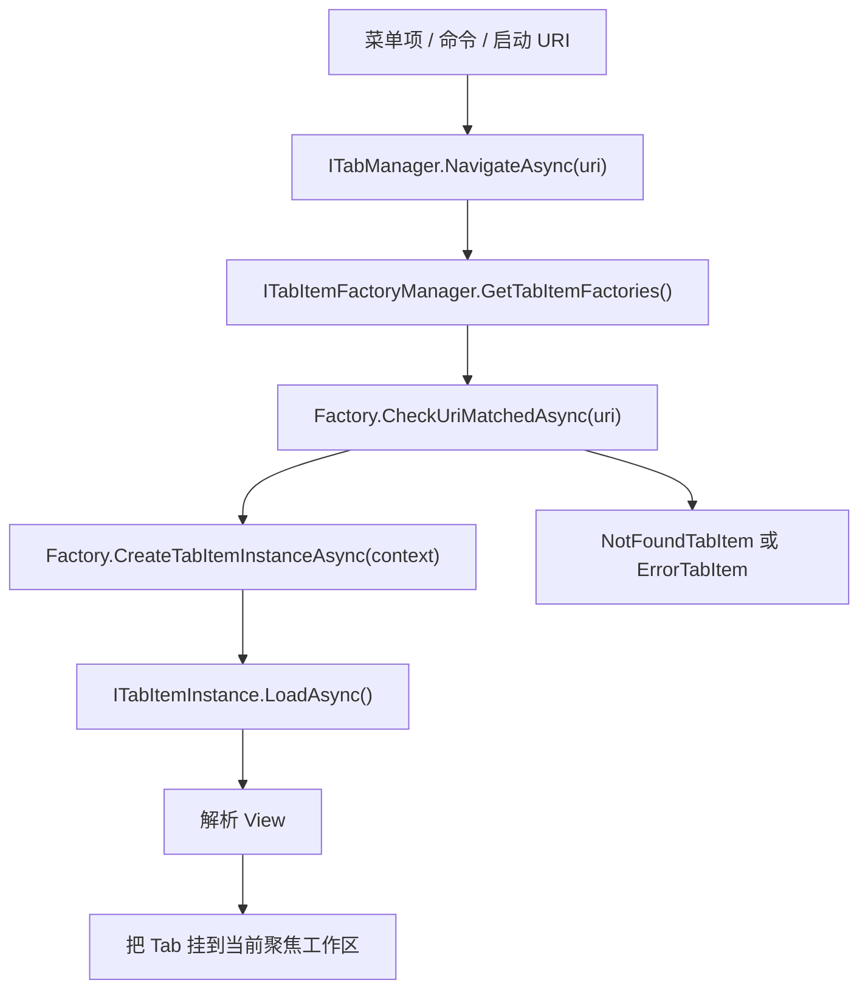
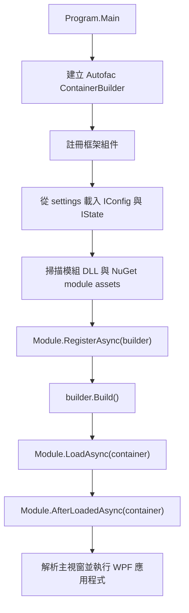
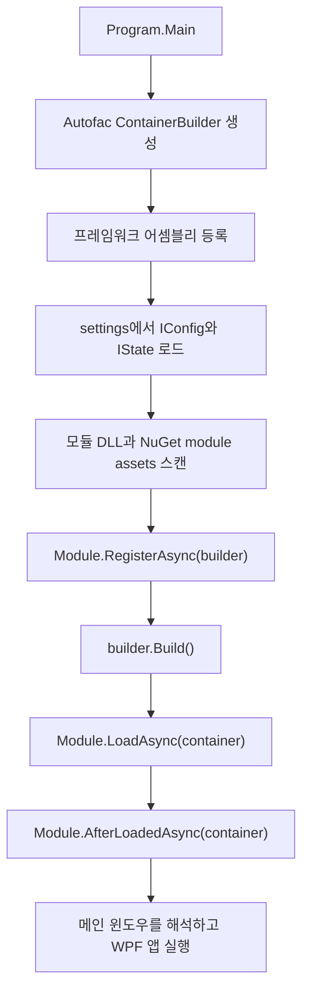
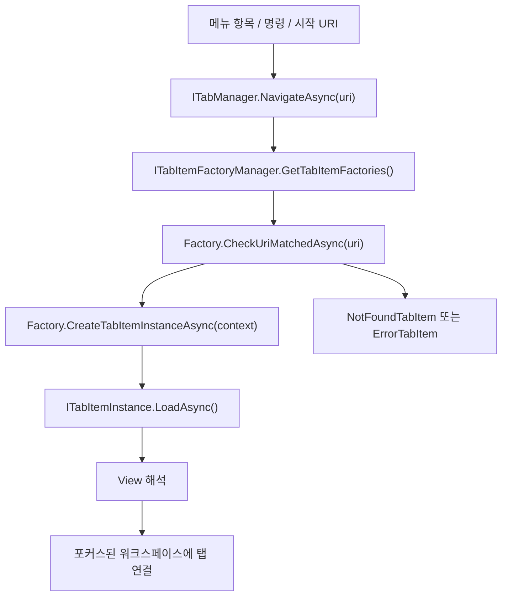

<p align="center">
  <a href="./architecture.md">English</a> |
  <a href="./architecture.ja.md">日本語</a> |
  <a href="./architecture.zh-CN.md">简体中文</a> |
  <a href="./architecture.zh-TW.md">繁體中文</a> |
  <a href="./architecture.ko.md">한국어</a> |
</p>

<!--doc-l10n:begin architecture-content-->
# Architecture

This document describes the current architecture of ZYC.Framework from the repository structure and runtime loading path. It focuses on the real extension points used by the application: modules, dependency injection, URI-based tabs, workspaces, configuration/state persistence, Aspire resources, and MCP exposure.

## Solution Shape

ZYC.Framework is a modular WPF desktop framework. The executable shell is intentionally small: it starts the application, builds the Autofac container, loads modules, and then hands UI composition to managers such as the main menu manager, tab manager, workspace manager, status bar manager, and notification managers.

| Area | Responsibility |
| --- | --- |
| `ZYC.Framework.Abstractions` | Public contracts, config/state types, module-facing DTOs, menu/tab/workspace interfaces, MCP attributes. |
| `ZYC.Framework.Core` | Shared WPF helpers, commands, base controls, dialogs, localization helpers, converters, and registration helpers. |
| `ZYC.Framework.MetroWindow` | Main window implementation and window-level services such as dialog hosting. |
| `ZYC.Framework.WebView2` | WebView2 host controls and browser integration infrastructure. |
| `ZYC.Framework` | Desktop executable shell, startup flow, workspace UI, tab UI, menu UI, notifications, quick bar, status bar, and app context implementation. |
| `ZYC.Framework.Modules.*.Abstractions` | Module-specific public contracts, config/state classes, constants, and command interfaces. These projects are the boundary other modules should reference. |
| `ZYC.Framework.Modules.*` | Module implementation projects. They register services, menu items, tab factories, status bar items, Aspire resources, or command-line options. |
| `ZYC.Framework.CLI` | Dotnet tool entrypoint. It owns `zyc new`, `zyc new-module`, and shares the module discovery/loading infrastructure used by the desktop host. |
| `ZYC.Framework.Build.*` | Build-time tools for docs, packaging, installer generation, project/module scaffolding wrappers, and product-version work. |
| `Thirdparty/*` | Vendored or forked dependencies that are built with the solution. |

## High-Level Dependency Graph



The important boundary is that `*.Abstractions` projects define public module contracts and should stay independent from WPF implementation details. Runtime modules can depend on WPF and framework UI infrastructure when they implement actual views, menu items, or tab items.

## Startup Flow

The desktop entrypoint is `src/ZYC.Framework/Program.cs`.

1. The process reads the startup URI, initializes JSON/settings behavior, enforces single-instance behavior outside Debug builds, and decides whether to redirect to a persisted startup version.
2. An Autofac `ContainerBuilder` is created.
3. Core framework assemblies are registered through `ModuleTools.RegisterAllFromAssembly(...)`: the executable assembly, `ZYC.Framework.Core`, `ZYC.Framework.WebView2`, `ZYC.Framework.MetroWindow`, and `ZYC.Framework.Abstractions`.
4. `RegisterAllFromAssembly(...)` registers Autofac services from the assembly and loads every discovered `IConfig` and `IState` implementation from the settings directory.
5. `ModuleTools.RegisterModules(...)` scans the executing folder for `ZYC.Framework.Modules*.dll`, adds assemblies listed in `ModuleConfig.AdditionalAssemblyNames`, skips disabled assemblies from `ModuleConfig.DisabledAssemblyNames`, handles pending file deletion, and can also load NuGet modules from `settings/nuget.module.assets.json`.
6. Each module instance runs `RegisterAsync(builder)` before the container is built.
7. After `builder.Build()`, enabled modules run `LoadAsync(container)` and then `AfterLoadedAsync(container)`.
8. The shell registers the built-in module-load tab factory, stores module load errors in `IModuleLoadInfoManager`, resolves the main window, and starts WPF.



## Module Model

A module is normally split into two projects:

| Project | Purpose |
| --- | --- |
| `ZYC.Framework.Modules.<Name>.Abstractions` | Public API, constants, config/state, commands, and DTOs. |
| `ZYC.Framework.Modules.<Name>` | Implementation: `Module.cs`, views, tab items, tab factories, menu items, managers, providers, and service registrations. |

The runtime module object is a `ModuleBase` subclass. The framework uses these phases:

| Phase | When it runs | Use it for |
| --- | --- | --- |
| `RegisterAsync(ContainerBuilder)` | Before Autofac builds the root container. | Register services that must participate in dependency resolution. |
| `LoadAsync(ILifetimeScope)` | After the container is built. | Register runtime extension points such as tab factories, menu items, status bar items, Aspire resources, and startup tasks. |
| `AfterLoadedAsync(ILifetimeScope)` | After all enabled modules have loaded. | Work that depends on other modules already being available. |

Module dependencies are inferred from assembly references to `ZYC.Framework.Modules.*.Abstractions.dll`. This gives the module manager a practical dependency view, but it is still convention-based discovery rather than a separate semantic module manifest.

## UI Composition

The shell is built from managers rather than hardcoded module UI.

| Surface | Primary contracts |
| --- | --- |
| Main menu and hamburger menu | `IMainMenuManager`, `IMainMenuItemsProvider`, `IMainMenuItem`, `IHamburgerMenuManager` |
| Tabs and navigation | `ITabManager`, `ITabItemFactoryManager`, `ITabItemFactory`, `ITabItemInstance` |
| Workspaces | `IParallelWorkspaceManager`, workspace state/config types, workspace menu managers |
| Quick bar | `IQuickBarManager`, quick bar item/provider contracts |
| Status bar | `IStatusBarManager`, `IStatusBarItemsProvider`, `IStatusBarItem` |
| Notifications | `IToastManager`, `IBannerManager`, toast/banner view infrastructure |
| Dialogs and overlays | `IDialogManager`, `IDialog`, `IOverlayManager` |

Modules usually add UI in `LoadAsync(...)`. For example, a module can register a tab factory and a Tools menu item:

```csharp
public override Task LoadAsync(ILifetimeScope lifetimeScope)
{
    lifetimeScope.RegisterTabItemFactory<MyTabItemFactory>();
    lifetimeScope.RegisterToolsMainMenuItem<MyMainMenuItem>();
    return Task.CompletedTask;
}
```

For simple WPF views, `SimpleTabItemFactoryInfo` is the shortest path. It creates a URI-backed tab, adds a menu entry under Extensions, and can add a quick bar item. For richer routing, modules implement `ITabItemFactory` directly.

## URI-Based Tab Navigation

Tab navigation is URI-driven. Commands and menu items call `ITabManager.NavigateAsync(...)`; the tab manager asks registered factories whether they can handle the URI; the best matching factory creates the tab instance.



Factories are sorted by descending priority. Singleton factories can reuse an existing tab when the target URI is already open. When no factory matches, the shell creates a not-found tab; when creation fails, it creates an error tab.

## Configuration and State

Configuration and state are discovered through marker interfaces:

| Kind | Interface | Typical use |
| --- | --- | --- |
| Config | `IConfig` | User-editable or module-editable settings. |
| State | `IState` | Runtime state that should survive process restarts, such as navigation or workspace state. |

`ModuleTools.RegisterAllFromAssembly(...)` loads these types from the settings directory during startup and registers the instances into Autofac. `IAppContext` exposes app-level paths and save operations such as `SaveAllConfig()` and `SaveAllState()`.

`ModuleConfig` is the central module loading config:

| Property | Meaning |
| --- | --- |
| `DisabledAssemblyNames` | Module DLLs that should be ignored. |
| `AdditionalAssemblyNames` | Extra DLLs to load from the app folder in addition to standard module DLLs. |

NuGet-installed modules use a separate startup artifact: `settings/nuget.module.assets.json`. When it exists, `ModuleTools.RegisterModules(...)` asks the runtime asset loader to load runtime assemblies for `net10.0-windows`.

## Hybrid UI and Aspire Integration

ZYC.Framework supports native WPF views and hybrid web content.

`ZYC.Framework.WebView2` owns reusable WebView2 host infrastructure. Modules such as WebBrowser and BlazorDemo build on this surface to embed web content or web-backed experiences.

`ZYC.Framework.Modules.Aspire` integrates .NET Aspire. `AspireService.Build(...)` creates a `DistributedApplicationBuilder`, configures it with the existing Autofac lifetime scope, applies `AspireConfig.Environment`, and resolves all `IExtensionResourcesProvider` implementations. Extension modules can plug child resources into the Aspire app without modifying the core Aspire module.

The `Translator` module is an example of this pattern: it resolves `ICommandlineResourcesProvider` and registers a command-line resource for `libretranslate`.

`ZYC.Framework.Modules.Accounts` is a provider-based account shell. It owns session initialization, `IAccountManager`, protected token storage, and the window-title account UI. Provider modules such as `ZYC.Framework.Modules.Accounts.GitHub` contribute `IAccountProvider` implementations and can register their own authentication tab factories, including WebView2-backed OAuth flows.

`ZYC.Framework.Modules.ChromeExtensions` keeps browser extension package management separate from the browser runtime. It downloads and unpacks Chrome Web Store packages, reads manifest metadata, and synchronizes the unpacked manifest key so WebView2 can use stable extension identities. `ZYC.Framework.Modules.WebBrowser` consumes the installed package list, updates `WebBrowserConfig.CustomBrowserArguments` with `--load-extension`, and uses the live `CoreWebView2BrowserExtension` data exposed by `ZYC.Framework.WebView2` for runtime plugin UI.

## MCP Exposure

The MCP server module exposes application capabilities through interface annotations.

Interfaces or methods marked with `[ExposeToMCP]` can be discovered by `MCPAutoToolDiscoveryExtensions.AddAutoDiscoveredTools(...)`. Methods marked with `[MCPIgnore]` are skipped. If a tool requires UI-thread execution, the MCP wrapper delegates the call through the UI dispatcher.

This means MCP is contract-driven:

1. Put stable capabilities on interfaces.
2. Mark the interface or method with `[ExposeToMCP]`.
3. Exclude internal or unsafe members with `[MCPIgnore]`.
4. Let the MCP server discover the loaded assemblies at runtime.

## Build and Template Flow

Documentation and scaffolding are separate from runtime modules.

| Tool | Responsibility |
| --- | --- |
| `ZYC.Framework.Build.Doc` | Renders `Templates/README/README.md` and `Templates/docs/*` into root `README*.md` and `docs/*`. |
| `ZYC.Framework.CLI` | Provides `zyc new` project templates and `zyc new-module` module scaffolding. |
| `ZYC.Framework.Build.NewModule` | Wrapper around `zyc new-module` for repository-local module generation. |
| `ZYC.Framework.Build.NuGet` | NuGet packaging and release notes. |
| `ZYC.Framework.Build.InnoSetup` | Installer build support. |

Project creation and module creation are intentionally different command surfaces:

| Command | Purpose |
| --- | --- |
| `zyc new <ProjectName>` | Creates an external host project from `minimal` or `modular` project templates. |
| `zyc new-module <ModuleName> --src-root <SourceRoot>` | Creates a module pair inside an existing source tree. |

## Adding a Module

A typical module addition follows this path:

1. Create `ZYC.Framework.Modules.<Name>.Abstractions` for public contracts, constants, config, state, and command interfaces.
2. Create `ZYC.Framework.Modules.<Name>` for the runtime implementation.
3. Add `Module.cs` with a `ModuleBase` subclass.
4. Use `RegisterAsync(...)` for DI registrations that must exist before the container is built.
5. Use `LoadAsync(...)` to register tab factories, menu items, status bar items, quick bar items, Aspire providers, or startup behavior.
6. Prefer manager APIs such as `RegisterTabItemFactory<T>()` and `RegisterToolsMainMenuItem<T>()` over directly manipulating shell views.
7. Keep public abstractions stable and additive when possible.

This keeps modules independently developed while still letting the host compose them through a shared shell and manager-based extension model.
<!--doc-l10n:locale ja-->
# アーキテクチャ

このドキュメントでは、リポジトリ構成と実行時のロード経路に基づいて、現在の ZYC.Framework のアーキテクチャを説明します。対象は、アプリケーションで実際に使われている拡張ポイントです。具体的には、モジュール、依存性注入、URI ベースのタブ、ワークスペース、設定と状態の永続化、Aspire リソース、MCP 公開を扱います。

## ソリューション構成

ZYC.Framework はモジュール型の WPF デスクトップ フレームワークです。実行可能シェルは意図的に小さく保たれています。アプリケーションを開始し、Autofac コンテナーを構築し、モジュールをロードした後、メインメニュー、タブ、ワークスペース、ステータスバー、通知などの UI 構成を各マネージャーへ委譲します。

| 領域 | 責務 |
| --- | --- |
| `ZYC.Framework.Abstractions` | 公開コントラクト、設定/状態型、モジュール向け DTO、メニュー/タブ/ワークスペース インターフェイス、MCP 属性。 |
| `ZYC.Framework.Core` | 共通 WPF ヘルパー、コマンド、基底コントロール、ダイアログ、ローカライズ ヘルパー、コンバーター、登録ヘルパー。 |
| `ZYC.Framework.MetroWindow` | メインウィンドウ実装と、ダイアログ ホスティングなどのウィンドウ レベル サービス。 |
| `ZYC.Framework.WebView2` | WebView2 ホスト コントロールとブラウザー統合基盤。 |
| `ZYC.Framework` | デスクトップ実行シェル、起動処理、ワークスペース UI、タブ UI、メニュー UI、通知、クイックバー、ステータスバー、アプリ コンテキスト実装。 |
| `ZYC.Framework.Modules.*.Abstractions` | モジュール固有の公開コントラクト、設定/状態クラス、定数、コマンド インターフェイス。他モジュールが参照すべき境界。 |
| `ZYC.Framework.Modules.*` | モジュール実装プロジェクト。サービス、メニュー項目、タブ ファクトリ、ステータスバー項目、Aspire リソース、コマンドライン オプションなどを登録する。 |
| `ZYC.Framework.CLI` | dotnet tool のエントリポイント。`zyc new`、`zyc new-module` を持ち、デスクトップ ホストと同じモジュール発見/ロード基盤を共有する。 |
| `ZYC.Framework.Build.*` | ドキュメント、パッケージング、インストーラー生成、プロジェクト/モジュール スキャフォールド ラッパー、製品バージョン処理のビルド時ツール。 |
| `Thirdparty/*` | ソリューションと一緒にビルドされる vendored / forked 依存関係。 |

## 上位依存関係グラフ


重要な境界は、`*.Abstractions` プロジェクトが公開モジュール コントラクトを定義し、WPF 実装の詳細から独立している点です。実際の View、メニュー項目、タブ項目を実装するランタイム モジュールは、WPF やフレームワーク UI 基盤に依存できます。

## 起動フロー

デスクトップ エントリポイントは `src/ZYC.Framework/Program.cs` です。

1. プロセスは起動 URI を読み取り、JSON/設定動作を初期化し、Debug ビルド以外では単一インスタンス制御を行い、永続化された起動バージョンへリダイレクトするかを判断します。
2. Autofac の `ContainerBuilder` を作成します。
3. `ModuleTools.RegisterAllFromAssembly(...)` により、実行アセンブリ、`ZYC.Framework.Core`、`ZYC.Framework.WebView2`、`ZYC.Framework.MetroWindow`、`ZYC.Framework.Abstractions` などのコア フレームワーク アセンブリを登録します。
4. `RegisterAllFromAssembly(...)` はアセンブリ内の Autofac サービスを登録し、発見したすべての `IConfig` / `IState` 実装を settings ディレクトリから読み込みます。
5. `ModuleTools.RegisterModules(...)` は実行フォルダーから `ZYC.Framework.Modules*.dll` をスキャンし、`ModuleConfig.AdditionalAssemblyNames` に列挙されたアセンブリを追加し、`ModuleConfig.DisabledAssemblyNames` に含まれるものをスキップし、保留中のファイル削除を処理します。さらに `settings/nuget.module.assets.json` から NuGet モジュールもロードできます。
6. 各モジュール インスタンスは、コンテナー構築前に `RegisterAsync(builder)` を実行します。
7. `builder.Build()` の後、有効なモジュールは `LoadAsync(container)`、続いて `AfterLoadedAsync(container)` を実行します。
8. シェルは組み込みのモジュールロード用タブ ファクトリを登録し、モジュール ロード エラーを `IModuleLoadInfoManager` に保存し、メインウィンドウを解決して WPF を開始します。



## モジュール モデル

通常、モジュールは 2 つのプロジェクトに分かれます。

| プロジェクト | 目的 |
| --- | --- |
| `ZYC.Framework.Modules.<Name>.Abstractions` | 公開 API、定数、設定/状態、コマンド、DTO。 |
| `ZYC.Framework.Modules.<Name>` | 実装。`Module.cs`、View、タブ項目、タブ ファクトリ、メニュー項目、マネージャー、プロバイダー、サービス登録を含む。 |

実行時のモジュール オブジェクトは `ModuleBase` の派生クラスです。フレームワークは次のフェーズを使います。

| フェーズ | 実行タイミング | 主な用途 |
| --- | --- | --- |
| `RegisterAsync(ContainerBuilder)` | Autofac ルート コンテナー構築前。 | 依存解決に参加する必要があるサービスの登録。 |
| `LoadAsync(ILifetimeScope)` | コンテナー構築後。 | タブ ファクトリ、メニュー項目、ステータスバー項目、Aspire リソース、起動タスクなどのランタイム拡張ポイント登録。 |
| `AfterLoadedAsync(ILifetimeScope)` | 有効な全モジュールのロード後。 | 他モジュールが利用可能になっていることに依存する処理。 |

モジュール依存関係は、`ZYC.Framework.Modules.*.Abstractions.dll` へのアセンブリ参照から推定されます。これはモジュール マネージャーに実用的な依存関係ビューを与えますが、独立した意味論的なモジュール マニフェストではなく、あくまで規約ベースの発見です。

## UI 構成

シェルは、モジュール UI を直接固定するのではなく、各種マネージャーから構成されます。

| サーフェス | 主なコントラクト |
| --- | --- |
| メインメニュー / Hamburger メニュー | `IMainMenuManager`, `IMainMenuItemsProvider`, `IMainMenuItem`, `IHamburgerMenuManager` |
| タブとナビゲーション | `ITabManager`, `ITabItemFactoryManager`, `ITabItemFactory`, `ITabItemInstance` |
| ワークスペース | `IParallelWorkspaceManager`, ワークスペースの state/config 型、ワークスペース メニュー マネージャー |
| クイックバー | `IQuickBarManager`, クイックバー項目/プロバイダー コントラクト |
| ステータスバー | `IStatusBarManager`, `IStatusBarItemsProvider`, `IStatusBarItem` |
| 通知 | `IToastManager`, `IBannerManager`, Toast/Banner View 基盤 |
| ダイアログ / オーバーレイ | `IDialogManager`, `IDialog`, `IOverlayManager` |

通常、モジュールは `LoadAsync(...)` で UI を追加します。たとえば、タブ ファクトリと Tools メニュー項目を登録できます。

```csharp
public override Task LoadAsync(ILifetimeScope lifetimeScope)
{
    lifetimeScope.RegisterTabItemFactory<MyTabItemFactory>();
    lifetimeScope.RegisterToolsMainMenuItem<MyMainMenuItem>();
    return Task.CompletedTask;
}
```

単純な WPF View なら `SimpleTabItemFactoryInfo` が最短経路です。URI 対応タブを作成し、Extensions 配下のメニュー項目を追加し、必要に応じてクイックバー項目も追加できます。より複雑なルーティングでは、モジュールが `ITabItemFactory` を直接実装します。

## URI ベースのタブ ナビゲーション

タブ ナビゲーションは URI 駆動です。コマンドやメニュー項目は `ITabManager.NavigateAsync(...)` を呼び出し、タブ マネージャーは登録済みファクトリに URI を処理できるか問い合わせます。最も適したファクトリがタブ インスタンスを作成します。



ファクトリは Priority の降順で並べられます。シングルトン ファクトリは、対象 URI がすでに開かれている場合に既存タブを再利用できます。一致するファクトリがない場合は not-found タブが作成され、作成中に失敗した場合は error タブが作成されます。

## 設定と状態

設定と状態はマーカー インターフェイスで発見されます。

| 種別 | インターフェイス | 典型的な用途 |
| --- | --- | --- |
| Config | `IConfig` | ユーザーまたはモジュールが編集する設定。 |
| State | `IState` | ナビゲーションやワークスペース状態など、プロセス再起動後も保持したいランタイム状態。 |

`ModuleTools.RegisterAllFromAssembly(...)` は起動時に settings ディレクトリからこれらの型を読み込み、Autofac に登録します。`IAppContext` はアプリ レベルのパスと、`SaveAllConfig()` / `SaveAllState()` などの保存操作を公開します。

`ModuleConfig` は中心的なモジュール ロード設定です。

| プロパティ | 意味 |
| --- | --- |
| `DisabledAssemblyNames` | 無視すべきモジュール DLL。 |
| `AdditionalAssemblyNames` | 標準モジュール DLL に加えて、アプリ フォルダーからロードする追加 DLL。 |

NuGet でインストールされたモジュールは、別の起動アーティファクト `settings/nuget.module.assets.json` を使います。これが存在する場合、`ModuleTools.RegisterModules(...)` はランタイム アセット ローダーに `net10.0-windows` 用のランタイム アセンブリをロードさせます。

## ハイブリッド UI と Aspire 統合

ZYC.Framework はネイティブ WPF View とハイブリッド Web コンテンツをサポートします。

`ZYC.Framework.WebView2` は再利用可能な WebView2 ホスト基盤を持ちます。WebBrowser や BlazorDemo などのモジュールは、このサーフェスを使って Web コンテンツや Web ベース体験を埋め込みます。

`ZYC.Framework.Modules.Aspire` は .NET Aspire を統合します。`AspireService.Build(...)` は `DistributedApplicationBuilder` を作成し、既存の Autofac lifetime scope で構成し、`AspireConfig.Environment` を適用し、すべての `IExtensionResourcesProvider` 実装を解決します。拡張モジュールは、コア Aspire モジュールを変更せずに子リソースを Aspire アプリへ差し込めます。

`Translator` モジュールはこのパターンの例です。`ICommandlineResourcesProvider` を解決し、`libretranslate` 用のコマンドライン リソースを登録します。

`ZYC.Framework.Modules.Accounts` は provider-based account shell です。Session initialization、`IAccountManager`、protected token storage、タイトルバーの account UI を持ちます。`ZYC.Framework.Modules.Accounts.GitHub` のような provider module は `IAccountProvider` 実装を提供し、WebView2 ベースの OAuth flow を含む独自の authentication tab factory を登録できます。

`ZYC.Framework.Modules.ChromeExtensions` は browser extension package management を browser runtime から分離します。Chrome Web Store package をダウンロード/展開し、manifest metadata を読み取り、WebView2 が安定した extension identity を使えるよう unpacked manifest key を同期します。`ZYC.Framework.Modules.WebBrowser` は installed package list を利用して `WebBrowserConfig.CustomBrowserArguments` の `--load-extension` を更新し、`ZYC.Framework.WebView2` が公開する live `CoreWebView2BrowserExtension` data を runtime plugin UI に使います。

## MCP 公開

MCP Server モジュールは、インターフェイス注釈を通じてアプリケーション機能を公開します。

`[ExposeToMCP]` が付いたインターフェイスまたはメソッドは、`MCPAutoToolDiscoveryExtensions.AddAutoDiscoveredTools(...)` によって発見されます。`[MCPIgnore]` が付いたメソッドはスキップされます。ツールが UI スレッド実行を必要とする場合、MCP ラッパーは UI dispatcher 経由で呼び出します。

つまり MCP はコントラクト駆動です。

1. 安定した機能をインターフェイスに置く。
2. インターフェイスまたはメソッドに `[ExposeToMCP]` を付ける。
3. 内部用または危険なメンバーは `[MCPIgnore]` で除外する。
4. MCP Server に、ロード済みアセンブリを実行時に発見させる。

## ビルドとテンプレート フロー

ドキュメントとスキャフォールドは、ランタイム モジュールとは分離されています。

| ツール | 責務 |
| --- | --- |
| `ZYC.Framework.Build.Doc` | `Templates/README/README.md` と `Templates/docs/*` をルートの `README*.md` と `docs/*` へレンダリングする。 |
| `ZYC.Framework.CLI` | `zyc new` プロジェクト テンプレートと `zyc new-module` モジュール スキャフォールドを提供する。 |
| `ZYC.Framework.Build.NewModule` | リポジトリ内モジュール生成用の `zyc new-module` ラッパー。 |
| `ZYC.Framework.Build.NuGet` | NuGet パッケージングとリリースノート。 |
| `ZYC.Framework.Build.InnoSetup` | インストーラー ビルド支援。 |

プロジェクト作成とモジュール作成は、意図的に別々のコマンド サーフェスです。

| コマンド | 目的 |
| --- | --- |
| `zyc new <ProjectName>` | `minimal` または `modular` プロジェクト テンプレートから外部 Host プロジェクトを作成する。 |
| `zyc new-module <ModuleName> --src-root <SourceRoot>` | 既存のソース ツリー内にモジュール ペアを作成する。 |

## モジュールを追加する

典型的なモジュール追加は次の流れです。

1. 公開コントラクト、定数、設定、状態、コマンド インターフェイス用に `ZYC.Framework.Modules.<Name>.Abstractions` を作成する。
2. ランタイム実装用に `ZYC.Framework.Modules.<Name>` を作成する。
3. `ModuleBase` 派生クラスを持つ `Module.cs` を追加する。
4. コンテナー構築前に必要な DI 登録は `RegisterAsync(...)` で行う。
5. タブ ファクトリ、メニュー項目、ステータスバー項目、クイックバー項目、Aspire プロバイダー、起動処理は `LoadAsync(...)` で登録する。
6. シェル View を直接操作するのではなく、`RegisterTabItemFactory<T>()` や `RegisterToolsMainMenuItem<T>()` などの manager API を優先する。
7. 公開 Abstractions は、可能な限り安定的かつ追加型で保つ。

この形により、モジュールは独立して開発しつつ、共有シェルと manager ベースの拡張モデルを通じてホストに構成されます。
<!--doc-l10n:locale zh-CN-->
# 架构

本文档基于仓库结构和运行时加载路径，说明当前 ZYC.Framework 的架构。重点不是泛泛介绍 WPF，而是项目中真实使用的扩展点：模块、依赖注入、基于 URI 的 Tab、工作区、配置/状态持久化、Aspire 资源和 MCP 暴露。

## 解决方案结构

ZYC.Framework 是一个模块化 WPF 桌面框架。可执行 Shell 刻意保持较小：它负责启动应用、构建 Autofac 容器、加载模块，然后把 UI 组合交给主菜单、Tab、工作区、状态栏、通知等 Manager。

| 区域 | 职责 |
| --- | --- |
| `ZYC.Framework.Abstractions` | 公共契约、配置/状态类型、模块侧 DTO、菜单/Tab/工作区接口、MCP 属性。 |
| `ZYC.Framework.Core` | 通用 WPF 辅助能力、命令、基础控件、对话框、本地化辅助、转换器和注册辅助方法。 |
| `ZYC.Framework.MetroWindow` | 主窗口实现，以及对话框承载等窗口级服务。 |
| `ZYC.Framework.WebView2` | WebView2 宿主控件和浏览器集成基础设施。 |
| `ZYC.Framework` | 桌面可执行 Shell、启动流程、工作区 UI、Tab UI、菜单 UI、通知、QuickBar、状态栏和 AppContext 实现。 |
| `ZYC.Framework.Modules.*.Abstractions` | 模块专用的公共契约、配置/状态类、常量和命令接口。这些项目是其他模块应当引用的边界。 |
| `ZYC.Framework.Modules.*` | 模块实现项目。负责注册服务、菜单项、Tab Factory、状态栏项、Aspire 资源或命令行选项。 |
| `ZYC.Framework.CLI` | dotnet tool 入口。拥有 `zyc new`、`zyc new-module`，并与桌面 Host 共享模块发现/加载基础设施。 |
| `ZYC.Framework.Build.*` | 构建期工具，包括文档、打包、安装器生成、项目/模块脚手架包装器和产品版本处理。 |
| `Thirdparty/*` | 随解决方案一起构建的 vendored 或 forked 依赖。 |

## 高层依赖图


最重要的边界是：`*.Abstractions` 项目定义公开模块契约，并应保持与 WPF 实现细节解耦。运行时模块在实现真实 View、菜单项或 Tab 项时，可以依赖 WPF 和框架 UI 基础设施。

## 启动流程

桌面端入口是 `src/ZYC.Framework/Program.cs`。

1. 进程读取启动 URI，初始化 JSON/Settings 行为，在非 Debug 构建下启用单实例控制，并判断是否需要重定向到持久化的启动版本。
2. 创建 Autofac `ContainerBuilder`。
3. 通过 `ModuleTools.RegisterAllFromAssembly(...)` 注册核心框架程序集：可执行程序集、`ZYC.Framework.Core`、`ZYC.Framework.WebView2`、`ZYC.Framework.MetroWindow` 和 `ZYC.Framework.Abstractions`。
4. `RegisterAllFromAssembly(...)` 注册程序集中的 Autofac 服务，并从 settings 目录加载发现到的所有 `IConfig` 和 `IState` 实现。
5. `ModuleTools.RegisterModules(...)` 从执行目录扫描 `ZYC.Framework.Modules*.dll`，追加 `ModuleConfig.AdditionalAssemblyNames` 中列出的程序集，跳过 `ModuleConfig.DisabledAssemblyNames` 中禁用的程序集，处理待删除文件，并可从 `settings/nuget.module.assets.json` 加载 NuGet 模块。
6. 每个模块实例在容器构建前执行 `RegisterAsync(builder)`。
7. `builder.Build()` 之后，启用的模块依次执行 `LoadAsync(container)` 和 `AfterLoadedAsync(container)`。
8. Shell 注册内置的模块加载 Tab Factory，把模块加载错误写入 `IModuleLoadInfoManager`，解析主窗口，并启动 WPF。



## 模块模型

一个模块通常拆成两个项目：

| 项目 | 用途 |
| --- | --- |
| `ZYC.Framework.Modules.<Name>.Abstractions` | 公共 API、常量、配置/状态、命令和 DTO。 |
| `ZYC.Framework.Modules.<Name>` | 实现层：`Module.cs`、View、Tab Item、Tab Factory、菜单项、Manager、Provider 和服务注册。 |

运行时模块对象是 `ModuleBase` 的子类。框架使用以下阶段：

| 阶段 | 执行时机 | 用途 |
| --- | --- | --- |
| `RegisterAsync(ContainerBuilder)` | Autofac 根容器构建前。 | 注册必须参与依赖解析的服务。 |
| `LoadAsync(ILifetimeScope)` | 容器构建后。 | 注册运行时扩展点，例如 Tab Factory、菜单项、状态栏项、Aspire 资源和启动任务。 |
| `AfterLoadedAsync(ILifetimeScope)` | 所有启用模块加载完成后。 | 依赖其他模块已可用的工作。 |

模块依赖关系通过对 `ZYC.Framework.Modules.*.Abstractions.dll` 的程序集引用推断。这给模块管理器提供了实用的依赖视图，但它仍是基于约定的发现，并不是独立的语义化模块清单。

## UI 组合

Shell 由 Manager 组合，而不是硬编码模块 UI。

| 界面区域 | 主要契约 |
| --- | --- |
| 主菜单和 Hamburger 菜单 | `IMainMenuManager`, `IMainMenuItemsProvider`, `IMainMenuItem`, `IHamburgerMenuManager` |
| Tab 和导航 | `ITabManager`, `ITabItemFactoryManager`, `ITabItemFactory`, `ITabItemInstance` |
| 工作区 | `IParallelWorkspaceManager`, 工作区 state/config 类型, 工作区菜单 Manager |
| QuickBar | `IQuickBarManager`, QuickBar item/provider 契约 |
| 状态栏 | `IStatusBarManager`, `IStatusBarItemsProvider`, `IStatusBarItem` |
| 通知 | `IToastManager`, `IBannerManager`, Toast/Banner View 基础设施 |
| 对话框和 Overlay | `IDialogManager`, `IDialog`, `IOverlayManager` |

模块通常在 `LoadAsync(...)` 中添加 UI。例如，一个模块可以注册 Tab Factory 和 Tools 菜单项：

```csharp
public override Task LoadAsync(ILifetimeScope lifetimeScope)
{
    lifetimeScope.RegisterTabItemFactory<MyTabItemFactory>();
    lifetimeScope.RegisterToolsMainMenuItem<MyMainMenuItem>();
    return Task.CompletedTask;
}
```

对于简单 WPF View，`SimpleTabItemFactoryInfo` 是最短路径。它会创建一个 URI 驱动的 Tab，在 Extensions 下添加菜单入口，并可添加 QuickBar 项。更复杂的路由场景中，模块应直接实现 `ITabItemFactory`。

## 基于 URI 的 Tab 导航

Tab 导航由 URI 驱动。命令和菜单项调用 `ITabManager.NavigateAsync(...)`；TabManager 查询已注册的 Factory 是否能处理该 URI；最匹配的 Factory 创建 Tab 实例。



Factory 按 Priority 降序排列。Singleton Factory 在目标 URI 已经打开时可以复用已有 Tab。没有 Factory 匹配时，Shell 创建 not-found Tab；创建失败时，Shell 创建 error Tab。

## 配置和状态

配置和状态通过标记接口发现：

| 类型 | 接口 | 典型用途 |
| --- | --- | --- |
| Config | `IConfig` | 用户或模块可编辑的设置。 |
| State | `IState` | 进程重启后仍需保留的运行时状态，例如导航或工作区状态。 |

`ModuleTools.RegisterAllFromAssembly(...)` 在启动时从 settings 目录加载这些类型，并把实例注册到 Autofac。`IAppContext` 暴露应用级路径和保存操作，例如 `SaveAllConfig()` 与 `SaveAllState()`。

`ModuleConfig` 是核心模块加载配置：

| 属性 | 含义 |
| --- | --- |
| `DisabledAssemblyNames` | 应被忽略的模块 DLL。 |
| `AdditionalAssemblyNames` | 除标准模块 DLL 外，需要从 app 文件夹额外加载的 DLL。 |

NuGet 安装的模块使用单独的启动产物：`settings/nuget.module.assets.json`。当它存在时，`ModuleTools.RegisterModules(...)` 会让运行时资产加载器加载 `net10.0-windows` 对应的运行时程序集。

## 混合 UI 和 Aspire 集成

ZYC.Framework 支持原生 WPF View 和混合 Web 内容。

`ZYC.Framework.WebView2` 拥有可复用的 WebView2 Host 基础设施。WebBrowser、BlazorDemo 等模块基于这个能力嵌入 Web 内容或 Web 化体验。

`ZYC.Framework.Modules.Aspire` 集成 .NET Aspire。`AspireService.Build(...)` 创建 `DistributedApplicationBuilder`，使用现有 Autofac lifetime scope 配置它，应用 `AspireConfig.Environment`，并解析所有 `IExtensionResourcesProvider` 实现。扩展模块可以把子资源插入 Aspire app，而不需要修改核心 Aspire 模块。

`Translator` 模块是这个模式的一个例子：它解析 `ICommandlineResourcesProvider`，并为 `libretranslate` 注册命令行资源。

`ZYC.Framework.Modules.Accounts` 是 provider-based account shell。它负责 session 初始化、`IAccountManager`、受保护的 token 存储，以及窗口标题栏账号 UI。`ZYC.Framework.Modules.Accounts.GitHub` 这类 provider module 提供 `IAccountProvider` 实现，并可注册自己的 authentication tab factory，包括 WebView2-backed OAuth flow。

`ZYC.Framework.Modules.ChromeExtensions` 将 browser extension package management 与 browser runtime 分离。它下载并解包 Chrome Web Store package，读取 manifest metadata，并同步 unpacked manifest key，让 WebView2 可以使用稳定的 extension identity。`ZYC.Framework.Modules.WebBrowser` 消费已安装包列表，把 `--load-extension` 写入 `WebBrowserConfig.CustomBrowserArguments`，并使用 `ZYC.Framework.WebView2` 暴露的 live `CoreWebView2BrowserExtension` data 构建 runtime plugin UI。

## MCP 暴露

MCP Server 模块通过接口注解暴露应用能力。

标记了 `[ExposeToMCP]` 的接口或方法可以被 `MCPAutoToolDiscoveryExtensions.AddAutoDiscoveredTools(...)` 发现。标记了 `[MCPIgnore]` 的方法会被跳过。如果工具需要在 UI 线程执行，MCP 包装器会通过 UI dispatcher 转发调用。

这意味着 MCP 是契约驱动的：

1. 把稳定能力放在接口上。
2. 给接口或方法添加 `[ExposeToMCP]`。
3. 用 `[MCPIgnore]` 排除内部或不适合暴露的成员。
4. 让 MCP Server 在运行时发现已加载程序集。

## 构建和模板流程

文档和脚手架与运行时模块分离。

| 工具 | 职责 |
| --- | --- |
| `ZYC.Framework.Build.Doc` | 将 `Templates/README/README.md` 和 `Templates/docs/*` 渲染到根目录 `README*.md` 和 `docs/*`。 |
| `ZYC.Framework.CLI` | 提供 `zyc new` 项目模板和 `zyc new-module` 模块脚手架。 |
| `ZYC.Framework.Build.NewModule` | 面向仓库内模块生成的 `zyc new-module` 包装器。 |
| `ZYC.Framework.Build.NuGet` | NuGet 打包和发布说明。 |
| `ZYC.Framework.Build.InnoSetup` | 安装器构建支持。 |

项目创建和模块创建是刻意分开的命令面：

| 命令 | 用途 |
| --- | --- |
| `zyc new <ProjectName>` | 从 `minimal` 或 `modular` 项目模板创建外部 Host 项目。 |
| `zyc new-module <ModuleName> --src-root <SourceRoot>` | 在已有源码树中创建模块项目对。 |

## 添加模块

典型模块添加流程如下：

1. 创建 `ZYC.Framework.Modules.<Name>.Abstractions`，放公共契约、常量、配置、状态和命令接口。
2. 创建 `ZYC.Framework.Modules.<Name>`，放运行时实现。
3. 添加包含 `ModuleBase` 子类的 `Module.cs`。
4. 必须在容器构建前参与 DI 的注册放在 `RegisterAsync(...)`。
5. Tab Factory、菜单项、状态栏项、QuickBar 项、Aspire Provider 或启动行为放在 `LoadAsync(...)` 注册。
6. 优先使用 `RegisterTabItemFactory<T>()`、`RegisterToolsMainMenuItem<T>()` 等 Manager API，而不是直接操作 Shell View。
7. 公开 Abstractions 尽量保持稳定，并优先采用追加式变更。

这样可以让模块独立开发，同时仍通过共享 Shell 和基于 Manager 的扩展模型组合进 Host。
<!--doc-l10n:locale zh-TW-->
# 架構

本文件根據儲存庫結構與執行時載入路徑，說明目前 ZYC.Framework 的架構。重點不是泛泛介紹 WPF，而是專案中實際使用的擴充點：模組、相依性注入、基於 URI 的分頁、工作區、設定/狀態持久化、Aspire 資源與 MCP 暴露。

## 解決方案結構

ZYC.Framework 是一個模組化 WPF 桌面框架。可執行 Shell 刻意保持精簡：它負責啟動應用程式、建立 Autofac 容器、載入模組，然後將 UI 組合交給主選單、分頁、工作區、狀態列與通知等 Manager。

| 區域 | 職責 |
| --- | --- |
| `ZYC.Framework.Abstractions` | 公開契約、設定/狀態型別、模組側 DTO、選單/分頁/工作區介面、MCP 屬性。 |
| `ZYC.Framework.Core` | 通用 WPF 輔助能力、命令、基礎控制項、對話框、在地化輔助、轉換器與註冊輔助方法。 |
| `ZYC.Framework.MetroWindow` | 主視窗實作，以及對話框承載等視窗層級服務。 |
| `ZYC.Framework.WebView2` | WebView2 Host 控制項與瀏覽器整合基礎設施。 |
| `ZYC.Framework` | 桌面可執行 Shell、啟動流程、工作區 UI、分頁 UI、選單 UI、通知、QuickBar、狀態列與 AppContext 實作。 |
| `ZYC.Framework.Modules.*.Abstractions` | 模組專用的公開契約、設定/狀態類別、常數與命令介面。這些專案是其他模組應引用的邊界。 |
| `ZYC.Framework.Modules.*` | 模組實作專案。負責註冊服務、選單項、分頁 Factory、狀態列項、Aspire 資源或命令列選項。 |
| `ZYC.Framework.CLI` | dotnet tool 入口。擁有 `zyc new`、`zyc new-module`，並與桌面 Host 共用模組發現/載入基礎設施。 |
| `ZYC.Framework.Build.*` | 建置期工具，包含文件、打包、安裝程式產生、專案/模組鷹架包裝器與產品版本處理。 |
| `Thirdparty/*` | 隨解決方案一起建置的 vendored 或 forked 相依項。 |

## 高層相依圖


最重要的邊界是：`*.Abstractions` 專案定義公開模組契約，並應與 WPF 實作細節解耦。執行時模組在實作真實 View、選單項或分頁項時，可以依賴 WPF 與框架 UI 基礎設施。

## 啟動流程

桌面端入口是 `src/ZYC.Framework/Program.cs`。

1. 程序讀取啟動 URI，初始化 JSON/Settings 行為，在非 Debug 建置下啟用單一實例控制，並判斷是否需要重新導向至持久化的啟動版本。
2. 建立 Autofac `ContainerBuilder`。
3. 透過 `ModuleTools.RegisterAllFromAssembly(...)` 註冊核心框架組件：可執行組件、`ZYC.Framework.Core`、`ZYC.Framework.WebView2`、`ZYC.Framework.MetroWindow` 與 `ZYC.Framework.Abstractions`。
4. `RegisterAllFromAssembly(...)` 註冊組件中的 Autofac 服務，並從 settings 目錄載入發現到的所有 `IConfig` 與 `IState` 實作。
5. `ModuleTools.RegisterModules(...)` 從執行目錄掃描 `ZYC.Framework.Modules*.dll`，追加 `ModuleConfig.AdditionalAssemblyNames` 中列出的組件，略過 `ModuleConfig.DisabledAssemblyNames` 中停用的組件，處理待刪除檔案，並可從 `settings/nuget.module.assets.json` 載入 NuGet 模組。
6. 每個模組實例會在容器建立前執行 `RegisterAsync(builder)`。
7. `builder.Build()` 之後，啟用的模組依序執行 `LoadAsync(container)` 與 `AfterLoadedAsync(container)`。
8. Shell 註冊內建的模組載入分頁 Factory，將模組載入錯誤寫入 `IModuleLoadInfoManager`，解析主視窗，並啟動 WPF。



## 模組模型

一個模組通常拆成兩個專案：

| 專案 | 用途 |
| --- | --- |
| `ZYC.Framework.Modules.<Name>.Abstractions` | 公開 API、常數、設定/狀態、命令與 DTO。 |
| `ZYC.Framework.Modules.<Name>` | 實作層：`Module.cs`、View、分頁項、分頁 Factory、選單項、Manager、Provider 與服務註冊。 |

執行時模組物件是 `ModuleBase` 的子類別。框架使用以下階段：

| 階段 | 執行時機 | 用途 |
| --- | --- | --- |
| `RegisterAsync(ContainerBuilder)` | Autofac 根容器建立前。 | 註冊必須參與相依解析的服務。 |
| `LoadAsync(ILifetimeScope)` | 容器建立後。 | 註冊執行時擴充點，例如分頁 Factory、選單項、狀態列項、Aspire 資源與啟動工作。 |
| `AfterLoadedAsync(ILifetimeScope)` | 所有啟用模組載入完成後。 | 依賴其他模組已可用的工作。 |

模組相依關係是透過對 `ZYC.Framework.Modules.*.Abstractions.dll` 的組件參考推斷。這能提供模組管理器實用的相依視圖，但它仍是基於約定的發現，而不是獨立的語意化模組清單。

## UI 組合

Shell 由 Manager 組合，而不是硬編碼模組 UI。

| 介面區域 | 主要契約 |
| --- | --- |
| 主選單與 Hamburger 選單 | `IMainMenuManager`, `IMainMenuItemsProvider`, `IMainMenuItem`, `IHamburgerMenuManager` |
| 分頁與導覽 | `ITabManager`, `ITabItemFactoryManager`, `ITabItemFactory`, `ITabItemInstance` |
| 工作區 | `IParallelWorkspaceManager`, 工作區 state/config 型別, 工作區選單 Manager |
| QuickBar | `IQuickBarManager`, QuickBar item/provider 契約 |
| 狀態列 | `IStatusBarManager`, `IStatusBarItemsProvider`, `IStatusBarItem` |
| 通知 | `IToastManager`, `IBannerManager`, Toast/Banner View 基礎設施 |
| 對話框與 Overlay | `IDialogManager`, `IDialog`, `IOverlayManager` |

模組通常在 `LoadAsync(...)` 中加入 UI。例如，一個模組可以註冊分頁 Factory 與 Tools 選單項：

```csharp
public override Task LoadAsync(ILifetimeScope lifetimeScope)
{
    lifetimeScope.RegisterTabItemFactory<MyTabItemFactory>();
    lifetimeScope.RegisterToolsMainMenuItem<MyMainMenuItem>();
    return Task.CompletedTask;
}
```

對於簡單 WPF View，`SimpleTabItemFactoryInfo` 是最短路徑。它會建立一個 URI 驅動的分頁，在 Extensions 下加入選單入口，並可加入 QuickBar 項。更複雜的路由情境中，模組應直接實作 `ITabItemFactory`。

## 基於 URI 的分頁導覽

分頁導覽由 URI 驅動。命令與選單項呼叫 `ITabManager.NavigateAsync(...)`；TabManager 查詢已註冊的 Factory 是否能處理該 URI；最符合的 Factory 建立分頁實例。


Factory 依 Priority 遞減排序。Singleton Factory 在目標 URI 已開啟時可以重用既有分頁。沒有 Factory 符合時，Shell 會建立 not-found 分頁；建立失敗時，Shell 會建立 error 分頁。

## 設定與狀態

設定與狀態透過標記介面發現：

| 類型 | 介面 | 典型用途 |
| --- | --- | --- |
| Config | `IConfig` | 使用者或模組可編輯的設定。 |
| State | `IState` | 程序重啟後仍需保留的執行時狀態，例如導覽或工作區狀態。 |

`ModuleTools.RegisterAllFromAssembly(...)` 在啟動時從 settings 目錄載入這些型別，並將實例註冊到 Autofac。`IAppContext` 暴露應用層級路徑與保存操作，例如 `SaveAllConfig()` 與 `SaveAllState()`。

`ModuleConfig` 是核心模組載入設定：

| 屬性 | 含義 |
| --- | --- |
| `DisabledAssemblyNames` | 應被忽略的模組 DLL。 |
| `AdditionalAssemblyNames` | 除標準模組 DLL 外，需要從 app 資料夾額外載入的 DLL。 |

NuGet 安裝的模組使用獨立的啟動產物：`settings/nuget.module.assets.json`。當它存在時，`ModuleTools.RegisterModules(...)` 會讓執行時資產載入器載入 `net10.0-windows` 對應的執行時組件。

## 混合 UI 與 Aspire 整合

ZYC.Framework 支援原生 WPF View 與混合 Web 內容。

`ZYC.Framework.WebView2` 擁有可重用的 WebView2 Host 基礎設施。WebBrowser、BlazorDemo 等模組基於這個能力嵌入 Web 內容或 Web 化體驗。

`ZYC.Framework.Modules.Aspire` 整合 .NET Aspire。`AspireService.Build(...)` 建立 `DistributedApplicationBuilder`，使用現有 Autofac lifetime scope 進行配置，套用 `AspireConfig.Environment`，並解析所有 `IExtensionResourcesProvider` 實作。擴充模組可以將子資源插入 Aspire app，而不需要修改核心 Aspire 模組。

`Translator` 模組是這個模式的例子：它解析 `ICommandlineResourcesProvider`，並為 `libretranslate` 註冊命令列資源。

`ZYC.Framework.Modules.Accounts` 是 provider-based account shell。它負責 session 初始化、`IAccountManager`、受保護的 token 儲存，以及視窗標題列帳號 UI。`ZYC.Framework.Modules.Accounts.GitHub` 這類 provider module 提供 `IAccountProvider` 實作，並可註冊自己的 authentication tab factory，包括 WebView2-backed OAuth flow。

`ZYC.Framework.Modules.ChromeExtensions` 將 browser extension package management 與 browser runtime 分離。它下載並解包 Chrome Web Store package，讀取 manifest metadata，並同步 unpacked manifest key，讓 WebView2 可以使用穩定的 extension identity。`ZYC.Framework.Modules.WebBrowser` 消費已安裝 package list，把 `--load-extension` 寫入 `WebBrowserConfig.CustomBrowserArguments`，並使用 `ZYC.Framework.WebView2` 暴露的 live `CoreWebView2BrowserExtension` data 建構 runtime plugin UI。

## MCP 暴露

MCP Server 模組透過介面註解暴露應用能力。

標記了 `[ExposeToMCP]` 的介面或方法可以被 `MCPAutoToolDiscoveryExtensions.AddAutoDiscoveredTools(...)` 發現。標記了 `[MCPIgnore]` 的方法會被略過。如果工具需要在 UI 執行緒執行，MCP 包裝器會透過 UI dispatcher 轉發呼叫。

這代表 MCP 是契約驅動的：

1. 將穩定能力放在介面上。
2. 對介面或方法加上 `[ExposeToMCP]`。
3. 用 `[MCPIgnore]` 排除內部或不適合暴露的成員。
4. 讓 MCP Server 在執行時發現已載入組件。

## 建置與範本流程

文件與鷹架和執行時模組是分離的。

| 工具 | 職責 |
| --- | --- |
| `ZYC.Framework.Build.Doc` | 將 `Templates/README/README.md` 與 `Templates/docs/*` 渲染到根目錄 `README*.md` 與 `docs/*`。 |
| `ZYC.Framework.CLI` | 提供 `zyc new` 專案範本與 `zyc new-module` 模組鷹架。 |
| `ZYC.Framework.Build.NewModule` | 面向儲存庫內模組生成的 `zyc new-module` 包裝器。 |
| `ZYC.Framework.Build.NuGet` | NuGet 打包與發布說明。 |
| `ZYC.Framework.Build.InnoSetup` | 安裝程式建置支援。 |

專案建立與模組建立是刻意分開的命令面：

| 命令 | 用途 |
| --- | --- |
| `zyc new <ProjectName>` | 從 `minimal` 或 `modular` 專案範本建立外部 Host 專案。 |
| `zyc new-module <ModuleName> --src-root <SourceRoot>` | 在既有原始碼樹中建立模組專案對。 |

## 新增模組

典型模組新增流程如下：

1. 建立 `ZYC.Framework.Modules.<Name>.Abstractions`，放公開契約、常數、設定、狀態與命令介面。
2. 建立 `ZYC.Framework.Modules.<Name>`，放執行時實作。
3. 新增包含 `ModuleBase` 子類別的 `Module.cs`。
4. 必須在容器建立前參與 DI 的註冊放在 `RegisterAsync(...)`。
5. 分頁 Factory、選單項、狀態列項、QuickBar 項、Aspire Provider 或啟動行為放在 `LoadAsync(...)` 註冊。
6. 優先使用 `RegisterTabItemFactory<T>()`、`RegisterToolsMainMenuItem<T>()` 等 Manager API，而不是直接操作 Shell View。
7. 公開 Abstractions 盡量保持穩定，並優先採用追加式變更。

這樣可以讓模組獨立開發，同時仍透過共享 Shell 與基於 Manager 的擴充模型組合進 Host。
<!--doc-l10n:locale ko-->
# 아키텍처

이 문서는 저장소 구조와 런타임 로딩 경로를 기준으로 현재 ZYC.Framework의 아키텍처를 설명합니다. 초점은 일반적인 WPF 설명이 아니라, 애플리케이션에서 실제로 사용하는 확장 지점입니다. 모듈, 의존성 주입, URI 기반 탭, 워크스페이스, 설정/상태 영속화, Aspire 리소스, MCP 노출을 다룹니다.

## 솔루션 구성

ZYC.Framework는 모듈형 WPF 데스크톱 프레임워크입니다. 실행 셸은 의도적으로 작게 유지됩니다. 애플리케이션을 시작하고, Autofac 컨테이너를 만들고, 모듈을 로드한 뒤, UI 구성은 메인 메뉴, 탭, 워크스페이스, 상태 표시줄, 알림 등의 Manager에 위임합니다.

| 영역 | 책임 |
| --- | --- |
| `ZYC.Framework.Abstractions` | 공개 계약, config/state 타입, 모듈용 DTO, 메뉴/탭/워크스페이스 인터페이스, MCP 특성. |
| `ZYC.Framework.Core` | 공통 WPF 헬퍼, 명령, 기본 컨트롤, 다이얼로그, 로컬라이제이션 헬퍼, 컨버터, 등록 헬퍼. |
| `ZYC.Framework.MetroWindow` | 메인 윈도우 구현과 다이얼로그 호스팅 같은 윈도우 레벨 서비스. |
| `ZYC.Framework.WebView2` | WebView2 호스트 컨트롤과 브라우저 통합 인프라. |
| `ZYC.Framework` | 데스크톱 실행 셸, 시작 흐름, 워크스페이스 UI, 탭 UI, 메뉴 UI, 알림, QuickBar, 상태 표시줄, AppContext 구현. |
| `ZYC.Framework.Modules.*.Abstractions` | 모듈별 공개 계약, config/state 클래스, 상수, 명령 인터페이스. 다른 모듈이 참조해야 하는 경계입니다. |
| `ZYC.Framework.Modules.*` | 모듈 구현 프로젝트. 서비스, 메뉴 항목, 탭 팩토리, 상태 표시줄 항목, Aspire 리소스, 명령줄 옵션을 등록합니다. |
| `ZYC.Framework.CLI` | dotnet tool 엔트리포인트. `zyc new`, `zyc new-module`을 제공하며 데스크톱 Host와 모듈 발견/로딩 인프라를 공유합니다. |
| `ZYC.Framework.Build.*` | 문서, 패키징, 설치 프로그램 생성, 프로젝트/모듈 스캐폴딩 래퍼, 제품 버전 처리를 위한 빌드 타임 도구. |
| `Thirdparty/*` | 솔루션과 함께 빌드되는 vendored 또는 forked 의존성. |

## 상위 의존성 그래프


중요한 경계는 `*.Abstractions` 프로젝트가 공개 모듈 계약을 정의하고 WPF 구현 세부사항과 독립되어야 한다는 점입니다. 실제 View, 메뉴 항목, 탭 항목을 구현하는 런타임 모듈은 WPF와 프레임워크 UI 인프라에 의존할 수 있습니다.

## 시작 흐름

데스크톱 엔트리포인트는 `src/ZYC.Framework/Program.cs`입니다.

1. 프로세스는 시작 URI를 읽고, JSON/settings 동작을 초기화하며, Debug 빌드가 아닐 때 단일 인스턴스 제어를 수행하고, 영속화된 시작 버전으로 리디렉션할지 판단합니다.
2. Autofac `ContainerBuilder`를 만듭니다.
3. `ModuleTools.RegisterAllFromAssembly(...)`로 핵심 프레임워크 어셈블리를 등록합니다. 대상은 실행 어셈블리, `ZYC.Framework.Core`, `ZYC.Framework.WebView2`, `ZYC.Framework.MetroWindow`, `ZYC.Framework.Abstractions`입니다.
4. `RegisterAllFromAssembly(...)`는 어셈블리의 Autofac 서비스를 등록하고, settings 디렉터리에서 발견된 모든 `IConfig`와 `IState` 구현을 로드합니다.
5. `ModuleTools.RegisterModules(...)`는 실행 폴더에서 `ZYC.Framework.Modules*.dll`을 스캔하고, `ModuleConfig.AdditionalAssemblyNames`에 나열된 어셈블리를 추가하며, `ModuleConfig.DisabledAssemblyNames`에 있는 어셈블리를 건너뛰고, 대기 중인 파일 삭제를 처리합니다. 또한 `settings/nuget.module.assets.json`에서 NuGet 모듈을 로드할 수 있습니다.
6. 각 모듈 인스턴스는 컨테이너가 빌드되기 전에 `RegisterAsync(builder)`를 실행합니다.
7. `builder.Build()` 후 활성화된 모듈은 `LoadAsync(container)`와 `AfterLoadedAsync(container)`를 차례로 실행합니다.
8. 셸은 내장 모듈 로드 탭 팩토리를 등록하고, 모듈 로드 오류를 `IModuleLoadInfoManager`에 저장하며, 메인 윈도우를 해석한 뒤 WPF를 시작합니다.



## 모듈 모델

모듈은 일반적으로 두 프로젝트로 나뉩니다.

| 프로젝트 | 목적 |
| --- | --- |
| `ZYC.Framework.Modules.<Name>.Abstractions` | 공개 API, 상수, config/state, 명령, DTO. |
| `ZYC.Framework.Modules.<Name>` | 구현: `Module.cs`, View, 탭 항목, 탭 팩토리, 메뉴 항목, Manager, Provider, 서비스 등록. |

런타임 모듈 객체는 `ModuleBase`의 하위 클래스입니다. 프레임워크는 다음 단계를 사용합니다.

| 단계 | 실행 시점 | 용도 |
| --- | --- | --- |
| `RegisterAsync(ContainerBuilder)` | Autofac 루트 컨테이너 빌드 전. | 의존성 해석에 참여해야 하는 서비스 등록. |
| `LoadAsync(ILifetimeScope)` | 컨테이너 빌드 후. | 탭 팩토리, 메뉴 항목, 상태 표시줄 항목, Aspire 리소스, 시작 작업 같은 런타임 확장 지점 등록. |
| `AfterLoadedAsync(ILifetimeScope)` | 모든 활성 모듈 로드 후. | 다른 모듈이 이미 사용 가능해야 하는 작업. |

모듈 의존성은 `ZYC.Framework.Modules.*.Abstractions.dll`에 대한 어셈블리 참조에서 추론됩니다. 이는 모듈 관리자에게 실용적인 의존성 뷰를 제공하지만, 별도의 의미론적 모듈 매니페스트가 아니라 규약 기반 발견입니다.

## UI 구성

셸은 모듈 UI를 하드코딩하지 않고 Manager를 통해 구성됩니다.

| 표면 | 주요 계약 |
| --- | --- |
| 메인 메뉴와 Hamburger 메뉴 | `IMainMenuManager`, `IMainMenuItemsProvider`, `IMainMenuItem`, `IHamburgerMenuManager` |
| 탭과 탐색 | `ITabManager`, `ITabItemFactoryManager`, `ITabItemFactory`, `ITabItemInstance` |
| 워크스페이스 | `IParallelWorkspaceManager`, 워크스페이스 state/config 타입, 워크스페이스 메뉴 Manager |
| QuickBar | `IQuickBarManager`, QuickBar item/provider 계약 |
| 상태 표시줄 | `IStatusBarManager`, `IStatusBarItemsProvider`, `IStatusBarItem` |
| 알림 | `IToastManager`, `IBannerManager`, Toast/Banner View 인프라 |
| 다이얼로그와 Overlay | `IDialogManager`, `IDialog`, `IOverlayManager` |

모듈은 보통 `LoadAsync(...)`에서 UI를 추가합니다. 예를 들어, 모듈은 탭 팩토리와 Tools 메뉴 항목을 등록할 수 있습니다.

```csharp
public override Task LoadAsync(ILifetimeScope lifetimeScope)
{
    lifetimeScope.RegisterTabItemFactory<MyTabItemFactory>();
    lifetimeScope.RegisterToolsMainMenuItem<MyMainMenuItem>();
    return Task.CompletedTask;
}
```

간단한 WPF View에는 `SimpleTabItemFactoryInfo`가 가장 짧은 경로입니다. URI 기반 탭을 만들고 Extensions 아래에 메뉴 항목을 추가하며, 필요하면 QuickBar 항목도 추가합니다. 더 복잡한 라우팅에서는 모듈이 `ITabItemFactory`를 직접 구현합니다.

## URI 기반 탭 탐색

탭 탐색은 URI로 구동됩니다. 명령과 메뉴 항목은 `ITabManager.NavigateAsync(...)`를 호출하고, 탭 매니저는 등록된 팩토리에게 URI를 처리할 수 있는지 확인합니다. 가장 잘 맞는 팩토리가 탭 인스턴스를 생성합니다.



팩토리는 Priority 내림차순으로 정렬됩니다. Singleton 팩토리는 대상 URI가 이미 열려 있을 때 기존 탭을 재사용할 수 있습니다. 일치하는 팩토리가 없으면 셸은 not-found 탭을 만들고, 생성 중 실패하면 error 탭을 만듭니다.

## 설정과 상태

설정과 상태는 마커 인터페이스로 발견됩니다.

| 종류 | 인터페이스 | 일반적인 용도 |
| --- | --- | --- |
| Config | `IConfig` | 사용자 또는 모듈이 편집할 수 있는 설정. |
| State | `IState` | 탐색이나 워크스페이스 상태처럼 프로세스 재시작 후에도 유지해야 하는 런타임 상태. |

`ModuleTools.RegisterAllFromAssembly(...)`는 시작 시 settings 디렉터리에서 이러한 타입을 로드하고 인스턴스를 Autofac에 등록합니다. `IAppContext`는 앱 수준 경로와 `SaveAllConfig()`, `SaveAllState()` 같은 저장 작업을 노출합니다.

`ModuleConfig`는 중심적인 모듈 로딩 설정입니다.

| 속성 | 의미 |
| --- | --- |
| `DisabledAssemblyNames` | 무시해야 하는 모듈 DLL. |
| `AdditionalAssemblyNames` | 표준 모듈 DLL 외에 app 폴더에서 추가로 로드할 DLL. |

NuGet으로 설치된 모듈은 별도의 시작 아티팩트인 `settings/nuget.module.assets.json`을 사용합니다. 이 파일이 있으면 `ModuleTools.RegisterModules(...)`는 런타임 asset loader에게 `net10.0-windows`용 런타임 어셈블리를 로드하게 합니다.

## 하이브리드 UI와 Aspire 통합

ZYC.Framework는 네이티브 WPF View와 하이브리드 Web 콘텐츠를 지원합니다.

`ZYC.Framework.WebView2`는 재사용 가능한 WebView2 Host 인프라를 소유합니다. WebBrowser와 BlazorDemo 같은 모듈은 이 표면을 기반으로 Web 콘텐츠나 Web 기반 경험을 임베드합니다.

`ZYC.Framework.Modules.Aspire`는 .NET Aspire를 통합합니다. `AspireService.Build(...)`는 `DistributedApplicationBuilder`를 만들고, 기존 Autofac lifetime scope로 구성하며, `AspireConfig.Environment`를 적용하고, 모든 `IExtensionResourcesProvider` 구현을 해석합니다. 확장 모듈은 핵심 Aspire 모듈을 수정하지 않고도 자식 리소스를 Aspire 앱에 연결할 수 있습니다.

`Translator` 모듈은 이 패턴의 예입니다. `ICommandlineResourcesProvider`를 해석하고 `libretranslate`용 명령줄 리소스를 등록합니다.

`ZYC.Framework.Modules.Accounts`는 provider-based account shell입니다. Session initialization, `IAccountManager`, protected token storage, 창 제목 표시줄 account UI를 소유합니다. `ZYC.Framework.Modules.Accounts.GitHub` 같은 provider module은 `IAccountProvider` 구현을 제공하고 WebView2 기반 OAuth flow를 포함한 자체 authentication tab factory를 등록할 수 있습니다.

`ZYC.Framework.Modules.ChromeExtensions`는 browser extension package management를 browser runtime에서 분리합니다. Chrome Web Store package를 다운로드하고 압축을 풀며, manifest metadata를 읽고, WebView2가 안정적인 extension identity를 사용할 수 있도록 unpacked manifest key를 동기화합니다. `ZYC.Framework.Modules.WebBrowser`는 installed package list를 사용해 `WebBrowserConfig.CustomBrowserArguments`의 `--load-extension`을 갱신하고, `ZYC.Framework.WebView2`가 노출하는 live `CoreWebView2BrowserExtension` data를 runtime plugin UI에 사용합니다.

## MCP 노출

MCP Server 모듈은 인터페이스 주석을 통해 애플리케이션 기능을 노출합니다.

`[ExposeToMCP]`가 붙은 인터페이스나 메서드는 `MCPAutoToolDiscoveryExtensions.AddAutoDiscoveredTools(...)`에 의해 발견될 수 있습니다. `[MCPIgnore]`가 붙은 메서드는 건너뜁니다. 도구가 UI 스레드 실행을 필요로 하면 MCP 래퍼가 UI dispatcher를 통해 호출을 위임합니다.

즉 MCP는 계약 기반입니다.

1. 안정적인 기능을 인터페이스에 둡니다.
2. 인터페이스나 메서드에 `[ExposeToMCP]`를 붙입니다.
3. 내부용이거나 노출하기 부적절한 멤버는 `[MCPIgnore]`로 제외합니다.
4. MCP Server가 런타임에 로드된 어셈블리를 발견하게 합니다.

## 빌드와 템플릿 흐름

문서와 스캐폴딩은 런타임 모듈과 분리되어 있습니다.

| 도구 | 책임 |
| --- | --- |
| `ZYC.Framework.Build.Doc` | `Templates/README/README.md`와 `Templates/docs/*`를 루트 `README*.md`와 `docs/*`로 렌더링합니다. |
| `ZYC.Framework.CLI` | `zyc new` 프로젝트 템플릿과 `zyc new-module` 모듈 스캐폴딩을 제공합니다. |
| `ZYC.Framework.Build.NewModule` | 저장소 내부 모듈 생성을 위한 `zyc new-module` 래퍼입니다. |
| `ZYC.Framework.Build.NuGet` | NuGet 패키징과 릴리스 노트. |
| `ZYC.Framework.Build.InnoSetup` | 설치 프로그램 빌드 지원. |

프로젝트 생성과 모듈 생성은 의도적으로 서로 다른 명령 표면입니다.

| 명령 | 목적 |
| --- | --- |
| `zyc new <ProjectName>` | `minimal` 또는 `modular` 프로젝트 템플릿에서 외부 Host 프로젝트를 만듭니다. |
| `zyc new-module <ModuleName> --src-root <SourceRoot>` | 기존 소스 트리 안에 모듈 쌍을 만듭니다. |

## 모듈 추가하기

일반적인 모듈 추가 흐름은 다음과 같습니다.

1. 공개 계약, 상수, 설정, 상태, 명령 인터페이스를 위해 `ZYC.Framework.Modules.<Name>.Abstractions`를 만듭니다.
2. 런타임 구현을 위해 `ZYC.Framework.Modules.<Name>`를 만듭니다.
3. `ModuleBase` 하위 클래스를 포함하는 `Module.cs`를 추가합니다.
4. 컨테이너 빌드 전에 필요한 DI 등록은 `RegisterAsync(...)`에 둡니다.
5. 탭 팩토리, 메뉴 항목, 상태 표시줄 항목, QuickBar 항목, Aspire Provider, 시작 동작은 `LoadAsync(...)`에서 등록합니다.
6. 셸 View를 직접 조작하기보다 `RegisterTabItemFactory<T>()`, `RegisterToolsMainMenuItem<T>()` 같은 Manager API를 우선 사용합니다.
7. 공개 Abstractions는 가능한 한 안정적이고 추가형 변경으로 유지합니다.

이 구조는 모듈을 독립적으로 개발하면서도 공유 셸과 Manager 기반 확장 모델을 통해 Host에 구성할 수 있게 합니다.
<!--doc-l10n:end-->
