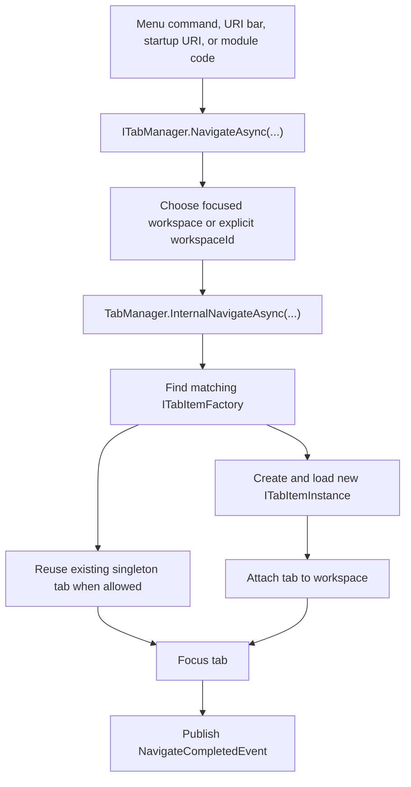
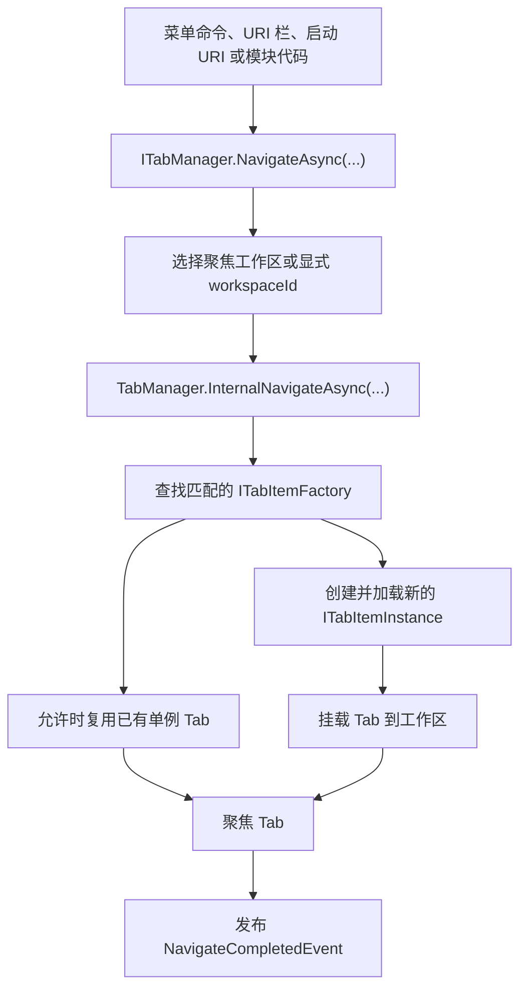
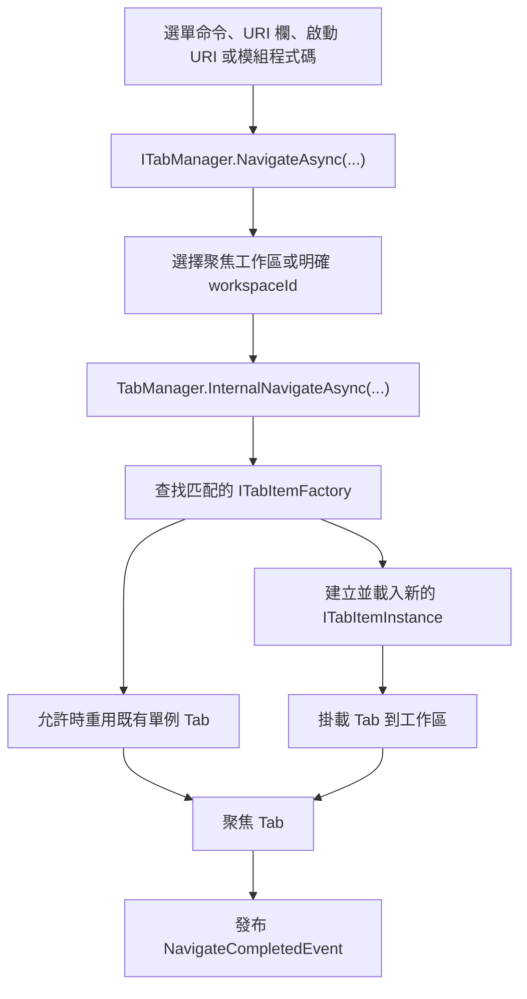
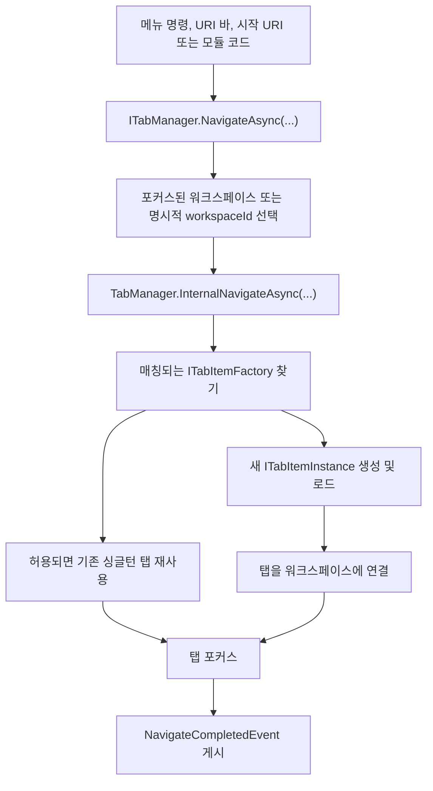

<p align="center">
  <a href="./navigation-workspace.md">English</a> |
  <a href="./navigation-workspace.ja.md">日本語</a> |
  <a href="./navigation-workspace.zh-CN.md">简体中文</a> |
  <a href="./navigation-workspace.zh-TW.md">繁體中文</a> |
  <a href="./navigation-workspace.ko.md">한국어</a> |
</p>

<!--doc-l10n:begin navigation-workspace-content-->
# Navigation and Workspace

ZYC.Framework separates **what to open** from **where to show it**. A URI describes the target content. A tab factory creates the tab instance for that URI. A workspace decides which tab surface receives the instance.

## Mental Model

| Concept | Runtime role |
| --- | --- |
| URI | The address of a feature, file, page, or tool. Examples include `zyc://...`, `file://...`, and module-owned schemes. |
| `ITabItemFactory` | Checks whether it can handle a URI and creates an `ITabItemInstance`. |
| `ITabItemInstance` | Owns tab identity, title, icon, view, lifecycle, and close behavior. |
| `ITabManager` | Coordinates URI navigation, tab creation, reuse, focus, close, reload, move, and restore. |
| `WorkspaceNode` | Represents one node in the workspace layout tree. Leaf nodes contain navigation state. |
| `IParallelWorkspaceManager` | Splits, merges, focuses, swaps, resets, and applies workspace layouts. |

## Navigation Flow



`NavigateAsync(Uri)` navigates in the currently focused workspace. `NavigateAsync(Guid workspaceId, Uri uri)` targets a specific workspace.

## URI Routing and Factories

Factories are registered through `ITabItemFactoryManager`, usually from `Module.LoadAsync`:

```csharp
public override Task LoadAsync(ILifetimeScope lifetimeScope)
{
    lifetimeScope.RegisterTabItemFactory<ReportsTabItemFactory>();
    return Task.CompletedTask;
}
```

`TabItemFactoryBase` uses `TabItemRouteAttribute` for route matching:

```csharp
[RegisterSingleInstance]
[TabItemRoute(Host = ReportsModuleConstants.Host)]
internal class ReportsTabItemFactory : TabItemFactoryBase
{
    public override async Task<ITabItemInstance> CreateTabItemInstanceAsync(
        TabItemCreationContext context)
    {
        await Task.CompletedTask;
        return context.Resolve<ReportsTabItem>(
            new TypedParameter(
                typeof(TabReference),
                new TabReference(context.Uri)));
    }
}
```

Important behavior:

- Factories are checked in manager order.
- `TabItemRouteAttribute` can match `Scheme`, `Host`, `Path`, and `PathMatch`.
- `TabItemFactoryBase.IsSingle` defaults to `true`.
- If a singleton factory matches a URI that is already open, the existing tab is reused.
- If no factory matches, the host opens the built-in Not Found tab.
- If creation or loading throws, the host opens the built-in Error tab.

## Workspace Selection

The focused workspace is stored in `ParallelWorkspaceState.FocusedWorkspaceId`. `IParallelWorkspaceManager.GetFocusedWorkspace()` resolves the active leaf node and falls back to the first available leaf if the stored id is no longer valid.

The UI changes focus when a workspace menu button, empty workspace surface, URI bar, or tab surface is interacted with. Module code can also target a workspace explicitly:

```csharp
var workspace = parallelWorkspaceManager.GetFocusedWorkspace();
await tabManager.NavigateAsync(workspace.Id, ReportsModuleConstants.Uri);
```

Use the overload with `workspaceId` when a command is clearly tied to a specific workspace. Use the plain `NavigateAsync(Uri)` overload when the command should follow the user's current focus.

## Workspace Layout Tree

The workspace layout is a tree of `WorkspaceNode` objects:

| Property | Meaning |
| --- | --- |
| `Id` | Stable workspace node identity. |
| `Left` / `Right` | Child nodes. A node with no children is a leaf workspace. |
| `IsHorizontal` | Split orientation for child nodes. |
| `Ratio` | Split ratio between child nodes. |
| `IsSplitterLocked` | Prevents splitter dragging while keeping the split visible. |
| `NavigationState` | Per-workspace tab URIs, focus URI, and history. |
| `IsNavigationBarVisible` | Controls whether the workspace navigation bar is visible. |

`ParallelWorkspaceView` is both the visual host and the `IParallelWorkspaceManager` implementation. Each leaf workspace resolves a `TabManagerView`, and each `TabManagerView` displays the tab collection for its `WorkspaceNode`.

## Split, Merge, and Layout Operations

`IParallelWorkspaceManager` owns layout operations:

| Operation | Effect |
| --- | --- |
| `SplitHorizontalAsync` | Splits a leaf into side-by-side workspaces. |
| `SplitVerticalAsync` | Splits a leaf into stacked workspaces. |
| `MergeAsync` | Merges a workspace back into its parent structure when possible. |
| `MergeAllAsync` | Collapses the layout to one workspace. |
| `ToggleOrientationAsync` | Toggles a parent split orientation. |
| `SwapAsync` | Swaps a workspace with the related sibling position. |
| `ApplyLayoutAsync` | Rebuilds the layout from a saved `WorkspaceNode` tree. |

When a workspace is removed, `ParallelWorkspaceView` moves its tabs to a fallback workspace through `ITabManager.MoveAllTabItemInstances(...)` before detaching the workspace view.

## State Restore

Startup restore happens after the workspace visual tree is ready:

1. `ParallelWorkspaceView` creates the root `WorkspaceView`.
2. Each leaf workspace resolves a `TabManagerView`.
3. `TabManager.RestoreStateAsync()` reopens saved tab URIs from every leaf `NavigationState`.
4. The previously focused URI is focused when possible.
5. `TabManagerRestoreCompleted` is published.

Startup URI handling waits for `TabManagerRestoreCompleted`, so protocol or command-line navigation does not race against tab/workspace restoration.

## Moving Tabs Between Workspaces

Tabs can move in three ways:

- `ITabManager.MoveTabItemInstance(instance, from, to)` moves one tab to another workspace.
- `ITabManager.MoveTabItemInstance(source, target, position)` reorders tabs or moves them relative to a target tab.
- `ITabManager.MoveAllTabItemInstances(from, to)` moves all tabs when a workspace is removed.

The built-in tab header context menu uses `IMoveWorkspaceTabItemHeaderContextMenuItemManager` to build the "move to workspace" targets. Drag/drop uses `IDropActionProvider` and `DropOrchestrator`; the built-in `TabManagerDropProvider` handles tab movement payloads.

## Workspace Menus

There are two workspace menu surfaces:

| Surface | Manager | Notes |
| --- | --- | --- |
| Workspace navigation drop-down | `IWorkspaceMenuManager` | Active visible menu near the workspace index. Built-in items include reset, split, merge, swap, orientation toggle, and focus. |
| Workspace context menu manager | `IWorkspaceContextMenuManager` | Provides recursive sorting by `Anchor` and `Priority`. Wire a view surface before assuming items appear in the current blank-area context menu. |

Use `IWorkspaceMenuManager.RegisterItem<T>()` for commands that should appear in the visible workspace menu. Use `IWorkspaceContextMenuManager` only when you are extending or wiring a context-menu surface.

## Practical Rules

- Navigate by URI; do not instantiate views directly from menu commands.
- Register a tab factory for every URI surface a module owns.
- Use `NavigateAsync(Uri)` for "open in focused workspace" behavior.
- Use `NavigateAsync(Guid, Uri)` when the command is workspace-specific.
- Treat `WorkspaceNode.NavigationState` as the persisted tab state for that workspace.
- Wait for `TabManagerRestoreCompleted` before running startup navigation that depends on restored tabs.
- Move tabs through `ITabManager`, not by editing UI collections.

<!--doc-l10n:locale ja-->
# ナビゲーションとワークスペース

ZYC.Framework は **何を開くか** と **どこに表示するか** を分離します。URI は対象コンテンツを表します。タブ ファクトリはその URI に対応するタブ インスタンスを作成します。ワークスペースは、そのインスタンスをどのタブ表示領域に載せるかを決めます。

## メンタルモデル

| 概念 | 実行時の役割 |
| --- | --- |
| URI | 機能、ファイル、ページ、ツールのアドレス。例: `zyc://...`、`file://...`、モジュール独自 scheme。 |
| `ITabItemFactory` | URI を処理できるか判定し、`ITabItemInstance` を作成する。 |
| `ITabItemInstance` | タブ ID、タイトル、アイコン、ビュー、ライフサイクル、クローズ動作を持つ。 |
| `ITabManager` | URI ナビゲーション、タブ作成、再利用、フォーカス、クローズ、リロード、移動、復元を調整する。 |
| `WorkspaceNode` | ワークスペース レイアウト ツリーの 1 ノード。リーフ ノードはナビゲーション状態を持つ。 |
| `IParallelWorkspaceManager` | ワークスペースの分割、結合、フォーカス、入れ替え、リセット、レイアウト適用を行う。 |

## ナビゲーション フロー


`NavigateAsync(Uri)` は現在フォーカスされているワークスペースへ移動します。`NavigateAsync(Guid workspaceId, Uri uri)` は特定のワークスペースを対象にします。

## URI ルーティングとファクトリ

ファクトリは通常 `Module.LoadAsync` から `ITabItemFactoryManager` に登録します。

```csharp
public override Task LoadAsync(ILifetimeScope lifetimeScope)
{
    lifetimeScope.RegisterTabItemFactory<ReportsTabItemFactory>();
    return Task.CompletedTask;
}
```

`TabItemFactoryBase` は `TabItemRouteAttribute` でルートを判定します。

```csharp
[RegisterSingleInstance]
[TabItemRoute(Host = ReportsModuleConstants.Host)]
internal class ReportsTabItemFactory : TabItemFactoryBase
{
    public override async Task<ITabItemInstance> CreateTabItemInstanceAsync(
        TabItemCreationContext context)
    {
        await Task.CompletedTask;
        return context.Resolve<ReportsTabItem>(
            new TypedParameter(
                typeof(TabReference),
                new TabReference(context.Uri)));
    }
}
```

重要な動作:

- ファクトリはマネージャーの順序で確認されます。
- `TabItemRouteAttribute` は `Scheme`、`Host`、`Path`、`PathMatch` を判定できます。
- `TabItemFactoryBase.IsSingle` の既定値は `true` です。
- シングルトン ファクトリが既に開いている URI に一致すると、既存タブを再利用します。
- 一致するファクトリがない場合、組み込みの Not Found タブを開きます。
- 作成またはロードで例外が発生した場合、組み込みの Error タブを開きます。

## ワークスペース選択

フォーカス中のワークスペースは `ParallelWorkspaceState.FocusedWorkspaceId` に保存されます。`IParallelWorkspaceManager.GetFocusedWorkspace()` は有効なリーフ ノードを解決し、保存された id が無効な場合は最初に見つかったリーフへフォールバックします。

UI は、ワークスペース メニュー ボタン、空のワークスペース領域、URI バー、タブ領域の操作でフォーカスを変更します。モジュール コードから明示的にワークスペースを指定することもできます。

```csharp
var workspace = parallelWorkspaceManager.GetFocusedWorkspace();
await tabManager.NavigateAsync(workspace.Id, ReportsModuleConstants.Uri);
```

コマンドが特定のワークスペースに結び付く場合は `workspaceId` 付きのオーバーロードを使います。ユーザーの現在フォーカスに従うべきコマンドでは、通常の `NavigateAsync(Uri)` を使います。

## ワークスペース レイアウト ツリー

ワークスペース レイアウトは `WorkspaceNode` のツリーです。

| プロパティ | 意味 |
| --- | --- |
| `Id` | 安定したワークスペース ノード ID。 |
| `Left` / `Right` | 子ノード。子を持たないノードがリーフ ワークスペースです。 |
| `IsHorizontal` | 子ノードの分割方向。 |
| `Ratio` | 子ノード間の分割比率。 |
| `IsSplitterLocked` | 分割線を表示したままドラッグを禁止する。 |
| `NavigationState` | ワークスペースごとのタブ URI、フォーカス URI、履歴。 |
| `IsNavigationBarVisible` | ワークスペース ナビゲーションバーの表示状態。 |

`ParallelWorkspaceView` はビジュアル ホストであり、`IParallelWorkspaceManager` の実装でもあります。各リーフ ワークスペースは `TabManagerView` を解決し、各 `TabManagerView` は自身の `WorkspaceNode` に属するタブ コレクションを表示します。

## 分割、結合、レイアウト操作

`IParallelWorkspaceManager` がレイアウト操作を持ちます。

| 操作 | 効果 |
| --- | --- |
| `SplitHorizontalAsync` | リーフを左右のワークスペースに分割する。 |
| `SplitVerticalAsync` | リーフを上下のワークスペースに分割する。 |
| `MergeAsync` | 可能な場合、ワークスペースを親構造へ結合する。 |
| `MergeAllAsync` | レイアウトを 1 つのワークスペースへ折りたたむ。 |
| `ToggleOrientationAsync` | 親分割の方向を切り替える。 |
| `SwapAsync` | ワークスペースを関連する兄弟位置と入れ替える。 |
| `ApplyLayoutAsync` | 保存済み `WorkspaceNode` ツリーからレイアウトを再構築する。 |

ワークスペースが削除されると、`ParallelWorkspaceView` はワークスペース ビューを切り離す前に `ITabManager.MoveAllTabItemInstances(...)` でタブをフォールバック先へ移動します。

## 状態復元

起動時の復元は、ワークスペースのビジュアル ツリーが準備された後に行われます。

1. `ParallelWorkspaceView` が root `WorkspaceView` を作成する。
2. 各リーフ ワークスペースが `TabManagerView` を解決する。
3. `TabManager.RestoreStateAsync()` が各リーフの `NavigationState` から保存済みタブ URI を再オープンする。
4. 可能であれば、以前フォーカスされていた URI をフォーカスする。
5. `TabManagerRestoreCompleted` を発行する。

Startup URI 処理は `TabManagerRestoreCompleted` を待つため、プロトコルやコマンドラインからのナビゲーションがタブ/ワークスペース復元と競合しません。

## ワークスペース間のタブ移動

タブ移動には 3 つの経路があります。

- `ITabManager.MoveTabItemInstance(instance, from, to)` は 1 つのタブを別ワークスペースへ移動します。
- `ITabManager.MoveTabItemInstance(source, target, position)` はタブを並べ替える、または対象タブに対する相対位置へ移動します。
- `ITabManager.MoveAllTabItemInstances(from, to)` はワークスペース削除時に全タブを移動します。

組み込みのタブ ヘッダー コンテキストメニューは、`IMoveWorkspaceTabItemHeaderContextMenuItemManager` で「移動先ワークスペース」を構築します。ドラッグ&ドロップは `IDropActionProvider` と `DropOrchestrator` を使い、組み込みの `TabManagerDropProvider` がタブ移動ペイロードを処理します。

## ワークスペース メニュー

ワークスペース メニューには 2 つの面があります。

| 面 | Manager | 補足 |
| --- | --- | --- |
| ワークスペース ナビゲーション ドロップダウン | `IWorkspaceMenuManager` | ワークスペース番号の近くにある有効な表示メニュー。組み込み項目は reset、split、merge、swap、orientation toggle、focus。 |
| ワークスペース コンテキストメニュー manager | `IWorkspaceContextMenuManager` | `Anchor` と `Priority` による再帰ソートを提供します。現在の空白領域コンテキストメニューに表示される前提にするには、先に表示面を接続してください。 |

表示中のワークスペース メニューへコマンドを出したい場合は `IWorkspaceMenuManager.RegisterItem<T>()` を使います。`IWorkspaceContextMenuManager` は、コンテキストメニュー面を拡張または接続する場合だけ使います。

## 実用ルール

- メニュー コマンドからビューを直接生成せず、URI でナビゲーションする。
- モジュールが所有する各 URI 面にはタブ ファクトリを登録する。
- 「フォーカス中ワークスペースで開く」動作には `NavigateAsync(Uri)` を使う。
- コマンドがワークスペース固有の場合は `NavigateAsync(Guid, Uri)` を使う。
- `WorkspaceNode.NavigationState` はそのワークスペースの永続タブ状態として扱う。
- 復元済みタブに依存する起動時ナビゲーションは `TabManagerRestoreCompleted` を待つ。
- タブ移動は UI コレクションを直接編集せず、`ITabManager` 経由で行う。

<!--doc-l10n:locale zh-CN-->
# 导航与工作区

ZYC.Framework 将 **打开什么** 和 **显示在哪里** 分开处理。URI 描述目标内容。Tab 工厂为该 URI 创建 Tab 实例。Workspace 决定这个实例进入哪个 Tab 显示区域。

## 心智模型

| 概念 | 运行时角色 |
| --- | --- |
| URI | 功能、文件、页面或工具的地址。例如 `zyc://...`、`file://...` 和模块自有 scheme。 |
| `ITabItemFactory` | 判断自己能否处理某个 URI，并创建 `ITabItemInstance`。 |
| `ITabItemInstance` | 拥有 Tab 标识、标题、图标、View、生命周期和关闭行为。 |
| `ITabManager` | 协调 URI 导航、Tab 创建、复用、聚焦、关闭、重载、移动和恢复。 |
| `WorkspaceNode` | 工作区布局树中的一个节点。叶子节点持有导航状态。 |
| `IParallelWorkspaceManager` | 负责工作区拆分、合并、聚焦、交换、重置和应用布局。 |

## 导航流程



`NavigateAsync(Uri)` 会导航到当前聚焦工作区。`NavigateAsync(Guid workspaceId, Uri uri)` 会导航到指定工作区。

## URI 路由与工厂

工厂通过 `ITabItemFactoryManager` 注册，通常在 `Module.LoadAsync` 中完成：

```csharp
public override Task LoadAsync(ILifetimeScope lifetimeScope)
{
    lifetimeScope.RegisterTabItemFactory<ReportsTabItemFactory>();
    return Task.CompletedTask;
}
```

`TabItemFactoryBase` 使用 `TabItemRouteAttribute` 做路由匹配：

```csharp
[RegisterSingleInstance]
[TabItemRoute(Host = ReportsModuleConstants.Host)]
internal class ReportsTabItemFactory : TabItemFactoryBase
{
    public override async Task<ITabItemInstance> CreateTabItemInstanceAsync(
        TabItemCreationContext context)
    {
        await Task.CompletedTask;
        return context.Resolve<ReportsTabItem>(
            new TypedParameter(
                typeof(TabReference),
                new TabReference(context.Uri)));
    }
}
```

关键行为：

- 工厂按 Manager 返回顺序检查。
- `TabItemRouteAttribute` 可以匹配 `Scheme`、`Host`、`Path` 和 `PathMatch`。
- `TabItemFactoryBase.IsSingle` 默认是 `true`。
- 如果单例工厂匹配到一个已经打开的 URI，会复用已有 Tab。
- 如果没有工厂匹配，Host 会打开内置 Not Found Tab。
- 如果创建或加载时抛出异常，Host 会打开内置 Error Tab。

## 工作区选择

当前聚焦工作区保存在 `ParallelWorkspaceState.FocusedWorkspaceId`。`IParallelWorkspaceManager.GetFocusedWorkspace()` 会解析当前有效叶子节点；如果保存的 id 已经失效，会回退到第一个可用叶子节点。

当用户操作工作区菜单按钮、空工作区区域、URI 栏或 Tab 区域时，UI 会切换聚焦工作区。模块代码也可以显式指定工作区：

```csharp
var workspace = parallelWorkspaceManager.GetFocusedWorkspace();
await tabManager.NavigateAsync(workspace.Id, ReportsModuleConstants.Uri);
```

当命令明确绑定到某个工作区时，使用带 `workspaceId` 的重载。当命令应该跟随用户当前焦点时，使用普通的 `NavigateAsync(Uri)`。

## 工作区布局树

工作区布局是一棵 `WorkspaceNode` 树：

| 属性 | 含义 |
| --- | --- |
| `Id` | 稳定的工作区节点标识。 |
| `Left` / `Right` | 子节点。没有子节点的节点就是叶子工作区。 |
| `IsHorizontal` | 子节点拆分方向。 |
| `Ratio` | 子节点之间的拆分比例。 |
| `IsSplitterLocked` | 禁止拖动分隔条，但仍保持分隔可见。 |
| `NavigationState` | 每个工作区自己的 Tab URI、焦点 URI 和历史记录。 |
| `IsNavigationBarVisible` | 控制工作区导航栏是否可见。 |

`ParallelWorkspaceView` 既是可视化宿主，也是 `IParallelWorkspaceManager` 的实现。每个叶子工作区都会解析一个 `TabManagerView`，每个 `TabManagerView` 显示自己 `WorkspaceNode` 下的 Tab 集合。

## 拆分、合并与布局操作

`IParallelWorkspaceManager` 拥有布局操作：

| 操作 | 效果 |
| --- | --- |
| `SplitHorizontalAsync` | 将叶子拆成左右两个工作区。 |
| `SplitVerticalAsync` | 将叶子拆成上下两个工作区。 |
| `MergeAsync` | 在可行时把工作区合并回父结构。 |
| `MergeAllAsync` | 将布局折叠为单一工作区。 |
| `ToggleOrientationAsync` | 切换父拆分方向。 |
| `SwapAsync` | 与相关兄弟位置交换。 |
| `ApplyLayoutAsync` | 从保存的 `WorkspaceNode` 树重建布局。 |

当工作区被移除时，`ParallelWorkspaceView` 会先通过 `ITabManager.MoveAllTabItemInstances(...)` 把它的 Tab 移到兜底工作区，然后再分离工作区视图。

## 状态恢复

启动恢复发生在工作区可视化树准备完成之后：

1. `ParallelWorkspaceView` 创建根 `WorkspaceView`。
2. 每个叶子工作区解析一个 `TabManagerView`。
3. `TabManager.RestoreStateAsync()` 从每个叶子 `NavigationState` 中重新打开已保存的 Tab URI。
4. 如果可能，恢复之前聚焦的 URI。
5. 发布 `TabManagerRestoreCompleted`。

启动 URI 处理会等待 `TabManagerRestoreCompleted`，因此协议或命令行导航不会和 Tab/工作区恢复发生竞态。

## 在工作区之间移动 Tab

Tab 有三种移动方式：

- `ITabManager.MoveTabItemInstance(instance, from, to)` 把一个 Tab 移到另一个工作区。
- `ITabManager.MoveTabItemInstance(source, target, position)` 重排 Tab，或把它移动到目标 Tab 的相对位置。
- `ITabManager.MoveAllTabItemInstances(from, to)` 在工作区被移除时移动所有 Tab。

内置 Tab 头部右键菜单通过 `IMoveWorkspaceTabItemHeaderContextMenuItemManager` 构建“移动到工作区”的目标。拖放使用 `IDropActionProvider` 和 `DropOrchestrator`；内置 `TabManagerDropProvider` 处理 Tab 移动负载。

## 工作区菜单

工作区菜单有两个表面：

| 表面 | Manager | 说明 |
| --- | --- | --- |
| 工作区导航下拉菜单 | `IWorkspaceMenuManager` | 工作区编号附近的当前可见菜单。内置项包括 reset、split、merge、swap、orientation toggle 和 focus。 |
| 工作区上下文菜单 Manager | `IWorkspaceContextMenuManager` | 提供按 `Anchor` 和 `Priority` 的递归排序。不要假设它的项会出现在当前空白区域右键菜单中，除非已经接入对应 View 表面。 |

要把命令放进可见的工作区菜单，请使用 `IWorkspaceMenuManager.RegisterItem<T>()`。只有在扩展或接线工作区上下文菜单表面时，才使用 `IWorkspaceContextMenuManager`。

## 实用规则

- 通过 URI 导航，不要从菜单命令直接实例化 View。
- 模块拥有的每个 URI 表面都应注册 Tab 工厂。
- “在当前聚焦工作区打开”使用 `NavigateAsync(Uri)`。
- 命令明确绑定工作区时使用 `NavigateAsync(Guid, Uri)`。
- 将 `WorkspaceNode.NavigationState` 视为该工作区的持久化 Tab 状态。
- 依赖已恢复 Tab 的启动导航要等待 `TabManagerRestoreCompleted`。
- 移动 Tab 通过 `ITabManager`，不要直接编辑 UI 集合。

<!--doc-l10n:locale zh-TW-->
# 導覽與工作區

ZYC.Framework 將 **開啟什麼** 和 **顯示在哪裡** 分開處理。URI 描述目標內容。Tab factory 為該 URI 建立 Tab 實例。Workspace 決定這個實例進入哪個 Tab 顯示區域。

## 心智模型

| 概念 | 執行階段角色 |
| --- | --- |
| URI | 功能、檔案、頁面或工具的位址。例如 `zyc://...`、`file://...` 和模組自有 scheme。 |
| `ITabItemFactory` | 判斷自己能否處理某個 URI，並建立 `ITabItemInstance`。 |
| `ITabItemInstance` | 擁有 Tab 識別、標題、圖示、View、生命週期與關閉行為。 |
| `ITabManager` | 協調 URI 導覽、Tab 建立、重用、聚焦、關閉、重載、移動與恢復。 |
| `WorkspaceNode` | 工作區布局樹中的一個節點。葉節點持有導覽狀態。 |
| `IParallelWorkspaceManager` | 負責工作區拆分、合併、聚焦、交換、重置與套用布局。 |

## 導覽流程



`NavigateAsync(Uri)` 會導覽到目前聚焦工作區。`NavigateAsync(Guid workspaceId, Uri uri)` 會導覽到指定工作區。

## URI 路由與 factory

Factory 透過 `ITabItemFactoryManager` 註冊，通常在 `Module.LoadAsync` 中完成：

```csharp
public override Task LoadAsync(ILifetimeScope lifetimeScope)
{
    lifetimeScope.RegisterTabItemFactory<ReportsTabItemFactory>();
    return Task.CompletedTask;
}
```

`TabItemFactoryBase` 使用 `TabItemRouteAttribute` 做路由匹配：

```csharp
[RegisterSingleInstance]
[TabItemRoute(Host = ReportsModuleConstants.Host)]
internal class ReportsTabItemFactory : TabItemFactoryBase
{
    public override async Task<ITabItemInstance> CreateTabItemInstanceAsync(
        TabItemCreationContext context)
    {
        await Task.CompletedTask;
        return context.Resolve<ReportsTabItem>(
            new TypedParameter(
                typeof(TabReference),
                new TabReference(context.Uri)));
    }
}
```

關鍵行為：

- Factory 依 Manager 回傳順序檢查。
- `TabItemRouteAttribute` 可以匹配 `Scheme`、`Host`、`Path` 和 `PathMatch`。
- `TabItemFactoryBase.IsSingle` 預設是 `true`。
- 如果單例 factory 匹配到一個已經開啟的 URI，會重用既有 Tab。
- 如果沒有 factory 匹配，Host 會開啟內建 Not Found Tab。
- 如果建立或載入時拋出例外，Host 會開啟內建 Error Tab。

## 工作區選擇

目前聚焦工作區保存在 `ParallelWorkspaceState.FocusedWorkspaceId`。`IParallelWorkspaceManager.GetFocusedWorkspace()` 會解析目前有效葉節點；如果保存的 id 已失效，會回退到第一個可用葉節點。

當使用者操作工作區選單按鈕、空工作區區域、URI 欄或 Tab 區域時，UI 會切換聚焦工作區。模組程式碼也可以明確指定工作區：

```csharp
var workspace = parallelWorkspaceManager.GetFocusedWorkspace();
await tabManager.NavigateAsync(workspace.Id, ReportsModuleConstants.Uri);
```

當命令明確繫結到某個工作區時，使用帶 `workspaceId` 的多載。當命令應該跟隨使用者目前焦點時，使用普通的 `NavigateAsync(Uri)`。

## 工作區布局樹

工作區布局是一棵 `WorkspaceNode` 樹：

| 屬性 | 含義 |
| --- | --- |
| `Id` | 穩定的工作區節點識別。 |
| `Left` / `Right` | 子節點。沒有子節點的節點就是葉工作區。 |
| `IsHorizontal` | 子節點拆分方向。 |
| `Ratio` | 子節點之間的拆分比例。 |
| `IsSplitterLocked` | 禁止拖動分隔條，但仍保持分隔可見。 |
| `NavigationState` | 每個工作區自己的 Tab URI、焦點 URI 與歷史記錄。 |
| `IsNavigationBarVisible` | 控制工作區導覽列是否可見。 |

`ParallelWorkspaceView` 既是視覺宿主，也是 `IParallelWorkspaceManager` 的實作。每個葉工作區都會解析一個 `TabManagerView`，每個 `TabManagerView` 顯示自己 `WorkspaceNode` 下的 Tab 集合。

## 拆分、合併與布局操作

`IParallelWorkspaceManager` 擁有布局操作：

| 操作 | 效果 |
| --- | --- |
| `SplitHorizontalAsync` | 將葉節點拆成左右兩個工作區。 |
| `SplitVerticalAsync` | 將葉節點拆成上下兩個工作區。 |
| `MergeAsync` | 在可行時把工作區合併回父結構。 |
| `MergeAllAsync` | 將布局摺疊為單一工作區。 |
| `ToggleOrientationAsync` | 切換父拆分方向。 |
| `SwapAsync` | 與相關兄弟位置交換。 |
| `ApplyLayoutAsync` | 從保存的 `WorkspaceNode` 樹重建布局。 |

當工作區被移除時，`ParallelWorkspaceView` 會先透過 `ITabManager.MoveAllTabItemInstances(...)` 把它的 Tab 移到備援工作區，然後再分離工作區 View。

## 狀態恢復

啟動恢復發生在工作區視覺樹準備完成之後：

1. `ParallelWorkspaceView` 建立根 `WorkspaceView`。
2. 每個葉工作區解析一個 `TabManagerView`。
3. `TabManager.RestoreStateAsync()` 從每個葉 `NavigationState` 中重新開啟已保存的 Tab URI。
4. 如果可能，恢復之前聚焦的 URI。
5. 發布 `TabManagerRestoreCompleted`。

啟動 URI 處理會等待 `TabManagerRestoreCompleted`，因此通訊協定或命令列導覽不會和 Tab/工作區恢復發生競態。

## 在工作區之間移動 Tab

Tab 有三種移動方式：

- `ITabManager.MoveTabItemInstance(instance, from, to)` 把一個 Tab 移到另一個工作區。
- `ITabManager.MoveTabItemInstance(source, target, position)` 重排 Tab，或把它移動到目標 Tab 的相對位置。
- `ITabManager.MoveAllTabItemInstances(from, to)` 在工作區被移除時移動所有 Tab。

內建 Tab 標頭右鍵選單透過 `IMoveWorkspaceTabItemHeaderContextMenuItemManager` 建立「移動到工作區」的目標。拖放使用 `IDropActionProvider` 與 `DropOrchestrator`；內建 `TabManagerDropProvider` 處理 Tab 移動負載。

## 工作區選單

工作區選單有兩個表面：

| 表面 | Manager | 說明 |
| --- | --- | --- |
| 工作區導覽下拉選單 | `IWorkspaceMenuManager` | 工作區編號附近的目前可見選單。內建項包括 reset、split、merge、swap、orientation toggle 和 focus。 |
| 工作區內容選單 Manager | `IWorkspaceContextMenuManager` | 提供依 `Anchor` 和 `Priority` 的遞迴排序。不要假設它的項目會出現在目前空白區域右鍵選單中，除非已接入對應 View 表面。 |

要把命令放進可見的工作區選單，請使用 `IWorkspaceMenuManager.RegisterItem<T>()`。只有在擴展或接線工作區內容選單表面時，才使用 `IWorkspaceContextMenuManager`。

## 實用規則

- 透過 URI 導覽，不要從選單命令直接實例化 View。
- 模組擁有的每個 URI 表面都應註冊 Tab factory。
- 「在目前聚焦工作區開啟」使用 `NavigateAsync(Uri)`。
- 命令明確繫結工作區時使用 `NavigateAsync(Guid, Uri)`。
- 將 `WorkspaceNode.NavigationState` 視為該工作區的持久化 Tab 狀態。
- 依賴已恢復 Tab 的啟動導覽要等待 `TabManagerRestoreCompleted`。
- 移動 Tab 透過 `ITabManager`，不要直接編輯 UI 集合。

<!--doc-l10n:locale ko-->
# 내비게이션과 워크스페이스

ZYC.Framework는 **무엇을 열지** 와 **어디에 표시할지** 를 분리합니다. URI는 대상 콘텐츠를 설명합니다. 탭 팩터리는 해당 URI의 탭 인스턴스를 만듭니다. 워크스페이스는 그 인스턴스가 어느 탭 표면에 들어갈지 결정합니다.

## 멘탈 모델

| 개념 | 런타임 역할 |
| --- | --- |
| URI | 기능, 파일, 페이지, 도구의 주소입니다. 예: `zyc://...`, `file://...`, 모듈 소유 scheme. |
| `ITabItemFactory` | URI를 처리할 수 있는지 확인하고 `ITabItemInstance`를 만듭니다. |
| `ITabItemInstance` | 탭 ID, 제목, 아이콘, 뷰, 라이프사이클, 닫기 동작을 가집니다. |
| `ITabManager` | URI 내비게이션, 탭 생성, 재사용, 포커스, 닫기, 리로드, 이동, 복원을 조정합니다. |
| `WorkspaceNode` | 워크스페이스 레이아웃 트리의 노드입니다. 리프 노드는 내비게이션 상태를 가집니다. |
| `IParallelWorkspaceManager` | 워크스페이스 분할, 병합, 포커스, 교환, 리셋, 레이아웃 적용을 담당합니다. |

## 내비게이션 흐름



`NavigateAsync(Uri)`는 현재 포커스된 워크스페이스로 이동합니다. `NavigateAsync(Guid workspaceId, Uri uri)`는 특정 워크스페이스를 대상으로 합니다.

## URI 라우팅과 팩터리

팩터리는 보통 `Module.LoadAsync`에서 `ITabItemFactoryManager`에 등록합니다.

```csharp
public override Task LoadAsync(ILifetimeScope lifetimeScope)
{
    lifetimeScope.RegisterTabItemFactory<ReportsTabItemFactory>();
    return Task.CompletedTask;
}
```

`TabItemFactoryBase`는 `TabItemRouteAttribute`로 라우트를 매칭합니다.

```csharp
[RegisterSingleInstance]
[TabItemRoute(Host = ReportsModuleConstants.Host)]
internal class ReportsTabItemFactory : TabItemFactoryBase
{
    public override async Task<ITabItemInstance> CreateTabItemInstanceAsync(
        TabItemCreationContext context)
    {
        await Task.CompletedTask;
        return context.Resolve<ReportsTabItem>(
            new TypedParameter(
                typeof(TabReference),
                new TabReference(context.Uri)));
    }
}
```

중요한 동작:

- 팩터리는 매니저 순서대로 검사됩니다.
- `TabItemRouteAttribute`는 `Scheme`, `Host`, `Path`, `PathMatch`를 매칭할 수 있습니다.
- `TabItemFactoryBase.IsSingle` 기본값은 `true`입니다.
- 싱글턴 팩터리가 이미 열린 URI와 매칭되면 기존 탭을 재사용합니다.
- 매칭되는 팩터리가 없으면 Host는 내장 Not Found 탭을 엽니다.
- 생성 또는 로딩 중 예외가 발생하면 Host는 내장 Error 탭을 엽니다.

## 워크스페이스 선택

현재 포커스된 워크스페이스는 `ParallelWorkspaceState.FocusedWorkspaceId`에 저장됩니다. `IParallelWorkspaceManager.GetFocusedWorkspace()`는 활성 리프 노드를 찾고, 저장된 id가 더 이상 유효하지 않으면 첫 번째 사용 가능한 리프로 대체합니다.

UI는 워크스페이스 메뉴 버튼, 빈 워크스페이스 표면, URI 바, 탭 표면 조작으로 포커스를 변경합니다. 모듈 코드도 워크스페이스를 명시적으로 지정할 수 있습니다.

```csharp
var workspace = parallelWorkspaceManager.GetFocusedWorkspace();
await tabManager.NavigateAsync(workspace.Id, ReportsModuleConstants.Uri);
```

명령이 특정 워크스페이스에 묶여 있으면 `workspaceId`가 있는 오버로드를 사용합니다. 사용자의 현재 포커스를 따라야 하는 명령은 일반 `NavigateAsync(Uri)`를 사용합니다.

## 워크스페이스 레이아웃 트리

워크스페이스 레이아웃은 `WorkspaceNode` 트리입니다.

| 속성 | 의미 |
| --- | --- |
| `Id` | 안정적인 워크스페이스 노드 ID. |
| `Left` / `Right` | 자식 노드. 자식이 없는 노드가 리프 워크스페이스입니다. |
| `IsHorizontal` | 자식 노드의 분할 방향. |
| `Ratio` | 자식 노드 사이의 분할 비율. |
| `IsSplitterLocked` | 분할선을 보이게 유지하면서 드래그를 막습니다. |
| `NavigationState` | 워크스페이스별 탭 URI, 포커스 URI, 히스토리. |
| `IsNavigationBarVisible` | 워크스페이스 내비게이션 바 표시 여부. |

`ParallelWorkspaceView`는 시각적 host이면서 `IParallelWorkspaceManager` 구현입니다. 각 리프 워크스페이스는 `TabManagerView`를 resolve하고, 각 `TabManagerView`는 자신의 `WorkspaceNode`에 속한 탭 컬렉션을 표시합니다.

## 분할, 병합, 레이아웃 작업

`IParallelWorkspaceManager`가 레이아웃 작업을 담당합니다.

| 작업 | 효과 |
| --- | --- |
| `SplitHorizontalAsync` | 리프를 좌우 워크스페이스로 분할합니다. |
| `SplitVerticalAsync` | 리프를 상하 워크스페이스로 분할합니다. |
| `MergeAsync` | 가능하면 워크스페이스를 부모 구조로 병합합니다. |
| `MergeAllAsync` | 레이아웃을 하나의 워크스페이스로 접습니다. |
| `ToggleOrientationAsync` | 부모 분할 방향을 토글합니다. |
| `SwapAsync` | 워크스페이스를 관련 형제 위치와 교환합니다. |
| `ApplyLayoutAsync` | 저장된 `WorkspaceNode` 트리에서 레이아웃을 다시 만듭니다. |

워크스페이스가 제거되면 `ParallelWorkspaceView`는 워크스페이스 뷰를 분리하기 전에 `ITabManager.MoveAllTabItemInstances(...)`로 탭을 대체 워크스페이스로 이동합니다.

## 상태 복원

시작 복원은 워크스페이스 시각 트리가 준비된 뒤 실행됩니다.

1. `ParallelWorkspaceView`가 root `WorkspaceView`를 만듭니다.
2. 각 리프 워크스페이스가 `TabManagerView`를 resolve합니다.
3. `TabManager.RestoreStateAsync()`가 각 리프 `NavigationState`에서 저장된 탭 URI를 다시 엽니다.
4. 가능하면 이전에 포커스된 URI를 포커스합니다.
5. `TabManagerRestoreCompleted`를 게시합니다.

시작 URI 처리는 `TabManagerRestoreCompleted`를 기다리므로 프로토콜 또는 명령줄 내비게이션이 탭/워크스페이스 복원과 경쟁하지 않습니다.

## 워크스페이스 간 탭 이동

탭은 세 가지 방식으로 이동할 수 있습니다.

- `ITabManager.MoveTabItemInstance(instance, from, to)`는 하나의 탭을 다른 워크스페이스로 이동합니다.
- `ITabManager.MoveTabItemInstance(source, target, position)`은 탭을 재정렬하거나 대상 탭 기준 위치로 이동합니다.
- `ITabManager.MoveAllTabItemInstances(from, to)`는 워크스페이스가 제거될 때 모든 탭을 이동합니다.

내장 탭 헤더 컨텍스트 메뉴는 `IMoveWorkspaceTabItemHeaderContextMenuItemManager`로 "이동할 워크스페이스" 대상을 만듭니다. 드래그 앤 드롭은 `IDropActionProvider`와 `DropOrchestrator`를 사용하며, 내장 `TabManagerDropProvider`가 탭 이동 payload를 처리합니다.

## 워크스페이스 메뉴

워크스페이스 메뉴에는 두 표면이 있습니다.

| 표면 | Manager | 설명 |
| --- | --- | --- |
| 워크스페이스 내비게이션 드롭다운 | `IWorkspaceMenuManager` | 워크스페이스 번호 근처의 현재 표시 메뉴입니다. 내장 항목에는 reset, split, merge, swap, orientation toggle, focus가 있습니다. |
| 워크스페이스 컨텍스트 메뉴 manager | `IWorkspaceContextMenuManager` | `Anchor`와 `Priority`에 따른 재귀 정렬을 제공합니다. 현재 빈 영역 컨텍스트 메뉴에 항목이 보인다고 가정하려면 먼저 뷰 표면을 연결해야 합니다. |

표시되는 워크스페이스 메뉴에 명령을 넣으려면 `IWorkspaceMenuManager.RegisterItem<T>()`를 사용합니다. `IWorkspaceContextMenuManager`는 컨텍스트 메뉴 표면을 확장하거나 연결할 때만 사용합니다.

## 실무 규칙

- 메뉴 명령에서 뷰를 직접 인스턴스화하지 말고 URI로 이동합니다.
- 모듈이 소유한 각 URI 표면에는 탭 팩터리를 등록합니다.
- "포커스된 워크스페이스에서 열기" 동작에는 `NavigateAsync(Uri)`를 사용합니다.
- 명령이 워크스페이스에 명확히 연결되어 있으면 `NavigateAsync(Guid, Uri)`를 사용합니다.
- `WorkspaceNode.NavigationState`를 해당 워크스페이스의 지속 탭 상태로 취급합니다.
- 복원된 탭에 의존하는 시작 내비게이션은 `TabManagerRestoreCompleted`를 기다립니다.
- 탭 이동은 UI 컬렉션을 직접 수정하지 말고 `ITabManager`를 통해 수행합니다.

<!--doc-l10n:end-->
